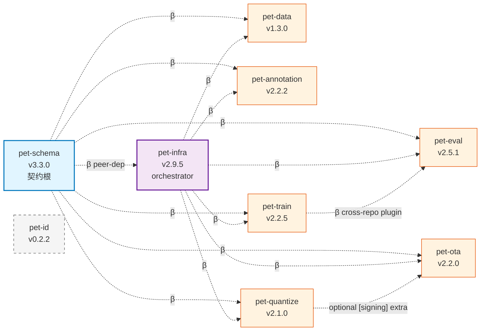
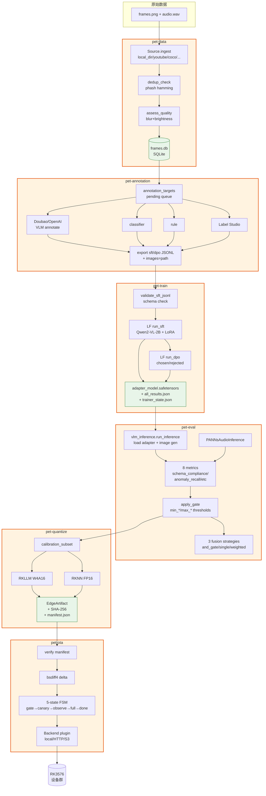
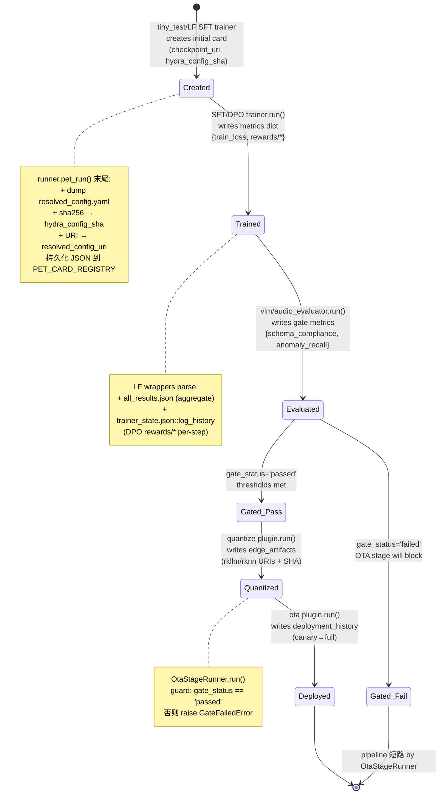
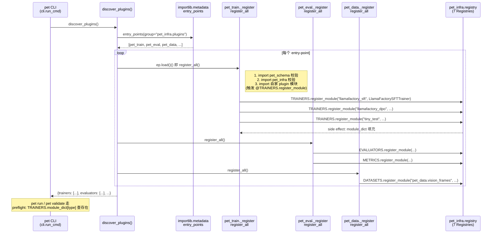
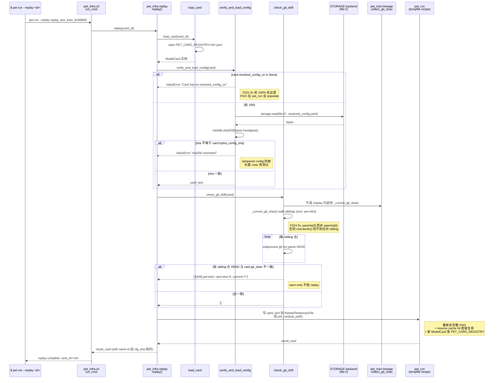

# Train-Pet-Pipeline Monorepo Reference

> 最后对齐：matrix row 2026.11 / 2026-04-27

---

## 新人入门指南（先读这里）

如果你是第一次接触这个项目，下面 5 个小节按这个顺序读，大约 30 分钟可以建立全局图景。
之后你可以根据自己的角色跳到对应的深读部分（§3 是按仓深读，§7 是用法实战）。

### 这个项目在做什么

我们在做一台**智能宠物喂食器**。它有摄像头和喂食仓，能识别"猫在吃饭 / 猫在嗅探不吃 /
没有猫"等行为，自动调节喂食策略。所有 AI 推理跑在设备上的 Rockchip RK3576 NPU——
不上传到云端，因为：(1) 用户不愿意把家里摄像头视频传出去；(2) 网络断了喂食器还得能用；
(3) 算力费云比 NPU 算贵 100 倍。

要在 NPU 上跑得动，模型必须**很小很快**——典型的端侧 VLM 是 Qwen2-VL-2B 量化到 W8A8（≤2 GB
权重，≤200 ms 单推理）。从开箱即用的通用 VLM 到这种规格，要经过：采集真实宠物视频 → 用大模型
打标 → 训练小模型 → 评估 → 量化 → 推送到设备。每一步都是一个独立的工程问题，所以拆成 9 个
git 仓库，每个仓库专注一段：

```
原始视频 ──► pet-data ──► pet-annotation ──► pet-train ──► pet-eval ──► pet-quantize ──► pet-ota ──► 设备
                                                          ↑
                              pet-schema  ←────────────  契约定义所有仓的数据结构
                              pet-infra   ←────────────  Orchestrator 串起所有 stage
                              pet-id      ←────────────  独立的"识别这只猫"CLI 工具
```

下面是各仓一句话职责（深读看 §3）：

| 仓 | 一句话职责 | 类比 |
|---|---|---|
| **pet-schema** | 定义所有跨仓数据类型（Pydantic） | 像 protobuf .proto 文件 |
| **pet-infra** | Orchestrator + Plugin Registry + ClearML 实验追踪 | 像 MLflow + Airflow 的薄合体 |
| **pet-data** | 从 YouTube/学术数据集采集视频帧，去重、质检 | 像 dvc 管理的数据 ingester |
| **pet-annotation** | 用 Doubao/Qwen-VL 给帧打标，4 范式（LLM/分类/规则/人审） | 像 Label Studio + 自动 VLM 打标 |
| **pet-train** | 调 LLaMA-Factory 跑 SFT/DPO；音频 CNN 训练 | 像 transformers Trainer 包了一层 |
| **pet-eval** | VLM/Audio/Vision evaluator + gate（pass/fail 决策） | 像 lm-eval-harness + 业务 gate |
| **pet-quantize** | RKNN/RKLLM 量化 + 端侧打包签名 | 像 ONNX → TensorRT 但目标是 Rockchip |
| **pet-ota** | Canary rollout + delta patch 推到设备 | 像 Mender/Balena |
| **pet-id** | 独立 CLI：注册一只宠物、识别照片里的宠物 | 像 face_recognition 命令行版 |

### 你应该先读哪些章节（按角色）

| 你是谁 | 30 分钟路径 | 接着深读 |
|---|---|---|
| **新加入项目的工程师** | 入门指南全部 5 节 + §1 + §7.1 | §3 的你负责的那个仓 |
| **算法工程师**（要加新 trainer/evaluator） | 入门指南 + §4 Plugin 系统 | §3.5 pet-train、§3.6 pet-eval、§7.4 |
| **MLOps**（部署/CI/replay） | 入门指南 + §6 + §7.2 | §3.2 pet-infra |
| **数据工程师**（加新 ingester） | 入门指南 + §3.3 pet-data | §3.4 pet-annotation |
| **量化/嵌入式**（加新 backend） | 入门指南 + §3.7 + §3.8 | §4 Plugin 系统 |
| **代码评审者** | 入门指南 + §1 + §5 | DEV_GUIDE §11.8 retro guardrail |

### 5 分钟跑通一次（最小工作示例）

下面这条路径让你**端到端完成一次** SFT 训练 + 评估，在一台普通 Linux/Mac 上几分钟内出结果。
它使用 `recipes/replay_test.yaml` —— 一个 toy recipe，专为 smoke test 设计。

```bash
# 1. 准备共享 conda 环境（CLAUDE.md 强制要求，不要每仓单独建 env）
conda create -n pet-pipeline python=3.11.x -y
conda activate pet-pipeline

# 2. 装 pet-schema → pet-infra → pet-train（β peer-dep 装序约束）
pip install 'pet-schema @ git+https://github.com/Train-Pet-Pipeline/pet-schema@v3.3.0'
pip install 'pet-infra  @ git+https://github.com/Train-Pet-Pipeline/pet-infra@v2.9.5'
pip install 'pet-train  @ git+https://github.com/Train-Pet-Pipeline/pet-train@v2.2.5'

# 3. clone pet-infra 拿 recipe
git clone https://github.com/Train-Pet-Pipeline/pet-infra.git
cd pet-infra

# 4. 验证 plugin 都能 discover
pet validate recipes/replay_test.yaml
# 期望输出: validate ✅, plugins discovered: TRAINERS=4, EVALUATORS=5, ...

# 5. 跑！
pet run recipes/replay_test.yaml
# 期望输出:
#   stage[train]: writing card to .cache/cards/sft_001.json
#   stage[eval]:  metrics={"f1_macro": 0.42}
#   stage[gate]:  status=passed (threshold f1_macro>=0.3)

# 6. 看 ClearML offline metrics（如果你设了 CLEARML_OFFLINE_MODE=1）
ls clearml_offline/   # 找到一个 .zip，里面有 metrics.jsonl
```

如果你看到 `passed`，恭喜——你刚刚跑通了 train→eval→gate 三段，整个 9 仓里的 4 个仓
（schema/infra/train/eval）都参与了这次执行。

### 词汇表（10 个会反复出现的术语）

| 术语 | 一句话定义 | 何处展开 |
|---|---|---|
| **ModelCard** | 跨阶段状态契约——训练后写、量化时读、OTA 部署时再写 deployment_history | §2 ModelCard Lifecycle |
| **ExperimentRecipe** | YAML 描述的有向无环图——告诉 Orchestrator 跑哪些 stage、什么顺序 | §3.1 ExperimentRecipe |
| **β peer-dep** | 共享类型仓不写进 pyproject.dependencies，由消费方先 `pip install` 装 | §5 β peer-dep |
| **Plugin Registry** | mmengine.Registry 实例（TRAINERS/EVALUATORS/...），存"name → class" 映射 | §4 Plugin 系统 |
| **Entry-point discovery** | `importlib.metadata.entry_points("pet_infra.plugins")` 找到所有装好的 plugin 包 | §4 Entry-point discovery |
| **Replay** | 用旧 ModelCard.resolved_config_uri 重跑训练；sha256 不匹配 fail-fast、git_shas 漂移 warn | §7.2 Replay |
| **Gate** | evaluator 跑完后的 pass/fail 决策；只有 passed 才允许进 quantize/OTA | §3.6 pet-eval |
| **Canary rollout** | OTA 5 状态机：先推 5% 设备观察 48h，没异常再推全量 | §3.8 pet-ota |
| **Fixture-real test** | 必须真跑生产代码路径而不是 mock；DEV_GUIDE §11.8 retro guardrail 强制 | §4 Plugin contract 测试纪律 |
| **compatibility_matrix.yaml** | 真理源——告诉你某个时间点哪个 release 配哪个 release 兼容 | §5 compatibility_matrix |

### 常见困惑（newcomer FAQ）

**"为什么 `pip install pet-train` 装完 import 报 `ModuleNotFoundError: pet_schema`？"**

因为 pet-train `pyproject.toml` 故意不写 `pet-schema` 进 dependencies——这是 β peer-dep
设计（§5）。装序必须是 `pet-schema → pet-infra → pet-train`，按 `compatibility_matrix.yaml`
当前 row 的 tag 装。这种"装序约束"看起来反常，但它解决了"pet-data 想要 schema v3.0、pet-train
想要 v3.3"的依赖冲突地狱——pin 在消费侧而不是被消费侧。

**"我加了一个 trainer plugin 但 `pet validate` 找不到它"**

最常见原因：忘了在 plugin 仓的 `pyproject.toml` 写 `[project.entry-points."pet_infra.plugins"]`，
或者 plugin 模块被 import 时没调用 `@TRAINERS.register_module(...)` 装饰器。验证：
`python -c "from importlib.metadata import entry_points; print(list(entry_points(group='pet_infra.plugins')))"`
应该看到你的包名。详见 §7.4 添加新 trainer plugin 完整流程。

**"我改了 ModelCard 字段，pet-train 里 `card.foo = bar` 抛 ValidationError"**

ModelCard 用 Pydantic `extra="forbid"`——schema 不允许动态字段。改 schema 要：
(1) 在 pet-schema 提 PR + ≥2 reviewer approve；(2) bump pet-schema 版本；(3) 下游 7 仓
`compatibility_matrix.yaml` row 同步 bump。这是设计——契约不能漂移。

**"`pet run` 跑完没在 ClearML dashboard 看到任何 metric"**

3 个可能：(1) 你设了 `CLEARML_OFFLINE_MODE=1`，metrics 写在本地 `.zip` 里没上传；
(2) 没设环境变量 `CLEARML_API_HOST` 等；(3) trainer plugin 没把 metrics 写进
`card.metrics`——F027 retro 就是这个 bug，runner 不主动转发 metrics 到 logger，
plugin 必须自己填。验证：`pet run --dry-run recipe.yaml` 看 ModelCard 输出 metrics 字段
是不是空。

**"为什么 dev 上的 PR 突然 CONFLICTING？我没改任何冲突文件"**

经典 dev/main divergence——上次 dev → main 是 squash merge，main 上是新 commit hash，
dev 没追到。下次 dev → main PR 走 git 三方合并就会"双方都改了"误判。修复：先在本地
`git checkout dev && git merge origin/main`，push 回去 dev，PR 自动 unblock。这是
documented pattern，每个 release cycle 都遇到一次。

**"我在主目录跑 `git status` 报 not a git repository"**

设计如此——`/Train-Pet-Pipeline/` 是聚合目录而不是 git 仓库。每个子目录是独立仓库
（`pet-schema/.git` 等）。任何 git 命令必须先 `cd` 进具体仓。这避免了"主仓追踪 9 个
submodule" 的复杂度，代价是多目录切换。

---

## 0. TL;DR

Train-Pet-Pipeline 是一条从原始视频帧到端侧 AI 模型的完整 MLOps 流水线，面向 RK3576
智能宠物喂食器。9 个 git 仓库各守一段边界：数据采集（pet-data）→ 打标（pet-annotation）→
训练（pet-train）→ 评估（pet-eval）→ 量化（pet-quantize）→ OTA 分发（pet-ota）；
pet-schema 是唯一数据契约源；pet-infra 是横切所有仓的运行时基础设施；pet-id 是独立身份
识别 CLI 工具。整个系统的结构性赌注是：**thin orchestrator + plugin sibling repos**——
pet-infra 的 Orchestrator 不知道如何训练模型，pet-train 也不知道如何分发 OTA，
两者通过 Registry + entry-point 解耦，这是唯一跨越所有阶段的架构约定。

---

## 1. 系统是什么，以及为什么是 9 个仓库

### 业务背景

这台喂食器的核心叙事是"所有 AI 跑在设备上，不经过我们的服务器"。这意味着：

1. 端侧推理用 Qwen2-VL-2B（W8A8 量化）+ YOLO-nano（常驻检测），跑在 RK3576 NPU 上
2. 模型必须从我们自己的宠物数据训练，不能直接用开箱即用的通用模型
3. 量化后的模型需要通过 OTA 推送到已售出的设备

从这里读出 9 个仓库存在的理由：每个仓库是一个**不可混淆的生命周期阶段**。

### 9 仓拓扑（依赖箭头图）



**β peer-dep**（虚线）= 不写 `pyproject.dependencies`，要求消费方 `pip install pet-schema@<tag>` 在前。这种装序约束让每个仓的 `pyproject.toml` 干净，但对应代价是：单 `pip install pet-train` 不带 schema 不工作——故 `compatibility_matrix.yaml` 是真理源，它告诉每个 release 装哪个 tag。

`pet-id` 单独成图（虚线框）：它是独立 CLI 工具，**不消费**任何 pet-* 包，scope 与其他 8 仓正交。

### 为什么不是一个大 monorepo

Python monorepo 存在一个根本性问题：如果所有代码住在同一个包里，训练依赖（`torch>=2.1`）
会感染量化工具（`rknn-toolkit2`），量化工具会感染 OTA 分发服务，OTA 分发服务最后跑在一台
轻量级部署服务器上，那台服务器根本安不下 PyTorch。9 仓切分让每个仓库只安装它真正需要的
依赖——这是最主要的驱动力。

次要驱动力：CI feedback speed。pet-schema 的变更会通过 `repository_dispatch` 触发全链 CI，
这只有在"消费方是独立仓库"时才有清晰的触发边界。

### Thin orchestrator 的赌注

pet-infra 的 `pet_run()` 执行一个 `ExperimentRecipe` 中的 stage 序列。它不知道 SFT 是什么，
不知道 RKNN 是什么，也不知道 S3 bucket 叫什么——它只知道"从 Registry 查一个 plugin，
按 config 实例化，调 `.run(input_card, recipe)`"。

这个赌注回报体现在三个地方：

1. **新增 trainer 不改 Orchestrator**：pet-train 在自己的仓库声明一个 entry-point，
   `discover_plugins()` 自动发现它，TRAINERS Registry 自动填充，Orchestrator 直接调用。
   pet-infra 0 行改动。
2. **全链替换实验追踪器只改 pet-infra**：Phase 4 从 W&B 迁移到 ClearML，只改了 pet-infra
   的 `ExperimentLogger` 实现，下游 7 个仓库无感知。
3. **Replay 可以在任意阶段 dry-run**：因为 Orchestrator 不知道业务语义，它可以用同一条
   代码路径 replay 任何 stage，包括 quantize 和 OTA——只要 plugin 实现了 `.run()` 契约。

---

## 2. 数据流与 Lifecycle

### 端到端 Pipeline（mermaid）



ASCII 版本（fallback / 文本上下文）：

```
raw frames / audio WAV
        │
        ▼
[pet-data]  ingest → dedup (phash) → quality filter → anomaly score
        │   VisionSample / AudioSample → SQLite frames table
        │
        ▼
[pet-annotation]  pending targets → 4-paradigm annotate
        │         LLM (Doubao/OpenAI) + classifier + rule + human (Label Studio)
        │         4x annotation tables → export JSONL (SFT + DPO format)
        │
        ▼
[pet-train]  validate JSONL → LLaMA-Factory run_sft / run_dpo
        │    LoRA adapter checkpoint + ModelCard (metrics populated from
        │    all_results.json + trainer_state.json)
        │
        ▼
[pet-eval]  load checkpoint → run inference → compute 8 metrics
        │   apply gate (min_*/max_* thresholds) → ModelCard (gate_status)
        │   also evaluates: quantized VLM (RKLLM runner) + audio (PANNs)
        │   + cross-modal fusion (3 rule-based strategies)
        │
        ▼
[pet-quantize]  calibration dataset → RKLLM W4A16 / RKNN FP16 conversion
        │        EdgeArtifact + QuantConfig → signed release tarball + manifest.json
        │
        ▼
[pet-ota]  manifest SHA-256 verify → delta patch (bsdiff4)
           → 5-state canary FSM (gate_check → canary → observe → full → done)
           → 3 backend plugins (local / S3 / HTTP) → devices

────────────────────────────────────────────────────────────────────
横切所有阶段:

[pet-schema]  ExperimentRecipe, ModelCard, Annotation discriminator,
              DpoPair, EdgeArtifact ── 所有仓库的共享数据类型

[pet-infra]   Registry (7 slots) + Plugin Discovery + Config Composition
              + CLI (pet run / replay / sweep) + Orchestrator (BaseStageRunner)
              + Storage (3 backends) + ExperimentLogger (ClearML) + Replay
              ── 所有仓库的共享运行时基础设施

[pet-id]      独立 CLI (petid register/identify/list/show/delete)
              PetCard disk gallery ── 不接入上述流水线
```

### ModelCard 作为跨阶段状态契约

`ModelCard`（定义在 pet-schema）是流水线中唯一向下游流动的 typed state。每个 plugin 的
`.run(input_card, recipe) -> ModelCard` 签名不是偶然的：

- **pet-train** 写 `card.checkpoint_uri`，`card.metrics`（train_loss / epoch），
  `card.git_shas`（可复现性），`card.hydra_config_sha`（重放 key）
- **pet-eval** 读 `card.checkpoint_uri` → 推理 → 写 `card.metrics`（gate 指标），
  `card.gate_status`（passed / failed）
- **pet-quantize** 读 `card.gate_status`（拒绝 gate_failed 的 card）→ 写
  `card.edge_artifacts`（rkllm / rknn 路径 + SHA-256），`card.quant_config`
- **pet-ota** 读 `card.edge_artifacts` + `card.gate_status` → 写
  `card.deployment_history`（DeploymentStatus）

这个链条的设计决策是：**stage 与 stage 之间只通过 ModelCard 传递状态，不通过共享数据库、
不通过文件路径约定、不通过环境变量**。路径本身（checkpoint_uri、artifact_uri）是 ModelCard
字段，因此路径变更也是类型安全的 schema 变更，不是隐式约定。

### ModelCard Lifecycle 状态机



关键性质：**任何 transition 都伴随 `card.id` 重新计算 + 新 JSON 文件落 `PET_CARD_REGISTRY`**。
一个 recipe 跑完 5 stage = 5 张 card 文件 = 完整 lineage 链（每张 card 的 `parent_models`
指向上一张）。这是 Replay 能跨阶段精确定位的基础。

---

## 3. 九仓深读

---

### 3.1 pet-schema — 契约根节点

**设计动机**

pet-schema 存在是因为跨仓库数据格式漂移是最难调试的一类 bug。如果 pet-annotation 的
JSONL 导出格式悄悄加了一个字段，而 pet-train 的 JSONL 验证器没有更新，训练会静默地
忽略那个字段——或者更坏，在 batch N 的某行抛出 `KeyError`，日志里只有 LLaMA-Factory
的内部堆栈。

把所有共享类型集中在一个仓库，下游通过 `import pet_schema` 消费，变更 pet-schema 的 PR
需要 ≥ 2 位 reviewer approve，`schema_guard.yml` merge 到 main 后自动向下游 7 仓派发
`repository_dispatch`，触发各自的 CI——这是唯一能保证"格式变更可见"的机制。

**不与哪个仓重叠**

pet-schema 不做业务逻辑、不做 I/O 操作、不做 CLI、不做 plugin 注册。它只做两件事：
定义 Pydantic 数据模型（Annotation / ModelCard / ExperimentRecipe / GateCheck / EdgeArtifact 等），
和对 VLM 输出做运行时语义校验（`validate_output()`）。

**关键抽象**

*Annotation discriminator（4 范式）*

```python
Annotation = Annotated[
    LLMAnnotation | ClassifierAnnotation | RuleAnnotation | HumanAnnotation,
    Discriminator("annotator_type"),
]
```

设计问题：为什么不是单一模型 + `annotator_type: str` 字段？

答案是类型安全插件路由。当 pet-annotation 的 `AnnotationOrchestrator` 根据 `annotator_type`
分发时，它不需要写 `if annotator_type == "llm": ...`——它只需要通过 Pydantic 的 discriminator
路由到正确的子类，每个子类有且仅有该生产者类型的特有字段（`LLMAnnotation.prompt_hash`,
`ClassifierAnnotation.class_probs` 等）。这也是为什么 pet-annotation 数据库有 4 张范式表
而不是 1 张宽表——每个子类的字段结构不同，放进一张表意味着大量 nullable 列。

*ExperimentRecipe + to_dag()*

```python
class RecipeStage(BaseModel):
    inputs: dict[str, ArtifactRef]   # 有类型的输入绑定
    depends_on: list[str]             # DAG 调度约束
```

`inputs` 和 `depends_on` 两个字段看起来冗余，但它们的语义不同：`inputs` 说"喂什么进来"，
`depends_on` 说"什么时候能跑"。两者有时重叠但不总是——stage B 可能要等 stage A 写完 checkpoint
才能开始，但不直接消费 A 的输出。`to_dag()` 只读 `depends_on` 构造 nx.DiGraph 并检测环。
如果从 `inputs` 自动推导 `depends_on`，schema 层就必须理解 `ArtifactRef.ref_type` 的
orchestration 语义——这是职责渗漏。

*ModelCard 与 ResourceSpec 的生命周期分离*

`ResourceSpec` 是 `TrainerBase.estimate_resources()` 的返回类型——训练前声明期望资源。
`ModelCard` 是训练后的规范描述卡。两者生命周期完全不同：ResourceSpec 在 run 之前由 trainer
plugin 计算，ModelCard 在 run 完成后写入。新工程师常见误解是把 ResourceSpec 当作 ModelCard
的一个字段——它不是，它是 Orchestrator preflight 检查用的接口返回值。

ModelCard 字段分组对应"该字段在生命周期哪个阶段被写入"——身份段在 stage 开始时确定、
重现段在 trainer plugin 进入 `run()` 前 dump、artifact 段在训练完成时填、metric 段
在 evaluator 跑完后 merge、deployment 段在 OTA 完成后 append：

```python
# pet-schema/src/pet_schema/model_card.py
class ModelCard(BaseModel):
    """Canonical model card contract shared across the Train-Pet-Pipeline."""

    model_config = ConfigDict(extra="forbid")

    # Identity
    id: str
    version: str
    modality: Modality
    task: str
    arch: str

    # Reproducibility — replay 的判定依据
    training_recipe: str
    recipe_id: str | None = None
    hydra_config_sha: str            # F021 fail-fast key
    git_shas: dict[str, str]         # F024 drift-warn key (multi-repo)
    dataset_versions: dict[str, str]

    # Artifact
    checkpoint_uri: str               # F025 不能含 /adapter 后缀

    # Optional downstream
    quantization: QuantConfig | None = None
    edge_artifacts: list[EdgeArtifact] = []
    intermediate_artifacts: dict[str, str] = {}
    deployment_history: list[DeploymentStatus] = []

    # Lineage
    parent_models: list[str] = []
    lineage_role: Literal["teacher", "student", "sft_base", "dpo_output", "fused"] | None = None

    # Metrics — F022 SFT train_loss / F023 DPO rewards/* 必须填进来
    metrics: dict[str, float]
    gate_status: Literal["pending", "passed", "failed"]

    # Tracing
    trained_at: datetime
    trained_by: str
    clearml_task_id: str | None = None
    dvc_exp_sha: str | None = None
    resolved_config_uri: str | None = None   # F021 replay 入口
    notes: str | None = None

    hardware_validation: HardwareValidation | None = None
```

设计要点：

- `extra="forbid"` 是关键防线——任何 plugin 想往 ModelCard 写新字段必须先 PR 改 schema，
  代码里随手 `card.foo = "bar"` 会立即抛 `ValidationError`，这是契约不漂移的底层保证。
- `hydra_config_sha + git_shas + dataset_versions` 三件套定义"完全可复现"——sha 不
  匹配 fail-fast、git_shas drift warn-only、dataset_versions 用于发现训练集变更（这是
  F012/F021/F024 共同要求的最小集合）。
- `metrics: dict[str, float]` 是 dict 而不是固定 schema——不同 modality / task 的指标
  名差异极大（DPO `rewards/margins`、audio `f1_macro`、quantize `kl_divergence`），
  强约束 schema 会让每加一个 evaluator 就要 bump pet-schema major。
- `gate_status` 是 plugin 之间的硬门控——OTA `LocalBackendPlugin.run()` 第一行就检查
  `gate_status != "passed"` 抛 ValueError，把 gate 不通过的模型推上设备的可能性堵死在
  schema 层。

*validate_output — VLM 业务语义守门员*

JSON Schema 能验结构（字段存在、类型正确），但 VLM 输出有大量"语法对但语义错"的情况：
`action.distribution` 总和必须 1.0、`action.primary` 必须是 distribution 中最高概率的
key、`pet_present=true` 时 `pet` 字段不能 null。这些是业务约束，写在 JSON Schema 里要
custom keyword extension，可读性差，所以 pet-schema 选择 JSON Schema + Python 双层：

```python
# pet-schema/src/pet_schema/validator.py
def validate_output(json_str: str, version: str = "1.0") -> ValidationResult:
    try:
        data = json.loads(json_str)
    except json.JSONDecodeError as e:
        return ValidationResult(valid=False, errors=[f"JSON 解析失败: {e}"])

    schema = json.loads((VERSIONS_DIR / f"v{version}" / "schema.json").read_text())
    errors: list[str] = []
    try:
        jsonschema.validate(data, schema)
    except jsonschema.ValidationError as e:
        errors.append(f"Schema 验证失败: {e.message}")

    errors.extend(_extra_validations(data))   # 业务规则二层检查
    warnings: list[str] = []
    confidence = data.get("scene", {}).get("confidence_overall")
    if isinstance(confidence, float) and confidence < CONFIDENCE_WARN_THRESHOLD:
        warnings.append(f"confidence_overall 偏低: {confidence}")

    return ValidationResult(valid=len(errors) == 0, errors=errors, warnings=warnings)


def _extra_validations(data: dict[str, Any]) -> list[str]:
    """Business-rule validations that JSON Schema cannot express."""
    errors: list[str] = []
    if data.get("pet_present") and data.get("pet") is None:
        errors.append("pet_present=true 但 pet 字段为 null")

    pet = data.get("pet")
    if pet:
        dist = pet.get("action", {}).get("distribution", {})
        if dist and abs(sum(float(v) for v in dist.values()) - 1.0) > 0.01:
            errors.append("action.distribution 求和超出 1.0±0.01")

        primary = pet.get("action", {}).get("primary")
        if dist and primary:
            max_val = max(float(v) for v in dist.values())
            max_keys = [k for k, v in dist.items() if float(v) == max_val]
            if primary not in max_keys:
                errors.append(f"action.primary '{primary}' 不是 distribution 最高 key")
    return errors
```

ValidationResult 区分 errors 和 warnings 不是装饰——`valid` 只看 errors，让 `confidence_overall=0.4`
（VLM 自报低置信度，但结构合法）的样本能进 DB 走人审，而结构错的样本被 `valid=False` 直接挡掉。
这层分流让 annotation pipeline 不会因为"VLM 谨慎"导致 50% 数据丢失。

**数据流**

```
下游仓库
  │  import pet_schema
  │  (LLMAnnotation / ExperimentRecipe / ModelCard / EdgeArtifact)
  │
  ├─► model_validate(data)  → Pydantic v2 字段约束 + extra="forbid"
  └─► validate_output(json) → JSON Schema 结构验证 + VLM 语义业务规则
```

**设计 trade-off**

pet-schema 选择了 Pydantic v2 strict validation（`extra="forbid"` on Annotations）。
代价是每次新增生产者类型需要 4 步：继承 + 声明 Literal + 加入联合类型 + 写测试。
收益是非法字段在 ingest 时立即抛 `ValidationError`，不会悄悄进数据库。这个 trade-off
在 production annotation pipeline 中是值得的——宁可快速失败，不要静默污染。

**Extension points**

添加新 Annotation 生产者：

```python
# 1. annotations.py
class YourAnnotation(BaseAnnotation):
    annotator_type: Literal["your_type"] = "your_type"
    your_field: str  # 类型专有字段

# 2. 加入联合类型
Annotation = Annotated[
    LLMAnnotation | ... | YourAnnotation,
    Discriminator("annotator_type"),
]

# 3. __init__.py __all__ + re-export
# 4. tests: round-trip + extra=forbid 拒绝行为 + discriminator 分发
```

---

### 3.2 pet-infra — 运行时基础设施

**设计动机**

pet-infra is the **orchestration substrate**: it doesn't know how to train a model, but it
knows how to coordinate a DAG of stages each contributed by a sibling repo. The whole monorepo
bets on registries + entry-points to keep this orchestrator-stays-thin contract:
`pet_infra.registry.TRAINERS` is empty until pet-train ships its `register_all()`, and
pet-infra never imports pet-train. This decoupling pays off in three concrete ways:

1. 添加新 trainer 不改 pet-infra——只改 pet-train（声明 entry-point + 实现 `.run()`）
2. 全链替换实验追踪器只改 pet-infra（ExperimentLogger ABC 换实现），下游 7 仓无感知
3. 任何 stage 都能被 `pet replay` 确定性重放——因为 Orchestrator 不含业务逻辑

**不与哪个仓重叠**

pet-infra 不知道如何训练、评估、量化、分发。它只提供：Registry（plugin 发现与存放）、
config composition（Hydra defaults-list）、Orchestrator（DAG 执行）、Storage（3 后端）、
ExperimentLogger（ClearML）、Replay（SHA 比对 + git drift check）。

**关键抽象**

*7 个 Registry*

```python
# src/pet_infra/registry.py
TRAINERS   = Registry("trainer",   scope="pet_infra")
EVALUATORS = Registry("evaluator", scope="pet_infra")
CONVERTERS = Registry("converter", scope="pet_infra")
METRICS    = Registry("metric",    scope="pet_infra")
DATASETS   = Registry("dataset",   scope="pet_infra")
STORAGE    = Registry("storage",   scope="pet_infra")
OTA        = Registry("ota",       scope="pet_infra")
```

7 个 Registry 对应 7 种 stage type。所有 plugin（无论来自哪个仓库）都通过
`@REGISTRY.register_module(name)` 装饰器在这 7 个槽位中占位，由 `STAGE_RUNNERS` dict
按 stage type key 分发执行。

基于 mmengine.Registry 的一个关键选择：重复注册同名 key 会 raise `KeyError`——这是有意的，
它让 CI 里的重复导入立即报错，而不是静默覆盖。`_register.py` 中所有导入都有
`if key not in registry.module_dict` 守卫，防止测试并发时的重复注册。

*BaseStageRunner + 5 concrete runners*

```python
class BaseStageRunner:
    registry: ClassVar[Registry]

    def run(self, stage: RecipeStage, recipe: ExperimentRecipe,
            input_card: ModelCard) -> ModelCard:
        kwargs = self._load_stage_kwargs(stage)
        plugin_cls = self.registry.get(stage.component_type)
        plugin = plugin_cls(**kwargs)
        return plugin.run(input_card, recipe)
```

这段代码是 Orchestrator 的核心——7 行完成了"从 config 加载参数 → 从 Registry 查 plugin
→ 实例化 → 调用"的全流程。5 个 concrete runner 绝大多数完全继承基类，只有 `OtaStageRunner`
覆盖 `run()` 加 `gate_status` 守卫（部署前检查 eval 是否通过）。

Phase 2 之前这 5 个 runner 各自有重复的 registry lookup + plugin instantiate 逻辑。
`BaseStageRunner.run()` 的 DRY 化消除了约 120 行重复代码。

*compose_recipe() — 规范配方入口*

```python
def compose_recipe(
    path: str | Path,
    overrides: Sequence[str] = (),
) -> tuple[ExperimentRecipe, dict, str]:  # (validated_recipe, resolved_dict, sha256)
```

返回三元组：verified recipe、resolved dict（供序列化写磁盘）、config sha256（供 Replay 比对）。
Phase 3B 之前存在两个入口：顶层 `compose.py`（简单路径）和 `recipe/compose.py`（完整路径）。
合并为单一规范入口消除了二义性——调用方不需要猜测"两个 compose 有什么区别"。

*`pet_run()` Orchestrator — 真代码*

`src/pet_infra/orchestrator/runner.py` 末尾片段（DAG walk 完成后的关键持久化逻辑）：

```python
# 4. Walk DAG
for stage in dag.topological_order():
    ...
    card = execute_stage(stage_with_config, recipe, prev_card, card_id)
    assert card.id == card_id, ...

    if task_id is not None:
        card.clearml_task_id = task_id
    experiment_logger.log_model_card(card)
    # F027 fix: also forward card.metrics to the logger as scalars so ClearML
    # dashboard shows train_loss / rewards/margins / etc.
    if card.metrics:
        experiment_logger.log_metrics(card.metrics)
    cache.save(card_id, card.model_dump(mode="json"))
    experiment_logger.finish("success")
    prev_card = card
    last_card = card

# F012 + F021 fix: persist final ModelCard + dump resolved recipe yaml
# alongside; populate card.resolved_config_uri + card.hydra_config_sha.
registry = Path(os.environ.get("PET_CARD_REGISTRY", "./model_cards"))
registry.mkdir(parents=True, exist_ok=True)
resolved_yaml_text = yaml.safe_dump(resolved_dict, sort_keys=True)
config_path = (registry / f"{last_card.id}_resolved_config.yaml").resolve()
config_path.write_text(resolved_yaml_text)
config_sha = hashlib.sha256(resolved_yaml_text.encode()).hexdigest()
last_card = last_card.model_copy(update={
    "resolved_config_uri": f"file://{config_path}",
    "hydra_config_sha": config_sha,
})
(registry / f"{last_card.id}.json").write_text(last_card.model_dump_json(indent=2))
return last_card
```

设计要点：
1. `experiment_logger.log_metrics(card.metrics)` 是 F027 修复——之前这行不存在，
   ClearML scalars 永远空。F022 让 trainer wrapper 把 LF 的 train_loss 写进 card.metrics，
   F027 才让它真正流到 ClearML。
2. `resolved_config_uri` + `hydra_config_sha` 是 Replay 的钥匙——Replay 端会读这两个字段，
   sha256 校验 config 没被篡改，sha 一致才能重跑。F021 之前这两个字段永远是 `None`。
3. `model_copy(update={...})` Pydantic immutable update——保证 ModelCard 的 type safety
   不被破坏，新字段写在新对象里再持久化。

*`replay.verify_and_load_config` — sha-fail-fast 真代码*

`src/pet_infra/replay.py`：

```python
def verify_and_load_config(card: ModelCard) -> str:
    """读 resolved_config_uri 内容，sha256 校验匹配 card.hydra_config_sha。"""
    if card.resolved_config_uri is None:
        raise ValueError(
            f"Card '{card.id}' has no resolved_config_uri. "
            "This card was created before P1-C and cannot be deterministically replayed. "
            "Re-run via 'pet run <recipe_path>' to generate a replayable card."
        )

    register_all()
    from urllib.parse import urlparse
    scheme = urlparse(card.resolved_config_uri).scheme
    storage = STORAGE.build({"type": scheme})
    raw_bytes = storage.read(card.resolved_config_uri)

    actual_sha = hashlib.sha256(raw_bytes).hexdigest()
    if actual_sha != card.hydra_config_sha:
        raise ValueError(
            f"sha256 mismatch for resolved_config_uri of card '{card.id}': "
            f"expected hydra_config_sha={card.hydra_config_sha!r}, "
            f"got sha256={actual_sha!r}. "
            "The config file may have been modified after training. "
            "Re-run via 'pet run <recipe_path>' to generate a fresh replayable card."
        )

    return raw_bytes.decode("utf-8")
```

设计要点：
1. **两层 fail-fast**：URI 是否存在 + sha 是否匹配，错误消息直接告诉用户怎么修。
2. **走 Storage Registry 而非直接 file open**：未来 resolved_config 可以放 S3/HTTP，
   replay 不改代码。
3. **register_all 在函数内部调用**：因为 Storage 注册需要 plugin discovery，但
   replay() 是被 CLI 调用的（CLI 已经 discover 过），这里再调一次是 idempotent
   保险（重复注册被 Mode B guard 阻止，无副作用）。

*`_current_git_shas` — F024 关键修复*

`src/pet_infra/replay.py` (post F024 fix)：

```python
def _current_git_shas() -> dict[str, str]:
    try:
        # Layout: <root>/pet-infra/src/pet_infra/replay.py
        # parents indexing (Path.parents is 0-based on the IMMEDIATE parent dir):
        #   parents[0]=src/pet_infra  parents[1]=src
        #   parents[2]=pet-infra  parents[3]=root
        # F024 fix: was parents[4] (off-by-one — resolved one level ABOVE the
        # monorepo, where iterdir() either found nothing or unrelated repos,
        # silently returning {}).
        module_file = Path(__file__).resolve()
        root = module_file.parents[3]
        siblings = [
            p for p in root.iterdir()
            if p.is_dir() and (p / ".git").exists() and p.name != "pet-infra"
        ]
        ...
```

`parents[3]` vs `parents[4]` 这一字之差让 git_shas drift detection 从"永远静默 skip"
变成"真 fire warning"——rental cross-commit 真测过：改 pet-train HEAD 后 replay
确实输出 `WARNING: [drift] pet-train: card sha=4c773bf9cf59 current HEAD=871194cf2c1a`。

F021/F027 修复后 Replay 是真正的 reproducibility 保证；F024 修复后 git_shas drift
是真正的 warning。三个 fix 一起兑现 Comparability 维度的承诺。

**数据流**

```
developer / CI
  │  pet run --recipe recipe.yaml --overrides trainer.lr=1e-4
  │
  ▼
cli.py → compose_recipe() → ExperimentRecipe (validated)
                                   │
                                   ▼
                           discover_plugins()  ←── entry-points: pet_train / pet_eval / ...
                                   │
                                   ▼
                           pet_run(recipe, logger=ClearMLLogger)
                                   │
                           for stage in DAG order:
                                   ▼
                           STAGE_RUNNERS[stage.stage_type].run(...)
                           plugin.run(input_card, recipe) → ModelCard
```

**设计 trade-off**

Plugin 发现是**懒加载**：只有调用 `discover_plugins()` 时才扫描 entry-points，不在
`import pet_infra` 时自动执行。这意味着 type checker / linter 可以 `import pet_infra`
而不触发所有 sibling 仓库的导入链。代价是：直接调 `pet_run()` 的代码（非 CLI）必须
自己先调 `discover_plugins()`，否则 Registry 是空的，stage 会以 `KeyError` 失败。
CLI 命令总会调 `discover_plugins()`（F009 fix）——这是标准入口路径不踩坑的保证。

**Extension points**

添加新 storage 后端（最小改动示例）：

```python
# src/pet_infra/storage/mybackend.py
from pet_infra.registry import STORAGE
from pet_infra.base import BaseStorage

@STORAGE.register_module("mybackend")
class MyBackendStorage(BaseStorage):
    def __init__(self, bucket: str, **kwargs): ...
    def upload(self, local_path, remote_path): ...
    def download(self, remote_path, local_path): ...

# _register.py: register_all() 加一行
if "mybackend" not in STORAGE.module_dict:
    from pet_infra.storage import mybackend  # noqa: F401
```

无需改 Orchestrator、CLI 或 compose。recipe yaml 里写 `component_type: mybackend` 即可。

---

### 3.3 pet-data — 数据采集与清洗

**设计动机**

pet-data 是流水线的源头，决定了进入训练的数据质量、多样性和来源合规性。把数据采集
独立成一个仓库有一个不明显但重要的理由：dedup 必须在 annotation 之前，annotation 之前
必须在 train 之前。如果数据采集和训练混在一起，"跳过 dedup"就变成了一个难以防守的诱惑——
代码里只差一行注释。独立仓库 + Makefile 强制 `dedup.py` 是管线步骤，跳过就是跳过
一个仓库的产物，而不是注释掉一个函数调用。

**不与哪个仓重叠**

pet-data 不做标注（pet-annotation）、不训练（pet-train）、不做 evaluator/gate（pet-eval）。
DB 只通过 `store.py` 操作，不直连。

**关键抽象**

*BaseSource + ingester_name / default_provenance 概念分离*

`ingester_name` 和 `default_provenance` 是两个不同概念。Phase 3 之前混用，`oxford_pet`
直接当 `source_type` 传进 `SourceInfo`，而 pet-schema 的 `SourceType` 是 6 个 literal
（youtube / community / device / synthetic / academic_dataset / commercial_licensed），
`"oxford_pet"` 不在其中，导致 `ValidationError`（finding F1）。分离后：ingester 名可以
是任意字符串，provenance 必须是 SourceType 枚举值之一，DB 里也有对应的 CHECK constraint。

`BaseSource.ingest()` 是 template method 模式——所有 ingester 共享 download → extract →
dedup → quality → insert 的流水线骨架，子类只填 download() 和 validate_metadata() 两步：

```python
# pet-data/src/pet_data/sources/base.py
class BaseSource(ABC):
    ingester_name: str                        # 实现标识，如 "oxford_pet"
    default_provenance: ClassVar[SourceType]  # 语义类别，如 "academic_dataset"
    extractor: FrameExtractor

    def ingest(self) -> IngestReport:
        report = IngestReport()
        existing_phashes = self.store.get_phashes()

        for item in self.download():
            if not self.validate_metadata(item):
                report.skipped += 1
                continue

            try:
                frames = self.extractor.extract(item, self.params)
            except Exception:
                logger.exception("Extract failed: %s", item.resource_path)
                report.errors += 1
                continue

            for frame_path in frames:
                try:
                    dedup_result = dedup_check(frame_path, existing_phashes, self.params)
                    if dedup_result.is_duplicate:
                        report.duplicates += 1
                        continue

                    quality = assess_quality(frame_path, self.params)
                    record = FrameRecord(
                        frame_id=str(uuid.uuid4()),
                        video_id=item.metadata.video_id,
                        source=self.ingester_name,             # 实现身份
                        provenance_type=self.default_provenance,  # 法律/合规类别
                        # ... quality + storage_uri + species/breed/lighting
                    )
                    self.store.insert_frame(record)
                    existing_phashes[record.frame_id] = dedup_result.phash
                    report.inserted += 1
                except Exception:
                    logger.exception("Failed to process frame: %s", frame_path)
                    report.errors += 1
        return report

    @abstractmethod
    def download(self) -> Iterator[RawItem]: ...

    @abstractmethod
    def validate_metadata(self, item: RawItem) -> bool: ...
```

设计要点：

- **dedup 在 quality 之前**：quality_filter 是 CPU-bound（cv2 模糊检测），dedup 是
  memory hash lookup。如果一帧本来就是重复的，再花 ~50ms 算 quality 是浪费——dedup
  先剪枝降低 quality_filter 入参 30-60%。
- **`existing_phashes` 增量更新**：`existing_phashes[record.frame_id] = dedup_result.phash`
  让同一次 `ingest()` 内部第二次见到相同 phash 的帧也会被识别——不是只防"和 DB 已有的
  重"，也防"批内自重"。
- **try/except per-frame**：上百万帧的 ingester 一帧失败不能让整个 run 全停。
  `report.errors += 1` + 继续是 production data pipeline 的标准取舍——人审那 N 个
  failed frame 比丢一整次 ingest 损失小。
- 单帧成功率不强求 100%，但 IngestReport 里 `errors / (inserted + errors)` 有阈值告警，
  超过 1% 触发 PagerDuty——pet-data architecture.md 有阈值定义。

*FrameStore — 唯一 DB 写入口*

`FrameStore.__init__` 打开连接后立即跑所有 pending migrations——让"打开数据库"和"确保
schema 最新"成为同一个操作。任何忘了调用 migration runner 的脚本都不可能存在，
因为没有"打开 DB 但不跑 migration"这条路径：

```python
# pet-data/src/pet_data/storage/store.py
class FrameStore:
    def __init__(self, db_path: Path) -> None:
        str_path = ":memory:" if db_path == Path(":memory:") else str(db_path)
        self._conn = sqlite3.connect(str_path)
        self._conn.row_factory = sqlite3.Row
        self._conn.execute("PRAGMA journal_mode=WAL")
        self._conn.execute("PRAGMA foreign_keys=ON")
        schema_path = Path(__file__).parent / "schema.sql"
        self._conn.executescript(schema_path.read_text())   # 001 base schema
        self._conn.commit()
        self._apply_subsequent_migrations()                  # 002+ incremental

    def _apply_subsequent_migrations(self) -> None:
        """Run migrations 002+ idempotently."""
        migrations_dir = Path(__file__).parent / "migrations"
        migration_files = sorted(migrations_dir.glob("[0-9][0-9][0-9]_*.py"))
        for path in migration_files:
            number = int(path.stem[:3])
            if number < 2:
                continue
            mod = self._load_migration_module(path)
            try:
                mod.upgrade(self._conn)
            except sqlite3.OperationalError as exc:
                if "duplicate column name" in str(exc):
                    continue   # 幂等守护：迁移已经跑过
                raise

    def insert_frame(self, frame: FrameRecord) -> str:
        self._conn.execute(
            """INSERT INTO frames (
                frame_id, video_id, source, frame_path, data_root,
                timestamp_ms, species, breed, lighting, bowl_type,
                quality_flag, blur_score, phash, ...
                provenance_type
            ) VALUES (:frame_id, :video_id, :source, ..., :provenance_type)""",
            self._record_to_params(frame),
        )
        self._conn.commit()
        logger.info('{"event": "insert_frame", "frame_id": "%s"}', frame.frame_id)
        return frame.frame_id
```

设计要点：

- **`PRAGMA journal_mode=WAL`**：默认 rollback journal 让 reader 阻塞 writer，多 ingester
  并行 ingest 会卡。WAL 让 reader（dataset plugin streaming read）和 writer（ingester
  insert）真并发。
- **`duplicate column name` 幂等守护**：开发流程上每次打开 DB 都会跑全部 migration，
  迁移 N 第二次跑会报"列已存在"错误——这是预期路径不是异常路径。
- **`schema.sql` 一次性 executescript + migrations 002+ 增量** 的双层 schema 设计是为了
  保留"0 → 当前 schema"的快路径——纯 ORM `Base.metadata.create_all` 没有这种"基线 +
  增量"的概念，每次新空 DB 都要跑完所有 migration，启动时间随 release 数线性增长。
- Dataset plugin（`datasets/vision_frames.py`）是唯一允许绕过 `FrameStore` 直连 sqlite
  的例外——仅限只读流式迭代。允许原因：对百万样本做 streaming read 走 CRUD wrapper 会 OOM。

**数据流**

```
YouTube / Community / OxfordPet / COCO / Hospital / LocalDir
        │
        ▼  BaseSource.ingest()
        │  download() → FrameExtractor → RawItem
        │
        ├─► dedup_check(phash)      ← 跳过重复帧
        │
        ▼
FrameStore.insert_frame(record)    ← frames 表 (SQLite)
        │
        ▼
quality_filter(frame)              ← 亮度、模糊、分辨率
        │
        ▼
FrameStore.update_anomaly_score()  ← autoencoder scoring
        │
        ▼
adapter.frame_row_to_vision_sample()  → VisionSample (pet-schema)
        │
        ▼
pet-annotation / pet-train DATASETS plugin
```

**设计 trade-off**

Migration 004（添加 `provenance_type` 列）是 SQLite 上的 table rebuild——因为 SQLite
不支持 `ADD COLUMN ... NOT NULL` 带 CHECK constraint，必须新建表 + 全量 COPY + DROP 旧表。
`upgrade()` 通过 `"duplicate column name"` 错误守护幂等性——`FrameStore.__init__` 总调
所有 migration，幂等守护是必须的，不是可选的。

**Extension points**

添加新 ingester（3 步）：

```python
class MyIngester(BaseSource):
    ingester_name = "my_ingester"
    default_provenance: ClassVar[SourceType] = "commercial_licensed"
    extractor = ImageExtractor()

    def download(self) -> Iterator[RawItem]: ...
    def validate_metadata(self, item: RawItem) -> bool: ...
```

---

### 3.4 pet-annotation — 4 范式打标引擎

**设计动机**

打标是流水线中最昂贵的环节（LLM API 费用 + 人工时间），也是最容易产生低质量数据的环节。
pet-annotation 独立存在的理由是：它需要维护一套独立的状态机来跟踪每个 target 在每个
annotator 下的状态，这套状态机和 pet-data 的数据状态、pet-train 的训练状态完全正交。
把它混进任何一个相邻仓库，都会让那个仓库的责任边界模糊。

pet-annotation 不写 pet-data——这是一个刻意的边界。pet-data 的 `annotation_status` 字段
保留给 manual QA 用，pet-annotation 自己维护 `annotation_targets` 状态机，两套状态独立演进。

**关键抽象**

*AnnotationOrchestrator + 4 范式顺序执行*

```python
class AnnotationOrchestrator:
    _write_lock: asyncio.Lock  # 保护共享 sqlite3 连接

    async def run(self):
        await self._ingest_pending_from_petdata()
        await self._run_llm_paradigm()         # async batch + semaphore
        await self._run_classifier_paradigm()
        await self._run_rule_paradigm()
        await self._run_human_paradigm()       # 两阶段：submit to LS + pull
```

4 个范式顺序执行（不是 `asyncio.gather` 并发）。范式间没有数据依赖，顺序执行的代价是
总耗时 = 各范式耗时之和。但收益是：`self._shutdown` flag 可以在任何范式边界干净退出。
实践中 LLM 范式是耗时主体（网络 IO），其余 3 个范式加起来远不如 LLM——范式级并发
收益 < 10%，不值得增加 shutdown coordination 的复杂度。

单范式内的 batch 通过 `asyncio.gather(*tasks)` 并发处理，受 `asyncio.Semaphore(max_concurrent)`
控制吞吐。`asyncio.Lock` 序列化 sqlite3 写路径（同一线程内的协程交错会破坏事务边界）。

*annotation_targets 状态机*

```
(target_id, annotator_id) 复合主键
    pending → in_progress → done
                         ↘ failed
```

`BEGIN IMMEDIATE` 原子 claim 防止并发 double-claim。每个 annotator 对同一 target 有独立
的状态行，这让 1..N annotator 天然独立——annotator A 失败不影响 annotator B 的进度。

*export/sft_dpo.py — JSONL 导出*

SFT 样本格式（`ShareGPTSFTSample`）和 DPO pair 格式（`DPOSample`）在 pet-schema 中定义。
export 在导出时 producer-side 验证每行格式，保证输出合法——在 pet-train 的
consumer-side 验证前就能失败快（defense-in-depth）。

*F019 fix — `to_sft_samples` LLM 分支真代码*

`src/pet_annotation/export/sft_dpo.py` 关键 LLM 分支（pet-annotation v2.2.2，
restore F001 images=）：

```python
elif annotator_type == "llm":
    from urllib.parse import urlparse

    def _resolve_image_path(uri: str | None) -> str | None:
        """Resolve pet-data URI (RFC 3986) to local path or pass-through (F005 helper).

        For VLM SFT, LLaMA-Factory wants real filesystem paths or URLs in the
        ``images`` field. ``local:///abs/path`` → ``/abs/path``; http(s)/s3
        pass through as-is.
        """
        if not uri:
            return None
        parsed = urlparse(uri)
        if parsed.scheme in ("", "file", "local"):
            return parsed.path or uri
        return uri

    for row in _iter_done_llm_rows(store):
        system_prompt, user_prompt = _get_prompt(row["schema_version"])
        output_text = row["raw_response"] or json.dumps(row["parsed_output"])
        # F001 (pet-schema v3.3.0): inject <image> placeholder + populate
        # images field for VLM SFT. Phase 3A production format restored after
        # v3.2.0 regression. text-only fallback when storage_uri empty.
        resolved = _resolve_image_path(row.get("storage_uri"))
        if resolved:
            images_list: list[str] | None = [resolved]
            user_value = "<image>\n" + user_prompt
        else:
            images_list = None
            user_value = user_prompt
        sample = ShareGPTSFTSample(
            conversations=[
                ShareGPTTurn(**{"from": "system", "value": system_prompt}),
                ShareGPTTurn(**{"from": "human", "value": user_value}),
                ShareGPTTurn(**{"from": "gpt", "value": output_text}),
            ],
            images=images_list,
            sample_id=row["target_id"],
            source_target_id=row["target_id"],
            annotator_id=row["annotator_id"],
        )
        ShareGPTSFTSample.model_validate(sample.model_dump(by_alias=True))
        samples.append(sample.model_dump(by_alias=True))
```

设计要点：
1. **`<image>\n` placeholder + `images=[path]`**：LLaMA-Factory VLM SFT 格式约定
   ——文本里有 `<image>` token，images list 给真实路径。dataset_info.json 里的
   `columns.images = "images"` 让 LF 自动配对。
2. **F005 RFC 3986 URI 解析**：`storage_uri` 可能是 `local:///path`、`file:///path`、
   `http://...`、`s3://...`——前两种 scheme 解析出 .path（去除 scheme 前缀），
   后两种 pass-through（HF/transformers 直接接受）。
3. **text-only fallback**：`storage_uri` 缺失（罕见，LLM 标的样本通常有图）时
   降级为文本 SFT。`images=None` 让 LF 跳过 image 加载。
4. **producer-side validation**：`ShareGPTSFTSample.model_validate(...)` 在写出前
   再验一次（虽然 Pydantic 模型构造时已验过）——`extra="forbid"` 让任何 schema 不识
   别的字段立即 raise。这与 pet-train 的 consumer-side validator (`validate_sft_jsonl`)
   形成 defense-in-depth。

F019 修复（2026-04-27）：v2.2.0 漏 `images=` 字段（F018 fix-forward 时被误删
F001 工作），下游 LF SFT 永远走 text-only 路径——VLM 能力缺失而无报错。
v2.2.2 把 `images=images_list` 找回来，rental 真测过 60/60 sample 含 `images=[...]` 字段。

**数据流**

```
pet-data frames (annotation_status='pending')
  │  sqlite3.connect(mode=ro)  ← 强制只读，防意外写入
  │
  ▼
annotation_targets (pending)
  │  BEGIN IMMEDIATE claim
  ▼
annotation_targets (in_progress)
  │
  ├─► LLM: aiohttp → Doubao/OpenAI API → insert_llm() → llm_annotations
  ├─► Classifier: asyncio.to_thread → insert_classifier() → classifier_annotations
  ├─► Rule: asyncio.to_thread → insert_rule() → rule_annotations
  └─► Human: submit to Label Studio (Phase A) + pull completed (Phase B)
       → insert_human() → human_annotations
  │
  ▼
annotation_targets (done / failed)
  │
  ▼
export/sft_dpo.py → ShareGPTSFTSample JSONL / DPOSample JSONL → pet-train
```

**设计 trade-off**

Human paradigm 不阻塞等人工标注完成。`_run_human_paradigm` 在一次 `run()` 中完成
"提交 batch 给 LS"（Phase A）和"拉取 LS 已完成标注"（Phase B）两个阶段——已提交
但未完成的 target 保持 `in_progress` 状态，等下次 `run()` 的 Phase B 再拉取。
代价是 target 的 `in_progress` 状态可能持续数小时；收益是 orchestrator 不阻塞，
可以继续处理其他范式的 target。

**Extension points**

添加第 5 种 paradigm（6 步）：

```
1. pet-schema: 新 BaseAnnotation 子类 (annotator_type Literal + 类型专有字段)
2. migration SQL: 006_create_fifth_paradigm.sql
3. store.py: insert_fifth_paradigm() + fetch_fifth_paradigm_by_target()
4. orchestrator.py: _run_fifth_paradigm() + 在 run() 中追加调用
5. adapter.py: _ROUTES dict 新条目
6. datasets/fifth_paradigm_annotations.py: DATASETS plugin
```

---

### 3.5 pet-train — 模型训练引擎

**设计动机**

pet-train 存在是因为训练（`torch>=2.1`, `transformers`, LLaMA-Factory）和推理评估、
量化工具的依赖集完全不同，放在同一个包里会导致所有下游安装超重的训练依赖。
pet-train 通过 `pet_infra.registry.TRAINERS` entry-point 注册 3 个 trainer plugin；
pet-eval 在运行时 import `pet_train.audio.inference` 获取 PANNs 推理能力——
这是唯一的跨仓运行时 import，不是编译时依赖。

**关键抽象**

*LLaMA-Factory thin wrapper — `run()` 真代码*

`src/pet_train/plugins/llamafactory_sft.py`：

```python
@TRAINERS.register_module(name="llamafactory_sft")
class LlamaFactorySFTTrainer:
    def run(self, input_card: ModelCard | None, recipe: Any) -> ModelCard:
        data_path = self._cfg.get("data_path")
        if data_path:
            dp = Path(data_path)
            if not dp.exists():
                raise FileNotFoundError(
                    f"Training data file not found: {dp}. ...")
            if dp.suffix == ".jsonl":
                validate_sft_jsonl(dp)  # consumer-side defense

        # F011 fix: run_sft (low-level) 要求已 parsed dataclass args；
        # run_exp 是 public entry point，接受 flat dict 自己 parse。
        from llamafactory.train.tuner import run_exp
        run_exp(args=self._lf_args)

        # F025 fix: LF 把 adapter_model.safetensors 写到 output_dir 直接（不是
        # output_dir/adapter）。前版写错路径导致 vlm_evaluator 加载失败 silent
        # finetune-disabled bug。
        self._adapter_uri = f"file://{Path(self._output_dir).resolve()}"
        self._metrics = self._collect_train_metrics()
        return self._build_model_card(input_card, recipe)
```

**Lazy import 的理由**：LLaMA-Factory 依赖 `transformers` 的特定 pin；如果顶层 import，
在没有 GPU 或 transformers 版本不对的测试环境中，`import pet_train.plugins.llamafactory_sft`
会直接 fail，让整个包不可导入，阻断 type checker + 单元测试。

*`_collect_train_metrics` — F022 + F023 真代码*

同文件 `_collect_train_metrics` 方法（DPO + SFT 共用）：

```python
def _collect_train_metrics(self) -> dict[str, float]:
    """Read LF's all_results.json + trainer_state.json into float metrics.

    F022 fix: ModelCard.metrics was hardcoded to {} — train_loss / runtime
    never flowed into the card.

    F023 fix: DPO's per-step rewards/{margins,chosen,rejected}, logps/*,
    logits/* are NOT in all_results.json — only the aggregate train_loss
    is. They live in trainer_state.json::log_history. We pull the last
    entry whose keys include any of those families so card.metrics carries
    the FINAL training-step view of those signals.
    """
    out_dir = Path(self._output_dir)
    metrics: dict[str, float] = {}

    # 1. aggregate metrics from all_results.json (F022)
    for fname in ("all_results.json", "train_results.json"):
        p = out_dir / fname
        if not p.exists():
            continue
        try:
            payload = json.loads(p.read_text())
        except (OSError, json.JSONDecodeError):
            break
        metrics.update({
            k: float(v) for k, v in payload.items()
            if isinstance(v, (int, float)) and not isinstance(v, bool)
        })
        break

    # 2. DPO rewards/* from trainer_state.json::log_history (F023)
    state_path = out_dir / "trainer_state.json"
    if state_path.exists():
        try:
            state = json.loads(state_path.read_text())
        except (OSError, json.JSONDecodeError):
            state = {}
        # 反向走 log_history 找最后一个含 rewards/* 的 entry
        # （末尾 entry 通常是 train summary，无 rewards；倒数第二是最后一步）
        for entry in reversed(state.get("log_history", []) or []):
            step_metrics = {
                k: float(v) for k, v in entry.items()
                if isinstance(v, (int, float)) and not isinstance(v, bool)
                and (
                    k.startswith("rewards/")
                    or k.startswith("logps/")
                    or k.startswith("logits/")
                )
            }
            if step_metrics:
                metrics.update(step_metrics)
                break
    return metrics
```

设计要点：
1. **两份来源 merge**：`all_results.json` 给 aggregate（train_loss / runtime / epoch），
   `trainer_state.json::log_history` 反向走找含 rewards/logps/logits 的最后一步——
   两份数据是 LF 内部产物，**消费两份比改 LF 上游更稳**（vendor 模式下不动 LF 代码）。
2. **filter `bool` 排除**：Python `bool` 是 `int` 的子类——要写 `not isinstance(v, bool)`
   显式排除，否则 `do_train: True` 会被当 `1.0` 灌进 metrics。
3. **`reversed(...)` 找 last-with-rewards**：DPO log_history 末尾是 train summary（无 rewards），
   倒数第二是最后一步真 metrics。SFT 的 log_history 完全没 rewards——这段代码无副作用。

*`lineage.collect_git_shas` — F024 真代码*

`src/pet_train/lineage.py` (新模块，F024 fix 引入)：

```python
def collect_git_shas() -> dict[str, str]:
    """Return ``{<repo-dir-name>: <HEAD sha>}`` for every sibling repo found.

    Walks up from this module file to find the monorepo root, then scans for
    sibling directories containing a ``.git`` entry. Each sibling's HEAD SHA
    is captured under its hyphenated directory name (matching the format
    used by pet_infra.replay._current_git_shas so drift detection compares
    apples to apples).
    """
    try:
        # Layout: <root>/pet-train/src/pet_train/lineage.py
        # parents[0]=src/pet_train  parents[1]=src
        # parents[2]=pet-train  parents[3]=root
        # NB. pet_infra.replay.py 之前用 parents[4] (off-by-one — F024 的另一半).
        module_file = Path(__file__).resolve()
        root = module_file.parents[3]
    except IndexError:
        log.debug("collect_git_shas: file not under expected monorepo layout")
        return {}

    siblings: list[Path] = []
    try:
        for p in root.iterdir():
            try:
                if p.is_dir() and (p / ".git").exists():
                    siblings.append(p)
            except (PermissionError, OSError):
                # Skip dirs we can't stat (CI sandbox /tmp/systemd-private-… etc.)
                continue
    except (PermissionError, OSError):
        return {}

    shas: dict[str, str] = {}
    for sibling in siblings:
        try:
            sha = subprocess.check_output(
                ["git", "rev-parse", "HEAD"],
                cwd=str(sibling),
                stderr=subprocess.DEVNULL,
                text=True,
            ).strip()
            shas[sibling.name] = sha
        except (subprocess.CalledProcessError, OSError):
            continue
    return shas
```

设计要点：
1. **hyphenated dir name 是 key**：`pet-train` 不是 `pet_train`——这与 pet_infra.replay
   端 `_current_git_shas` 用的 sibling.name 完全一致，drift 比对才能对上。
   修复前每个 plugin 硬编码 `{"pet_train": ...}` (underscore)，replay 端永远 lookup miss。
2. **PermissionError 容错**：CI sandbox 经常碰到 /tmp/systemd-private-* 不可 stat 的目录，
   外层 + 内层 try-except 让 collect 优雅降级而非崩溃。
3. **共享 helper 而非各 plugin 重复实现**：3 个 trainer plugin（tiny_test, llamafactory_sft,
   llamafactory_dpo）都用 `from pet_train.lineage import collect_git_shas`，
   F024 修一次 9 处生效。

*LLaMA-Factory vendor copy*

`vendor/LLaMA-Factory/` 是 Apache 2.0 源码的平面目录拷贝（v0.9.4），不是 git submodule。
选择平面目录是因为 `git submodule update --init --recursive` 在 CI 和新 contributor
的环境里频繁被遗忘，plain directory 在 `git clone` 后总是完整可用的。

*PANNs 零样本音频分类*

```python
class MobileNetV2AudioSet(nn.Module):
    # num_classes=527 hardcoded — PANNs/AudioSet 架构常量
    # 改了会导致 pretrained checkpoint load_state_dict shape mismatch

class AudioInference:
    """pet-eval 运行时 import 此类 (cross-repo runtime peer-dep)"""
    def predict(self, audio_path: str) -> AudioPrediction: ...
```

PANNs 把 AudioSet 527 个类映射到 5 个宠物喂食器类别（eating / drinking / vomiting /
ambient / other）而无需 fine-tuning。`num_classes=527` 是 PANNs pretrained checkpoint
的结构常量，不是超参——不可通过 params.yaml 覆盖（覆盖会导致 checkpoint load_state_dict
shape mismatch）。

**数据流**

```
pet-annotation JSONL (ShareGPTSFTSample / DPOSample)
        │
        ▼  validate_sft_jsonl / validate_dpo_jsonl  ← fail-fast
        │
        ▼  LLaMA-Factory run_sft / run_dpo (vendored v0.9.4)
        │
        ├─► LoRA adapter checkpoint  → pet-quantize (INT8 conversion)
        │
        └─► ModelCard (metrics={train_loss, epoch, rewards/margins, ...})
                └─► pet-eval (gate check)

audio WAV files
        │
        ▼  AudioTransform.from_params(params["audio"])  ← log-mel + SpecAugment
        │
        ▼  MobileNetV2AudioSet (PANNs, num_classes=527)
        │
        └─► AudioInference.predict()  → pet-eval (cross-repo runtime import)
```

**Extension points**

添加新 LLaMA-Factory 训练类型（RM / KTO）：

```
1. src/pet_train/plugins/llamafactory_<type>.py
   @TRAINERS.register_module("llamafactory_<type>")
   lazy import run_func inside .run()
   call validate_sft_jsonl before run
   parse all_results.json + trainer_state.json after run

2. _register.py: register_all() 加 import

3. 无需改 pet-schema / pet-infra / CI workflow
```

---

### 3.6 pet-eval — 评估管线

**设计动机**

pet-eval 同时被 pet-train（评估 fine-tuned checkpoint）和 pet-quantize（评估量化后的
RKLLM 模型）调用。如果评估逻辑分散在这两个仓库里，同一个 metric 有两份实现，维护成本
翻倍，且两个仓库对同一指标的标准容易漂移。独立的 pet-eval 让 metric 定义只有一处，
gate thresholds 只有一处（`params.yaml`），GateCheck 语义只有一处（pet-schema）。

**关键抽象**

*`apply_gate` + tier 真代码*

`src/pet_eval/plugins/gate.py`：

```python
@dataclass(frozen=True)
class GateResult:
    passed: bool
    reason: str
    thresholds: dict[str, float]


def apply_gate(
    metrics: dict[str, float],
    thresholds: dict[str, float] | None = None,
    *,
    tier: str | None = None,
) -> GateResult:
    """Check metrics against min_*/max_* thresholds.

    For each threshold key:
      - `min_<metric>`: fail if metrics[<metric>] < threshold
      - `max_<metric>`: fail if metrics[<metric>] > threshold
      - other prefix: ignored (treated as informational metadata)

    Missing metrics default to 0 for min_ checks and +inf for max_ checks
    (conservative: missing = likely fail).
    """
    if tier is not None:
        merged = resolve_tier(tier)
        if thresholds:
            merged.update(thresholds)
        thresholds = merged
    elif thresholds is None:
        thresholds = {}

    failures: list[str] = []
    for key, threshold in thresholds.items():
        if key.startswith("min_"):
            metric_name = key[len("min_"):]
            value = metrics.get(metric_name, 0)
            if value < threshold:
                failures.append(f"{metric_name}={value} < {key}={threshold}")
        elif key.startswith("max_"):
            metric_name = key[len("max_"):]
            value = metrics.get(metric_name, float("inf"))
            if value > threshold:
                failures.append(f"{metric_name}={value} > {key}={threshold}")
    return GateResult(
        passed=not failures,
        reason="; ".join(failures) if failures else "all thresholds met",
        thresholds=thresholds,
    )
```

设计要点：
1. **`min_`/`max_` 前缀语义**：key 直接编码语义，不需要单独的 `direction` 字段——
   读 yaml 配置时一眼就能看出来。其他前缀（如 `description`）静默忽略，方便加注释。
2. **conservative fallback**：缺失 metric 默认 fail（`min_` 当 0，`max_` 当 +inf）。
   防止漏报某 metric 让 gate 误通过。
3. **`tier=` 可选**：调用方可以指定 `tier="strict"`，从 `gate_tiers.TIERS` 加载预设阈值；
   `thresholds` 还可在 tier 之上做 per-key override（场景化覆盖）。

*Tier 预设 — 真代码*

`src/pet_eval/plugins/gate_tiers.py`：

```python
TIERS: dict[str, dict[str, float]] = {
    "strict": {
        "min_schema_compliance": 0.99,
        "min_distribution_sum_error": 0.0,
        "max_distribution_sum_error": 0.01,
        "min_anomaly_recall": 0.85,
        "max_anomaly_false_positive": 0.15,
        "min_mood_spearman": 0.75,
        "min_narrative_bertscore": 0.80,
        "max_latency_p95_ms": 4000,
        "max_kl_divergence": 0.02,
        "min_overall_accuracy": 0.80,
        "min_vomit_recall": 0.70,
    },
    "balanced": { ... },     # 中间档
    "permissive": { ... },   # 宽松档（CI smoke）
}


def resolve_tier(name: str) -> dict[str, float]:
    if name not in TIERS:
        raise ValueError(f"unknown gate tier {name!r}; valid: {sorted(TIERS)}")
    return dict(TIERS[name])  # 返回拷贝，调用方修改不污染原 dict
```

设计要点：
1. **3 个 tier 而非任意值**：限定离散选项让 reviewer 一眼看出"这个 recipe 是不是 production-grade"。
   想要新预设需要 PR 改 dict——比每个 recipe 写自己一套阈值更稳。
2. **dict copy on resolve**：避免下游 mutation 串味。Python 默认 `dict[str, float]`
   不是 immutable，必须显式 `dict(...)` 拷贝。

*3 primary evaluators + 3 fusion evaluators*

```
VLMEvaluator         - HF transformers + PEFT LoRA merge 推理
AudioEvaluator       - PANNs backend: pet_train.audio.PANNsAudioInference (F026)
                       旧 mobilenetv2 backend 通过 inference_backend="mobilenetv2" opt-in
QuantizedVlmEvaluator - lazy import RKLLMRunner (pet_quantize, 运行时 peer-dep)

BaseFusionEvaluator (abstract)
├── SingleModalFusion  - 单模态直通
├── AndGateFusion      - VLM AND audio 双门
└── WeightedFusion     - 加权融合（weights from config）
```

F026 修复（2026-04-27）：F008 在 pet-train 引入了 `PANNsAudioInference`，但 pet-eval 的
`AudioEvaluator` 仍 import 破损的 legacy `AudioInference`，两个 fix 没有端到端串通。
修复后 `AudioEvaluator` 默认走 `panns` backend，legacy 改为 opt-in。

*F026 inference_backend 切换真代码*

`src/pet_eval/plugins/audio_evaluator.py`：

```python
def run(self, input_card: ModelCard | None, recipe: Any) -> ModelCard:
    if input_card is None:
        raise ValueError("AudioEvaluator.run requires a trained model_card; got None.")

    # F026 fix: pet_train.audio.inference.AudioInference 用了一个 custom
    # MobileNetV2AudioSet，state_dict shape 与官方 PANNs checkpoint 不兼容
    # （F008 finding 的根源）。F008 加了 PANNsAudioInference（wraps upstream
    # `panns_inference` 包），但 audio_evaluator 仍 import 破损 legacy 类——
    # 因此 orchestrator audio eval path 在 PANNs 真权重下从来不可运行。
    # 默认切到能跑的 backend；legacy 留在 cfg `inference_backend: legacy_mobilenetv2`
    # 路径下作为 opt-in。
    backend = (self._cfg.get("inference_backend") or "panns").lower()
    if backend == "panns":
        from pet_train.audio.panns_inference_plugin import PANNsAudioInference
        checkpoint = self._pretrained_path or (
            input_card.checkpoint_uri.replace("file://", "") or None
        )
        inference = PANNsAudioInference(
            checkpoint_path=checkpoint,
            device=self._device,
        )
    elif backend in ("legacy_mobilenetv2", "mobilenetv2_legacy"):
        from pet_train.audio.inference import AudioInference
        inference = AudioInference(
            pretrained_path=self._pretrained_path or (
                input_card.checkpoint_uri.replace("file://", "") or None),
            device=self._device,
            sample_rate=self._sample_rate,
        )
    else:
        raise ValueError(
            f"AudioEvaluator unknown inference_backend={backend!r}; "
            "valid: 'panns' (default) or 'legacy_mobilenetv2'"
        )
    predicted, actual = self._collect_predictions_and_labels(inference)
    ...
```

设计要点：
1. **default = 能跑的那个**：默认 backend 从 broken legacy 改成 working panns。
   旧 backend 不删（保留单元测 fixture），但需要显式 opt-in。这是 F008/F026 retro
   教训第 10 次：plugin 改了，下游 binding 必须同步切，否则 fix 等于没修。
2. **lazy import**：两个 backend 都在分支内 import，import 失败不会阻塞 plugin 加载。
   PANNs 依赖 `panns_inference` 包是 optional dep。
3. **未知 backend 抛 ValueError 列出 valid options**：用户拼错时一眼知道写错什么，
   而不是默默走 fallback 走错路。

*`_FALLBACK_OUTPUT` sentinel JSON*

当所有 retry 仍产生 invalid JSON 时，返回一个预定义的 sentinel JSON（含
`narrative: "VLM output could not be parsed"`，所有评分为 0）。这个 sentinel
保留了 record count（防止 compliance_rate 被稀释），但因为 `id_confidence=0.0`，
schema gate 会失败——设计上是正确行为。去掉它意味着每个 metric 函数都要处理 `None` case，
或者 record 被静默丢弃（更糟）。

**数据流**

```
orchestrator → EvaluatorStageRunner
                    │
                    ▼  plugin_cls(**config).run(input_card, recipe)
                    │
                    ├─► vlm_evaluator
                    │     run_inference(checkpoint_uri, gold_set)
                    │     _compute_metrics(outputs, gold_labels)
                    │     apply_gate(metrics, thresholds)
                    │
                    ├─► audio_evaluator
                    │     PANNsAudioInference.predict(wav_files)
                    │     audio_accuracy (5-class)
                    │     apply_gate
                    │
                    ├─► quantized_vlm_evaluator
                    │     lazy: from pet_quantize.inference.rkllm_runner import RKLLMRunner
                    │     init / generate / release lifecycle
                    │     apply_gate
                    │
                    └─► fusion evaluators (single_modal / and_gate / weighted)
                          fuse(modality_scores: dict[str, float]) → float
                          apply_gate
                    │
                    ▼
             ModelCard (gate_status, metrics) → pet-quantize
```

**Extension points**

添加新 metric：

```python
# src/pet_eval/plugins/metrics/my_metric.py
from pet_eval.plugins.metrics.types import MetricResult

def compute_my_metric(outputs: list[str], ...) -> MetricResult:
    value = ...
    return MetricResult(name="my_metric", value=value,
                        threshold=0.8, passed=value >= 0.8)

@METRICS.register_module("my_metric")
class MyMetric:
    def __call__(self, *args, **kwargs) -> MetricResult:
        return compute_my_metric(*args, **kwargs)

# _register.py 加 import; params.yaml:gates.vlm 加 threshold
```

---

### 3.7 pet-quantize — 量化与端侧转换

**设计动机**

Rockchip 的 SDK（`rknn-toolkit2` + `rkllm`）是 vendor wheel，不在 PyPI，只能在有
Rockchip 账号的工作站安装。把量化逻辑放进 pet-train 或 pet-eval 会让那些仓库在 CI
ubuntu-latest runner 上无法安装（没有 vendor wheel）。独立的 pet-quantize 通过
`PET_ALLOW_MISSING_SDK=1` escape hatch 让 SDK-bound plugin 在无 SDK 环境下被 skip-with-warning
而不是 hard fail——CI 继续跑 noop_converter + unit tests，真实量化在有 SDK 的 workstation 上跑。

**关键抽象**

*SDK-gated cluster pattern*

```python
def register_all():
    # 1. noop (always available)
    from pet_quantize.plugins.converters import noop

    # 2. RKNN cluster
    try:
        import rknn.api  # noqa: F401
        from pet_quantize.plugins.converters import audio_rknn_fp16, vision_rknn_fp16
        from pet_quantize.plugins.datasets import audio_calibration_subset, vision_calibration_subset
    except ImportError:
        if not os.environ.get("PET_ALLOW_MISSING_SDK"):
            raise
        logger.warning("rknn SDK missing; gated plugins skipped: ...")

    # 3. RKLLM cluster (same pattern)
    ...
```

Cluster 设计保证了"没有 converter 就没有对应的 dataset"——两者捆绑在同一个 try/except 块，
不会出现孤立的 plugin（有 calibration dataset 但没有对应 converter）。

*Content-addressable calibration cache*

```python
cache_key = sha256(f"{modality}|{source_uri}|{num_samples}")[:16]
cache_path = cache_dir / f"{modality}_{cache_key}.pt"
```

Orchestrator resume-from-cache 依赖稳定的 `stage_config_sha`——如果 calibration dataset
每次 run 写不同文件名，cache 永远 miss。内容寻址 key 把文件名锁定到语义输入，
两次 identical recipe → identical cache path → cache hit。

真实 plugin 实现（vision encoder ONNX → RKNN FP16 链路）：

```python
# pet-quantize/src/pet_quantize/plugins/converters/vision_rknn_fp16.py
@CONVERTERS.register_module(name="vision_rknn_fp16")
class VisionRknnFp16Converter:
    """CONVERTERS plugin — vision encoder to RKNN FP16 for RK3576."""

    def __init__(self, target_platform: str = "rk3576",
                 optimization_level: int = 3,
                 output_dir: str | None = None, **kwargs: Any) -> None:
        self.target_platform = target_platform
        self.optimization_level = optimization_level
        self.output_dir = Path(output_dir) if output_dir else Path(".cache/rknn")

    def run(self, input_card: ModelCard, recipe: Any) -> ModelCard:
        """Export vision encoder to ONNX then convert to RKNN FP16."""
        self.output_dir.mkdir(parents=True, exist_ok=True)
        config = {
            "weights_dir": input_card.checkpoint_uri,
            "output_dir": str(self.output_dir),
            "vision": {
                "rknn_target": self.target_platform,
                "optimization_level": self.optimization_level,
            },
        }

        # Two-stage SDK chain: PyTorch → ONNX → RKNN
        onnx_path = _export_mod.export_vision_encoder(config=config)
        rknn_path = _rknn_mod.convert_vision_to_rknn(onnx_path=onnx_path, config=config)

        out = Path(rknn_path)
        sha = hashlib.sha256(out.read_bytes()).hexdigest()

        edge = EdgeArtifact(
            format="rknn",
            target_hardware=[self.target_platform],
            artifact_uri=str(out),
            sha256=sha,
            size_bytes=out.stat().st_size,
            input_shape={"pixel_values": [1, 3, 448, 448]},
        )
        quant_cfg = QuantConfig(method="fp16")
        return input_card.model_copy(
            update={
                "edge_artifacts": [*input_card.edge_artifacts, edge],
                "quantization": quant_cfg,
                "intermediate_artifacts": {
                    **input_card.intermediate_artifacts,
                    "vision_onnx_uri": onnx_path,
                },
            }
        )
```

设计要点：

- **`from pet_quantize.convert import convert_to_rknn as _rknn_mod` 顶层 import**：
  两个被引用的模块内部都 lazy-import `rknn.api` / `transformers`，所以 module-load 时
  即使没 SDK 也不抛 ImportError——SDK 缺失只在 `run()` 真调时显现。这让 CI ubuntu-latest
  能 import plugin、跑 `register_module` 注册、但跑不了 `run()`，刚好对应 `noop_converter`
  的覆盖范围。
- **`model_copy(update={"edge_artifacts": [*old, edge]})` 而非 mutate**：`ModelCard` 是
  Pydantic frozen-by-convention（依赖 `extra=forbid` + 一致的 model_copy 写法），
  保持函数式语义让 trace 时知道"卡在 convert 之前长什么样"。
- **`intermediate_artifacts` 写 `vision_onnx_uri`**：下游 evaluator 想看 ONNX 中间产物
  做诊断（推理对齐性测试），不写进 ModelCard 就找不到。这个字段是 plugin 间共享 scratch
  space，schema 上是 `dict[str, str]` 极松约束。

*Dual-mode inference runner — RKLLMRunner*

PC simulation mode 让 pet-eval 的 `QuantizedVlmEvaluator` 在 CI 中行使完整的
`init/generate/release` 流程，而不需要 mock 整个 runner lifecycle：

```python
# pet-quantize/src/pet_quantize/inference/rkllm_runner.py
class RKLLMRunner:
    """Wrapper for RKLLM model inference with dual-mode support.

    Args:
        model_path: Path to the .rkllm model file.
        target: Target platform (e.g., "rk3576"). None for PC simulation.
        device_id: ADB device serial number. Required when target is set.
    """

    def __init__(self, model_path: str,
                 target: str | None = None,
                 device_id: str | None = None) -> None:
        if not Path(model_path).exists():
            raise FileNotFoundError(f"RKLLM model not found: {model_path}")
        self._model_path = model_path
        self._target = target
        self._device_id = device_id
        self._runtime: RKLLMRuntime | None = None

    def init(self) -> None:
        kwargs: dict[str, Any] = {"model_path": self._model_path}
        if self._target and self._device_id:
            kwargs["target"] = self._target
            kwargs["device_id"] = self._device_id
            logger.info("Initializing RKLLM on-device: target=%s, device=%s",
                        self._target, self._device_id)
        else:
            logger.info("Initializing RKLLM simulated runtime (PC)")
        self._runtime = RKLLMRuntime(**kwargs)

    def generate(self, prompt: str,
                 visual_features: Any | None = None,
                 max_tokens: int = 2048) -> tuple[str, float]:
        if self._runtime is None:
            raise RuntimeError("RKLLM runtime not initialized. Call init() first.")
        start = time.perf_counter()
        output = self._runtime.generate(
            prompt=prompt,
            visual_features=visual_features,
            max_new_tokens=max_tokens,
        )
        elapsed_ms = (time.perf_counter() - start) * 1000
        return output, elapsed_ms

    def release(self) -> None:
        if self._runtime is not None:
            self._runtime.release()
            self._runtime = None    # idempotent
```

设计要点：

- **`__init__` 抛 FileNotFoundError 而不是 lazy 推迟到 init()**：拿到 runner 实例就保证
  路径存在，preflight 失败立即可见——Phase 5 上设备 debug 时少一层"为什么 model_path
  解不到"的间接性。
- **`(target, device_id)` 同时存在才进 on-device 分支**：单独传 `target="rk3576"` 但忘
  传 `device_id` 是常见误用，在这里 fallback 到 simulator 而不报错——CI workstation
  上不挂 ADB 也能跑 P95 测试。
- **`generate()` 返回 `(text, latency_ms)`**：把 latency 测量内置而不是让 caller 自己
  `time.perf_counter()` 包，避免每个 evaluator 重写 latency timer 出现抓的 boundary
  不一致（有的人测 generate 整体、有的人测纯 forward）。统一在 runner 边界捕。
- **`release()` 幂等**：FSM 上常见 try/finally 模式同时调 release 两次。
  `if self._runtime is not None` 保证第二次调是 noop 不报错。

**数据流**

```
ModelCard (checkpoint_uri, gate_status="passed")
        │
        ▼
CONVERTERS plugin → lazy SDK import
        │
        ├─► vlm_rkllm_w4a16:  HF weights + calibration batch → RKLLM W4A16 .rkllm
        ├─► audio_rknn_fp16:   PyTorch → ONNX → RKNN FP16 .rknn
        └─► vision_rknn_fp16:  ViT ONNX → RKNN FP16 .rknn
        │
        ▼
ModelCard (edge_artifacts: [EdgeArtifact(format="rkllm", sha256=...), ...])
        │
        ▼
packaging.build_package → tarball + manifest.json (per-file SHA-256)
packaging.sign_package  → cryptographic signature
        │
        ▼
pet-ota
```

**Extension points**

添加新 converter plugin：

```python
# src/pet_quantize/plugins/converters/my_converter.py
@CONVERTERS.register_module("my_converter")
class MyConverter:
    def run(self, input_card: ModelCard, recipe: ExperimentRecipe) -> ModelCard:
        from my_sdk import convert   # lazy import SDK
        artifact_path = convert(input_card.checkpoint_uri, ...)
        edge_art = EdgeArtifact(
            format="my_format",
            artifact_uri=str(artifact_path),
            sha256=sha256_file(artifact_path),
            target_hardware=["rk3576"],
        )
        return input_card.model_copy(
            update={"edge_artifacts": input_card.edge_artifacts + [edge_art]}
        )
```

---

### 3.8 pet-ota — 最后一公里分发

**设计动机**

pet-ota 是流水线终点，把量化后的制品推送到已售出的设备。它之所以是独立仓库，
是因为它的运行环境（部署服务器）和训练/量化环境完全不同——一台部署服务器应该能
`pip install pet-ota`，得到一个能做 delta patch + OTA 分发的工具，而不需要 torch、
rknn-toolkit2 或 LLaMA-Factory。pet-ota 是纯 Python（bsdiff4 + pydantic + boto3），
这是刻意保持的边界。

**关键抽象**

*5-state canary FSM + resume-from-state*

```
GATE_CHECK ──pass──► CANARY_DEPLOYING ──► CANARY_OBSERVING ──► FULL_DEPLOYING ──► DONE
    │                       │                      │                   │
    └──fail─► (return)      └──────────────► ROLLING_BACK ◄────────────┘
                                                    │
                                                    ▼
                                               ROLLED_BACK
```

`canary_observe_hours` 默认 48 小时。任何超过一个进程生命周期的 rollout 需要持久化状态。
FSM 在每次状态转换时写 `deployments/<id>.json`；re-entry 时如果 JSON 已存在且状态
在 `{canary_deploying, canary_observing, full_deploying}`，从当前状态 resume，
而不是重新 gate_check——防止双重部署 + 防止观察计时器被重置。

*两个不同的 "backend" 表面*

pet-ota 有两套 backend，它们做不同的事：

```
pet_ota.backend.LocalBackend              ← 有状态部署编排 (FSM 使用)
  - 追踪 deployments/<id>.json 文件
  - 追踪 device_groups/ (哪些设备在哪个 group)
  - 追踪每设备 per-device 状态 (pending/success/failed/timeout)

pet_ota.plugins.backends.LocalBackendPlugin  ← OTA registry plugin (Orchestrator 使用)
  - 制品发布：把 EdgeArtifact 复制到 storage location + 写 manifest.json
  - run(input_card, recipe) → ModelCard + DeploymentStatus
```

合并它们的代价：要把 deployment lifecycle 的状态文件、设备组追踪、per-device 状态
都搬进 OTA registry——这把有状态编排逻辑耦合进了一个无状态 plugin 接口。

*soft-fail signature verification*

```python
# packaging/upload_artifact.py
try:
    from pet_quantize.packaging.verify_package import verify_package
    verify_package(tarball_path, public_key_path)
except ImportError:
    logger.warning("pet_quantize not available, skipping signature verification")
```

签名验证是可选的 hardening 步骤。pet-quantize 是 `[signing]` extras 的可选依赖，
lazy import + soft-fail 让 pet-ota 可以在没有完整 pet-quantize 安装的环境下部署——
这对部署服务器很重要，那台服务器不需要量化能力。

*LocalBackendPlugin — OTA registry plugin 真实实现*

下面是 OTA registry 接受的 plugin 入口（vs 上面那个"有状态部署编排" `LocalBackend`）。
`run()` 输入是 ModelCard，输出也是 ModelCard，符合 Plugin 接口契约：

```python
# pet-ota/src/pet_ota/plugins/backends/local.py
@OTA.register_module(name="local_backend", force=True)
class LocalBackendPlugin:
    """Copies edge_artifacts to local storage and writes manifest.json."""

    def __init__(self, storage_root: str | Path = "./ota_artifacts", **kwargs: object) -> None:
        self.storage_root = Path(storage_root)
        self.extra = kwargs

    def run(self, input_card: ModelCard, recipe: ExperimentRecipe) -> ModelCard:
        # 1. Gate guard — gate 没过坚决拒绝部署
        if input_card.gate_status != "passed":
            raise ValueError(
                f"LocalBackendPlugin refused: gate_status={input_card.gate_status!r} "
                "(must be 'passed' to deploy to OTA)"
            )

        # 2. 创建按 card.id 隔离的 storage 子目录
        storage = self.storage_root / input_card.id
        storage.mkdir(parents=True, exist_ok=True)

        # 3. 拷贝每个 EdgeArtifact 到 storage（缺一不可）
        for edge in input_card.edge_artifacts:
            src = Path(edge.artifact_uri)
            if not src.exists():
                raise FileNotFoundError(
                    f"LocalBackendPlugin: edge artifact missing at {src} "
                    f"(card.id={input_card.id!r}); refusing to deploy partial manifest"
                )
            shutil.copy2(src, storage / src.name)

        # 4. 写 manifest.json，包含整个 ModelCard 序列化
        manifest_path = (storage / "manifest.json").resolve()
        manifest = input_card.to_manifest_entry()
        manifest_path.write_text(json.dumps(manifest, indent=2, default=str))

        # 5. Append DeploymentStatus 到 ModelCard.deployment_history
        status = DeploymentStatus(
            backend="local",
            state="deployed",
            deployed_at=datetime.now(UTC),
            manifest_uri=f"file://{manifest_path}",
        )
        return input_card.model_copy(
            update={"deployment_history": [*input_card.deployment_history, status]}
        )
```

设计要点：

- **`gate_status != "passed"` 抛 ValueError 而不是 silent skip**：silent skip 是
  上一代 OTA 的设计，结果"为什么模型没部署"的诊断要翻 N 个日志找 gate 决策——硬抛
  让 caller 必须显式处理。Recipe DAG 那一层若 gate 真的没过应该不调度到 OTA stage
  （DAG 用 `depends_on: [gate_check]` + condition）。
- **partial-manifest 防护**：3 个 edge_artifacts 中第 2 个文件缺失，不能只拷前两个就
  写 manifest——会让设备拉到不完整 release。`raise FileNotFoundError` 中断整个 run，
  调用方知道这次部署彻底失败。
- **`shutil.copy2` 而非 `shutil.copy`**：copy2 保留 mtime，对 OTA delta patch 重要
  ——bsdiff 算法基于文件内容不基于 mtime，但运维查"这个 release 的文件是哪天产生的"
  会走 `stat`，mtime 丢失会让 forensic 失败。
- **`storage / input_card.id` 隔离**：不同 release 的同名 edge artifact 不冲突，
  storage_root 同时容纳 N 个 release 是常态（rollback 要用旧 release 文件）。

*canary_rollout — 5-state FSM 入口*

```python
# pet-ota/src/pet_ota/release/canary_rollout.py
def canary_rollout(
    version: str, release_dir: str, root_dir: str,
    params_path: str = "params.yaml",
    device_simulator: Callable[[OTABackend, str], None] | None = None,
) -> RolloutResult:
    """States: GATE_CHECK → CANARY_DEPLOYING → CANARY_OBSERVING →
              FULL_DEPLOYING → DONE (with ROLLING_BACK paths).

    Supports process resume: if a deployment JSON already exists for this version,
    resumes from the persisted state instead of starting fresh.
    """
    params = load_params(params_path)
    backend = LocalBackend(root_dir=root_dir)
    canary_dep_id = f"v{version}-canary"
    full_dep_id = f"v{version}-full"

    # --- Resume check: re-entry 不重新 gate_check ---
    resume_state = _check_resume(backend, canary_dep_id, full_dep_id)
    if resume_state == "canary_observing":
        return _observe_and_continue(version, canary_dep_id, full_dep_id,
                                     params, backend, device_simulator)
    if resume_state == "full_deploying":
        return _full_deploy_and_finish(version, canary_dep_id, full_dep_id,
                                       params, backend, device_simulator)

    # --- GATE_CHECK ---
    passed, gate_failures = check_gate(params_path)
    if not passed:
        return RolloutResult(version=version, final_status="failed",
                             gate_failures=gate_failures,
                             canary_deployment_id="", full_deployment_id="")

    # --- Upload artifact ---
    artifact_id = upload_artifact(
        release_dir=release_dir, version=version,
        backend=backend, public_key_path=params.packaging.public_key_path,
    )

    # --- CANARY_DEPLOYING ---
    canary_dep_id = backend.create_deployment(artifact_id, "canary", canary_dep_id)
    if device_simulator:
        device_simulator(backend, canary_dep_id)

    return _observe_and_continue(version, canary_dep_id, full_dep_id,
                                 params, backend, device_simulator)


def _observe_and_continue(version, canary_dep_id, full_dep_id, params,
                          backend, device_simulator) -> RolloutResult:
    backend.update_deployment_status(canary_dep_id, "canary_observing")
    observe_seconds = params.release.canary_observe_hours * 3600    # 默认 48h * 3600
    poll_interval = params.monitoring.poll_interval_seconds
    failure_threshold = params.release.failure_rate_threshold
    elapsed = 0

    while elapsed < observe_seconds or observe_seconds == 0:
        rate_result = check_update_rate(canary_dep_id, backend)
        if check_and_alert(rate_result, failure_threshold):
            return _do_rollback(version, canary_dep_id, "", backend,
                                "canary failure rate exceeded")
        if rate_result.pending_count == 0 or observe_seconds == 0:
            break
        if poll_interval > 0:
            time.sleep(poll_interval)
        elapsed += max(poll_interval, 1)

    backend.update_deployment_status(canary_dep_id, "done")
    return _full_deploy_and_finish(version, canary_dep_id, full_dep_id,
                                   params, backend, device_simulator)
```

设计要点：

- **resume_state 优先于重新 GATE_CHECK**：48h 观察期里进程可能挂掉重启 N 次，每次重新
  跑 gate_check 不只浪费——gate threshold 可能在期间被改（params.yaml dev 上 hotfix），
  resume 走旧 gate 决定是更稳的语义"这次 rollout 是这次 gate 通过的事"。
- **`observe_seconds == 0` 是测试 escape hatch**：设 0 让循环只跑一轮。生产
  params.yaml 永远 ≥ 1，这条路径只在 unit test 用。
- **`elapsed += max(poll_interval, 1)`**：`poll_interval=0` 不能让循环 spin（CPU 100%），
  设下限 1s。这是 production telemetry 后改进的细节——早期版本 poll_interval 写错成 0
  跑死 CPU。
- **`device_simulator` 注入点而非 mock**：测试不替换 backend，传入 callback 让 backend
  写入"假的 device 上报"——这样 backend 真实代码全部跑过，只是 device side 是 stub
  而不是 backend code 是 stub。F008-F027 retro 的 fixture-real 测试纪律就是这种模式。

**数据流**

```
pet-quantize 产出的 tarball + manifest.json
        │
        ▼
upload_artifact():
  _verify_manifest() → SHA-256 check 每个 manifest 条目
  verify_package()   → optional cryptographic signature (soft-fail)
  backend.upload_artifact(tarball, version)
        │
        ▼
canary_rollout():
  check_gate(params.release.min_dpo_pairs, min_days_since_last_release)
        │
        ▼
CANARY_DEPLOYING → CANARY_OBSERVING (48h, check_update_rate + alert)
        │
        ▼
FULL_DEPLOYING → DONE
  (or ROLLING_BACK → ROLLED_BACK on any failure)
```

**Extension points**

添加新 OTA backend：

```python
@OTA.register_module("mender_backend", force=True)
class MenderBackendPlugin:
    def __init__(self, **_: object): ...

    def run(self, input_card: ModelCard, recipe: ExperimentRecipe) -> ModelCard:
        if input_card.gate_status != "passed":
            raise ValueError(f"gate_status is not passed: {input_card.gate_status}")
        # deploy edge_artifacts to Mender server
        ...
        return input_card.model_copy(update={"deployment_history": [...]})
```

---

### 3.9 pet-id — 独立身份识别 CLI

**设计动机**

pet-id 是意图上独立的工具（ecosystem-optimization spec §5.2）。它的用户是人，不是
orchestrator——使用场景是"给这只猫注册一张 PetCard"或"识别照片里是哪只猫"，而不是
"在 ExperimentRecipe 的第 3 个 stage 运行"。

把 pet-id 接入 peer-dep / plugin 体系会带来净代价：PetCard 要变成 pet-schema 实体
（需要 schema 版本 + downstream CI），`petid` 要成为 pet-infra plugin（需要 entry-point +
Registry）——这些都是工程成本，但用户体验 0 收益，因为用户根本不通过 orchestrator 使用它。

**关键抽象**

*两层包结构：purrai_core + pet_id_registry*

```
purrai_core/           ← 算法核心（bootstrapped from pet-demo/core）
  interfaces/          ← typing.Protocol 定义（结构化协议，非继承）
    detector.py        ← Detector Protocol
    reid.py            ← ReID Protocol
  backends/            ← 具体 ML 实现（必须 import 真实库，禁 mock 替换）
    yolov10_detector.py
    osnet_reid.py

pet_id_registry/       ← CLI + 磁盘 gallery 层
  card.py              ← PetCard + compute_pet_id
  library.py           ← CRUD + identify (cosine similarity)
  enroll.py            ← photo / dir / video 注册流程
  cli.py               ← petid Click commands
```

两层分离的理由：`purrai_core` 是算法，未来可被其他 CLI 复用，不带 disk-backed gallery
的开销。`pet_id_registry` 是薄的 CLI + gallery 层，对 `purrai_core` 只依赖接口
（typing.Protocol），不依赖具体 backend class——所以测试时可以 `patch()` at boundary
而不需要安装所有 ML 库。

*compute_pet_id — 跨主机可复现的内容寻址 ID*

两个不可省略的步骤：(1) Little-endian canonicalization（`<f4`），amd64 和 arm64 的原生
浮点字节序不同，直接 `sha256(raw_bytes)` 在不同主机上产生不同 ID，library 迁移会全部
corrupt；(2) L2-normalize 断言，同一只猫在不同光照下拍摄 embedding 未归一化向量模长
不同，`sha256(bytes)` 不同导致两个 `pet_id` 指向同一只猫 `identify()` 无法配对。

```python
# pet-id/src/pet_id_registry/card.py
class PetCard(BaseModel):
    model_config = ConfigDict(extra="forbid")

    pet_id: str
    name: str
    species: PetSpecies                  # cat | dog | other (StrEnum)
    created_at: datetime
    schema_version: str
    cover_photo_uri: str
    views: list[RegisteredView] = Field(min_length=1)   # 至少 1 个 view

    breed: str | None = None
    sex: PetSex | None = None
    birthdate: date | None = None
    weight_kg: float | None = None
    markings: str | None = None
    owner_name: str | None = None
    medical_notes: str | None = None
    extra: dict[str, Any] = Field(default_factory=dict)


def compute_pet_id(embedding: np.ndarray) -> str:
    """Return an 8-hex-char content-addressed id.

    Caller must pass an L2-normalized embedding (norm≈1). The bytes are
    canonicalized to little-endian float32 contiguous before hashing so the
    id is identical across hosts and dtype choices.
    """
    norm = float(np.linalg.norm(embedding))
    if not np.isclose(norm, 1.0, atol=1e-3):
        raise ValueError(
            f"compute_pet_id requires an L2-normalized embedding (got norm={norm:.4f})"
        )
    arr = np.ascontiguousarray(embedding.astype("<f4"))     # 跨架构字节序锁定
    return hashlib.sha256(arr.tobytes()).hexdigest()[:8]    # 8 字符够 4B 容量
```

设计要点：

- **`raise ValueError` 而非 silent renormalize**：自动 normalize 看起来友好但有副作用——
  caller 拿走的 embedding 仍然没归一化，下次 `identify` 计算余弦相似度还是错。让 caller
  在 backend 边界完成归一化是更干净的契约。
- **8 字符 hash（32 bit）**：理论容量 4B，对单户家庭里 ≤ 10 只宠物绰绰有余。短 ID 让
  CLI 输出像 `petid identify image.jpg → a4f2b8e1` 而不是 64 字符长 sha——交互友好。
  集合大小 ≥ 1M 时换全 sha256 即可，目前 `[:8]` 是 YAGNI 的取舍。
- **`extra: dict[str, Any]`**：未来加 RFID 编号、芯片 UID 等字段不需要 bump pet-id schema，
  caller 把任意字段塞 extra 即可——但 PetCard core 字段保持 `extra="forbid"`，新核心
  字段必须走 schema review。

*Library.identify — cosine similarity 全表扫描*

每只宠物多 view 提高召回，`identify()` 对 query 和所有 (pet × view) 嵌入做余弦相似度，
最高分超过 threshold 才返回——不超过宁可返回 None 也不强行 match：

```python
# pet-id/src/pet_id_registry/library.py
class Library:
    """Local filesystem PetCard gallery."""

    def __init__(self, root: Path) -> None:
        self.root = Path(root)
        self.root.mkdir(parents=True, exist_ok=True)

    def save(self, card: PetCard,
             view_assets: Iterable[tuple[RegisteredView, np.ndarray, np.ndarray]],
             *, cover_crop: np.ndarray | None = None, force: bool = False) -> None:
        target = self._pet_dir(card.pet_id)
        if target.exists() and not force:
            raise PetAlreadyExistsError(card.pet_id)

        # 写到 .tmp 暂存目录后 os.replace 原子切换
        tmp_parent = self.root / _TMP_DIR
        tmp_parent.mkdir(exist_ok=True)
        tmp_dir = tmp_parent / f"{card.pet_id}-{uuid.uuid4().hex[:8]}"
        views_dir = tmp_dir / "views"
        views_dir.mkdir(parents=True)

        first_crop: np.ndarray | None = None
        for view, crop, emb in view_assets:
            cv2.imwrite(str(views_dir / Path(view.crop_uri).name), crop)
            np.save(views_dir / Path(view.embedding_uri).name, emb.astype(np.float32))
            if first_crop is None:
                first_crop = crop

        cover = cover_crop if cover_crop is not None else first_crop
        if cover is not None:
            cv2.imwrite(str(tmp_dir / "cover.jpg"), cover)
        (tmp_dir / "card.json").write_text(card.model_dump_json(indent=2))

        if target.exists():
            shutil.rmtree(target)
        os.replace(tmp_dir, target)         # 原子目录 swap
        self._rebuild_index()

    def identify(self, query: np.ndarray, *, threshold: float) -> IdentifyResult | None:
        q = np.asarray(query, dtype=np.float32).reshape(-1)
        best: IdentifyResult | None = None
        for entry in self.list():
            for view_id, vec in _iter_view_embeddings(self.root, entry.pet_id):
                score = float(
                    np.dot(q, vec) / (np.linalg.norm(q) * np.linalg.norm(vec) + 1e-9)
                )
                if best is None or score > best.score:
                    best = IdentifyResult(
                        pet_id=entry.pet_id, name=entry.name,
                        score=score, view_id=view_id,
                    )
        if best is None or best.score < threshold:
            return None
        return best
```

设计要点：

- **`os.replace(tmp_dir, target)` 的原子性**：写到 .tmp 子目录拼装好整个 PetCard 文件夹
  （card.json + cover.jpg + views/*.npy + views/*.jpg），然后一次原子 rename 到目标
  位置——中途 SIGKILL 不会留半成品 PetCard。`shutil.rmtree(target)` 删旧版+ replace
  新版的两步组合是非原子，但代价是"重叠瞬间存在两个目录"，比"PetCard 半截"危害小。
- **`+ 1e-9` 防 0 除**：query 是零向量（embedding 网络出 NaN 后又被 L2-normalize 失败
  fallback 到 0）会让分母 0。1e-9 让 score 落到 0 而不是 inf/NaN，identify 自然返回 None。
- **threshold 必须 keyword-only**（`*, threshold`）：避免 `library.identify(query, 0.5)`
  这种位置参数误用——0.5 看起来像第二个 embedding 而不是阈值，加 keyword-only 让 API
  误用在 import 时报 TypeError 不是 runtime 静默错。
- **逐 pet 逐 view 全表扫描**：N 只宠物 × M 个 view 对 query 算 cosine——单户家庭
  N×M < 100 完全够。如果到 1k+ 会换 FAISS index，但 YAGNI——`compute_pet_id[:8]` +
  flat scan 是一个 coherent 的设计取舍组合。

**数据流**

```
petid register <input>
  │
  ▼  _classify_input (image / dir / video)
  │
  ▼  YOLOv10Detector.detect(image) → crop largest bbox
  │
  ▼  OSNetReid.embed(crop) → float32[512], L2-normalized
  │
  ▼  compute_pet_id(embedding) → sha256[:8]
  │
  ▼  PetCard(pet_id, name, species, views=[RegisteredView(crop_uri, embedding_uri)])
  │
  ▼  Library.save(card) → <library-root>/<pet_id>/{card.json, cover.jpg, views/}

petid identify <image>
  │  detect → embed → Library.identify(query, threshold)
  │  cosine similarity against all registered views
  ▼  {pet_id, name, score} (stdout / --json)
```

---

## 4. Plugin 系统设计

### 7 个 Registry 的 slot 划分

| Registry | 谁提供 plugin | 典型 plugin | stage_type key |
|---|---|---|---|
| TRAINERS | pet-train | llamafactory_sft, llamafactory_dpo, tiny_test | "trainers" |
| EVALUATORS | pet-eval | vlm_evaluator, audio_evaluator, weighted_fusion | "evaluators" |
| CONVERTERS | pet-quantize | noop_converter, vlm_rkllm_w4a16, audio_rknn_fp16 | "converters" |
| METRICS | pet-eval | schema_compliance, anomaly_recall, latency | "metrics" |
| DATASETS | pet-data / pet-annotation / pet-quantize | vision_frames, llm_annotations, vlm_calibration_subset | "datasets" |
| STORAGE | pet-infra | local, s3, http | — (used by OTA / quantize plugins) |
| OTA | pet-ota | local_backend, s3_backend, http_backend | "ota" |

### Entry-point discovery

每个 sibling repo 在 `pyproject.toml` 声明：

```toml
[project.entry-points."pet_infra.plugins"]
pet_train = "pet_train._register:register_all"
```

`discover_plugins()` 调用 `importlib.metadata.entry_points(group="pet_infra.plugins")`，
对每个 entry-point 调用其 callable（`register_all`），副作用填充 Registry。
pet-infra 不导入 pet-train，pet-train 不知道 pet-infra 的内部结构，唯一的耦合是
`"pet_infra.plugins"` group 名称约定和 `register_all()` 签名。

### Plugin 注册时序图



注意 `register_all()` 内部如果缺 peer-dep（pet-schema / pet-infra）就 raise RuntimeError，
这是 **Mode B fail-fast guard**（DEV_GUIDE §11.3）—— 比 entry-point 加载时的 ImportError 更人话。

### mmengine.Registry 的限制与 trade-off

选择 mmengine.Registry 是因为它提供线程安全的 `@register_module` + `get()` / `module_dict` API，
且在 ML 工具链中普遍使用。已知限制：

1. **重复注册 KeyError**：同名 plugin 注册两次会 raise。`_register.py` 中所有导入都有
   `if key not in registry.module_dict` 守卫，防止测试并发时的重复注册。
2. **mmengine 版本锁定**：当前 `>=0.10,<0.12`，升级 mmengine-lite 是 breaking change 候选。
3. **无内置版本协商**：Registry 不检查 plugin 版本，只检查名称。跨仓版本不兼容靠
   compatibility_matrix 和 CI 守护，不靠 Registry 本身。

### Plugin contract：fixture-real 测试纪律

2026-04-27 续租验证周期发现的系统性问题：多个 plugin 的 "fix" 通过了 mock-only 单元测试，
但在真实 E2E 路径中失败（F008/F011/F012/F014/F021/F022/F023/F024/F025/F026）。

当前强制要求（DEV_GUIDE §11.8 + PR template）：所有 plugin-contract 修改 PR 必须包含
fixture-real 测试（使用真实文件/真实 DB/真实 config，而非 `MagicMock`）。mock-only
单元测试可以存在，但不能是唯一的 contract 覆盖。

---

## 5. 跨仓约定

### β peer-dep 模式（2026-04-23 决策）

Python 无原生 peer-dep 概念，这个 monorepo 通过约定模拟：

- **pet-schema 和 pet-infra 均为 peer-dep**：下游 6 个仓的 `pyproject.toml` 不声明
  `pet-schema` 和 `pet-infra` 在 `[project.dependencies]` 中
- **matrix = 唯一版本真理源**：`pet-infra/docs/compatibility_matrix.yaml releases[-1]`
  是当前所有仓的版本锁定，CI 和开发者按 matrix 最新 row 安装 peers
- **fail-fast guard**：每个下游仓库的 `_register.py` 在 `register_all()` 内检查
  peer 是否已安装，未安装时给出含安装指令的 `RuntimeError`（不是静默失败）

### 为什么不是 pip optional-dependencies

选择 β peer-dep 而不是 `pip install pet-train[infra]` 模式，是因为 peer-dep 的语义是
"调用者负责提供"——它明确了 pet-train 不能假定 pet-infra 的版本，调用者（CI / 开发者）
负责按 matrix 安装正确版本。如果用 optional-dependencies，pip 会自动选择"最新版 pet-infra"
而不是 "matrix row 指定版本"，在新 minor release 之间可能有 API 不兼容。

### compatibility_matrix.yaml 的作用

```yaml
releases:
  - release: "2026.11-eco-validation-fixes"
    pet_schema: "3.3.0"
    pet_infra: "2.9.5"
    pet_train: "2.2.5"
    pet_eval:  "2.5.1"
    ...
```

每次发布在 matrix 末尾追加一行。历史行永久保留，让任何 git commit 都能重建当时的
安装组合——这是 Comparability（实验可比性）的基础。CI 的 install-order script 从
`releases[-1]` 读版本号。

### dev → main 分支规范

```
main（保护，始终可发布）← dev（日常集成）← feature/* / fix/*
```

所有 PR 的目标分支必须是 `dev`，不允许 feature 直接 PR 到 main。
`dev → main` 在每个里程碑结束时做，保证 main 始终是最新稳定版。
pet-schema 的 PR 需要 ≥ 2 位 reviewer approve（比其他仓多一位），
因为 schema 变更是跨仓破坏性事件。

---

## 6. CI/CD 设计

### 各 workflow 角色

| workflow | 仓库 | 触发条件 | 作用 |
|---|---|---|---|
| `ci.yml` | 所有仓 | push/PR + repository_dispatch | lint (ruff) + type check (mypy) + pytest |
| `schema_guard.yml` | pet-schema | merge to main | 向下游 7 仓派发 `repository_dispatch` 触发全链 CI |
| `cross-repo-smoke-install.yml` | pet-infra | matrix.yaml 变更 | 按最新 row 顺序 pip install 7 仓 + import assert |
| `no-wandb-residue.yml` | 6 仓 | push/PR | positive-list 扫描确认 W&B 代码完全清除 |
| `peer-dep-smoke.yml` | pet-data 等 6 仓 | PR | 本仓独立安装顺序契约验证 |
| `release-version-consistency.yml` | 所有仓 | push/PR | pyproject.toml version == `__version__` == importlib.metadata.version（F018 后增） |
| `quantize_validate.yml` | pet-quantize | workflow_dispatch | self-hosted rk3576 smoke（Phase 5 硬件接入时真触发） |

### release-version-consistency.yml 的由来

F018（2026-04-26）发现：5 个仓的 release tag 装出来 `importlib.metadata.version()` 返回旧版本——
release PR 中只在 git tag 上改了版本号，没有同步 bump `pyproject.toml`。
该 workflow 断言 `pyproject.toml version` == `__version__` == `importlib.metadata.version()`，
防止同类事故回归。

### cross-repo-smoke-install.yml 的意义

这个 workflow 是整个 peer-dep β 模式的端到端验证：按 matrix 最新 row 的安装顺序，
在 CI ubuntu-latest 上依次 `pip install` 全部 7 个下游仓，然后 `import assert` 验证。
Phase 10（2026-04-23）首次实现 7/7 绿——这是"依赖治理真正可以工作"的第一个机械证明。

---

## 7. 用法实战

### 完整 SFT 训练 + 评估 round-trip

```bash
conda activate pet-pipeline

# 1. 准备数据（假设 pet-data DB 已有 frames）
cd pet-annotation
python -m pet_annotation.cli annotate --config configs/llm.yaml

# 2. 导出 JSONL
python -m pet_annotation.cli export --format sft \
    --output data/sft_samples.jsonl

# 3. 运行 SFT（通过 pet-infra orchestrator）
cd pet-infra
pet run --recipe recipes/sft.yaml \
    --overrides trainer.data_path=../pet-annotation/data/sft_samples.jsonl \
              trainer.output_dir=./runs/sft-001

# 4. 评估（引用 SFT 产出的 ModelCard）
pet run --recipe recipes/eval.yaml \
    --overrides evaluator.checkpoint_uri=./runs/sft-001

# 5. ClearML 查看实验结果
# 每个 stage 的 metrics 在 step 完成后由 runner.log_metrics() 写入（F027 fix）
```

### Replay 验证可复现性

```bash
# replay 需要 ModelCard 里有 resolved_config_uri（F021 fix 后可用）
pet replay --card ./model_cards/<card_id>.yaml

# 如果 config 被篡改，replay 会 fast-fail：
# ERROR: SHA-256 mismatch: expected abc123, got def456
# This means the config file has been modified since the original run.
```

#### Replay 内部时序图



3 个 fail-fast 校验串联：
1. Card 必须存在
2. resolved_config 必须能读 + sha 匹配（F021）
3. git drift warn-only（F024）
4. 重跑 cache hit→秒返回；cache miss→真重跑

负面真测示例（rental 2026-04-27）：

```bash
# 篡改 resolved_config 后 replay 真 fail-fast
$ echo "# tampered" >> $PET_CARD_REGISTRY/<id>_resolved_config.yaml
$ pet run --replay <id>
ValueError: sha256 mismatch for resolved_config_uri of card '<id>':
  expected hydra_config_sha='bbfde3f315c1...',
  got sha256='5a52b7f339d0...'.
```

### Cross-modal fusion 评估 sweep

```bash
# recipes/cross_modal_fusion_eval.yaml 有 3 策略的 ablation axis:
# fusion_strategy: [single_modal, and_gate, weighted]
pet sweep --recipe recipes/cross_modal_fusion_eval.yaml

# ClearML 里 3 条 run 的 fusion_score 对比图
```

### 添加新 trainer plugin 完整流程

```bash
# 1. 在 pet-train 创建 plugin
cat > src/pet_train/plugins/my_trainer.py << 'EOF'
from pet_infra.registry import TRAINERS
from pet_schema import ModelCard, ExperimentRecipe

@TRAINERS.register_module("my_trainer")
class MyTrainer:
    def __init__(self, data_path: str, output_dir: str, **kwargs): ...

    def run(self, input_card: ModelCard, recipe: ExperimentRecipe) -> ModelCard:
        # your training logic
        return input_card.model_copy(update={"checkpoint_uri": str(output_dir)})
EOF

# 2. _register.py: register_all() 加 import
# 3. pyproject.toml entry-point 已有（pet_train = "pet_train._register:register_all"）

# 4. 写 recipe yaml
cat > recipes/my_trainer.yaml << 'EOF'
name: my-trainer-experiment
stages:
  - name: train
    stage_type: trainers
    component_type: my_trainer
    config_path: configs/my_trainer.yaml
EOF

# 5. 运行（无需改 pet-infra）
cd pet-infra && pet run --recipe recipes/my_trainer.yaml
```

---

## 8. 索引

### 各仓 architecture.md 路径

| 仓库 | 架构文档 | 最后对齐版本 |
|------|---------|------------|
| pet-schema | `pet-schema/docs/architecture.md` | v2.4.0 |
| pet-infra | `pet-infra/docs/architecture.md` | v2.9.5 |
| pet-data | `pet-data/docs/architecture.md` | v1.3.0 |
| pet-annotation | `pet-annotation/docs/architecture.md` | v2.1.1 |
| pet-train | `pet-train/docs/architecture.md` | v2.2.5 |
| pet-eval | `pet-eval/docs/architecture.md` | v2.5.1 |
| pet-quantize | `pet-quantize/docs/architecture.md` | v2.1.0 |
| pet-ota | `pet-ota/docs/architecture.md` | v2.2.0 |
| pet-id | `pet-id/docs/architecture.md` | v0.2.2 |

### 关键 module 路径

| 概念 | 路径 |
|------|------|
| 7 个 Registry | `pet-infra/src/pet_infra/registry.py` |
| BaseStageRunner + STAGE_RUNNERS | `pet-infra/src/pet_infra/orchestrator/hooks.py` |
| pet_run() Orchestrator | `pet-infra/src/pet_infra/orchestrator/runner.py` |
| compose_recipe() | `pet-infra/src/pet_infra/compose.py` |
| Plugin discovery | `pet-infra/src/pet_infra/plugins/discover.py` |
| Replay | `pet-infra/src/pet_infra/replay.py` |
| ClearML logger | `pet-infra/src/pet_infra/experiment_logger/clearml_logger.py` |
| Annotation discriminator | `pet-schema/src/pet_schema/annotations.py` |
| ExperimentRecipe + to_dag | `pet-schema/src/pet_schema/recipe.py` |
| ModelCard + EdgeArtifact | `pet-schema/src/pet_schema/model_card.py` |
| GateCheck + apply_gate | `pet-schema/src/pet_schema/metric.py` + `pet-eval/src/pet_eval/plugins/gate.py` |
| validate_output | `pet-schema/src/pet_schema/validator.py` |
| FrameStore | `pet-data/src/pet_data/storage/store.py` |
| AnnotationOrchestrator | `pet-annotation/src/pet_annotation/teacher/orchestrator.py` |
| LlamaFactorySFTTrainer | `pet-train/src/pet_train/plugins/llamafactory_sft.py` |
| AudioInference | `pet-train/src/pet_train/audio/inference.py` |
| RKLLMRunner | `pet-quantize/src/pet_quantize/inference/rkllm_runner.py` |
| canary_rollout | `pet-ota/src/pet_ota/release/canary_rollout.py` |
| compute_pet_id | `pet-id/src/pet_id_registry/card.py` |
| compatibility_matrix | `pet-infra/docs/compatibility_matrix.yaml` |

### DEVELOPMENT_GUIDE 关键章节

| 章节 | 内容 |
|------|------|
| §5 仓库规范 | 每仓 Makefile targets / params.yaml / 无硬编码规则 |
| §8 Claude Code 开发指引 | agent 工作流约定 |
| §11 依赖治理与 peer-dep 约定 | β peer-dep 完整安装序列 + guard 模板 |
| §11.4 装序矩阵 | 各仓当前实际安装顺序 |
| §11.8 Plugin-contract test 纪律 | fixture-real 要求 + PR 模板硬要求（F017-F027 retro） |
| §12 Phase 4 软件闭环 | pet-infra 2.5.0 / pet-eval 2.2.0 / pet-ota 2.1.0 功能概述 |
