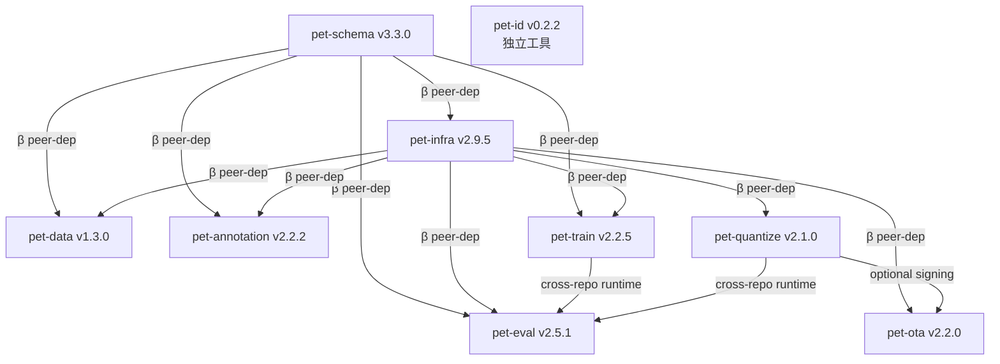

# Train-Pet-Pipeline — Monorepo 综合参考手册

> **本文档定位**：独立的导航百科，不替换 architecture.md / DEVELOPMENT_GUIDE / README。
> 读者可从本文档完整理解整个系统，再按章末链接深入各仓。
>
> 最后同步：matrix row `2026.11` / 2026-04-27 (F017-F027 retest cycle)
>
> **本文档 vs 其他文档：**
> | 文档 | 定位 |
> |------|------|
> | 本文档 | 导航 + 全局百科 + 关键代码细节（读一份了解全体） |
> | `./DEVELOPMENT_GUIDE.md` | 规范源（怎么做 / 禁止什么 / 约定） |
> | `./architecture/OVERVIEW.md` | 系统架构源（依赖关系 / 装序矩阵） |
> | 各仓 `docs/architecture.md` | 各仓模块设计 / 扩展点 / 已知复杂点 |

---

## 目录

- [§0. TL;DR](#0-tldr)
- [§1. 项目背景](#1-项目背景)
- [§2. 数据流与生命周期](#2-数据流与生命周期)
- [§3. 仓库详细介绍](#3-仓库详细介绍)
  - [3.1 pet-schema (v3.3.0)](#31-pet-schema-v330)
  - [3.2 pet-infra (v2.9.5)](#32-pet-infra-v295)
  - [3.3 pet-data (v1.3.0)](#33-pet-data-v130)
  - [3.4 pet-annotation (v2.2.2)](#34-pet-annotation-v222)
  - [3.5 pet-train (v2.2.5)](#35-pet-train-v225)
  - [3.6 pet-eval (v2.5.1)](#36-pet-eval-v251)
  - [3.7 pet-quantize (v2.1.0)](#37-pet-quantize-v210)
  - [3.8 pet-ota (v2.2.0)](#38-pet-ota-v220)
  - [3.9 pet-id (v0.2.2)](#39-pet-id-v022)
- [§4. Plugin 系统](#4-plugin-系统)
- [§5. 跨仓约定](#5-跨仓约定)
- [§6. CI / CD](#6-ci--cd)
- [§7. ecosystem-validation 历史](#7-ecosystem-validation-历史)
- [§8. 用法示例](#8-用法示例)
- [§9. 索引](#9-索引)

---

## §0. TL;DR

Train-Pet-Pipeline 是一个**智能宠物喂食器 AI 管线**——从摄像头帧和麦克风采样出发，训练在 RK3576 端侧芯片上运行的 VLM（视觉语言模型）+ 音频 CNN，实现宠物行为分析、健康异常检测、情绪识别，所有推理本地完成，数据不上云。

整个系统拆分为 **9 个独立 Git 仓库**，构成一条完整的 MLOps 流水线：`pet-schema`（契约）→ `pet-data`（采集/清洗）→ `pet-annotation`（VLM 打标）→ `pet-train`（SFT/DPO 训练）→ `pet-eval`（评估/门控）→ `pet-quantize`（量化/打包）→ `pet-ota`（OTA 分发）。`pet-infra` 是横切所有仓库的共享运行时基础设施，`pet-id` 是独立 CLI 工具。

**北极星**：P（Pluggability）/ F（Flexibility）/ E（Extensibility）/ C（Comparability）= **4/4/4/4**（2026-04-27 F017-F027 retest 验证）。

---

## §1. 项目背景

### 1.1 业务定位

公司原深耕**电子猫眼门锁**（瑞芯微生态 + 端侧 AI + ISP 调校），技术复用度约 70-80%，以此切入**宠物喂食器**赛道。

**核心产品**：内置固定俯角摄像头 + MEMS 麦克风的智能宠物喂食器/饮水机。

| 规格项 | 主力款 | 入门款 |
|--------|--------|--------|
| 主控芯片 | 瑞芯微 RK3576（6TOPs NPU） | 瑞芯微 RV1126B（3TOPs NPU） |
| RAM | 8GB LPDDR4x | 2GB |
| AI 能力 | 完整 VLM 推理（Qwen2-VL-2B LoRA） | 仅 YOLO 检测 |
| BOM 增量 | +¥107 | +¥88 |

**目标市场**：欧美众筹（Kickstarter），核心叙事："*All AI runs on your device, not our servers*"。Early Bird $89-99，正式 $129-149。

**产品目标**（P0 → P2 优先级）：

| 优先级 | 目标 | 技术含义 |
|--------|------|---------|
| P0 | 健康异常检测 | 高召回率；漏报代价 > 误报代价 |
| P1 | 情绪识别 | 多维度 0-1 评分 + 自然语言描述 |
| P2 | 长周期自然语言分析 | 进食趋势/周报，依赖云端 LLM 生成 |

### 1.2 9 仓拓扑

```
依赖方向（→ 表示下游消费上游）：

pet-schema ──────────────────────────────────────────────► (所有仓)
pet-infra  ──────────────────────────────────────────────► (下游7仓)

pet-schema → pet-data → pet-annotation → pet-train → pet-eval → pet-quantize → pet-ota
                                                              ▲
                                               pet-train ─────┘ (cross-repo runtime)
                                               pet-quantize ──┘ (cross-repo runtime)

pet-id ← 独立工具（spec §5.2），无 pet-* peer dep
```



> 详见 `./architecture/OVERVIEW.md` §2

### 1.3 北极星四维度（P/F/E/C）

四维度定义：**P**luggability（插件化程度）/ **F**lexibility（配置灵活性）/ **E**xtensibility（扩展容易程度）/ **C**omparability（实验可比性）。

当前状态（2026-04-27，F017-F027 retest 后）：**4/4/4/4**。

| 维度 | 体现 |
|------|------|
| Pluggability | 7-slot Registry + entry-point discovery；plugin 增删不改 pet-infra |
| Flexibility | ExperimentRecipe + Hydra defaults-list + overrides；params.yaml 全数值配置 |
| Extensibility | 新增 trainer/evaluator/converter 各 1 文件；pet-schema 4 范式表独立扩展 |
| Comparability | ClearML 单一追踪器 + ModelCard.metrics + replay cli + git_shas drift detection |

---

## §2. 数据流与生命周期

### 2.1 完整 Pipeline

```
原始数据 (摄像头帧 + 音频)
    │
    ▼ pet-data: ingest → dedup (phash) → quality_filter → anomaly_scoring
    │
    ▼ pet-annotation: VLM 打标 (4 范式) → DPO pair 生成 → export JSONL
    │
    ├─► SFT JSONL (ShareGPTSFTSample) ──► pet-train: LLaMA-Factory SFT (LoRA)
    │                                           │
    └─► DPO JSONL (DPOSample) ──────────► pet-train: LLaMA-Factory DPO
                                                │
    音频 WAV ────────────────────────────► pet-train: PANNs audio CNN
                                                │
                                                ▼
                                     ModelCard (checkpoint_uri + metrics + git_shas)
                                                │
                                                ▼
                                      pet-eval: VLM / Audio / Quantized 评估
                                           8 metric plugins + gate_tier
                                                │
                                         gate_status = passed?
                                           yes ▼      no → 不进下一步
                                      pet-quantize: RKLLM W4A16 + RKNN FP16
                                           + 签名打包 tarball
                                                │
                                                ▼
                                      pet-ota: manifest 验证 → delta patch
                                           → canary rollout → 设备 OTA
```

### 2.2 ModelCard 在各 Stage 的演化

`pet_schema.ModelCard` 是全链的"模型身份证"，在每个 stage 原地追加字段，最终随 OTA 制品一同上线设备：

| Stage | 新增/修改字段 |
|-------|-------------|
| pet-train（SFT/DPO） | `id`, `checkpoint_uri`, `metrics` (train_loss/DPO rewards), `hydra_config_sha`, `git_shas`, `clearml_task_id`, `resolved_config_uri` (F021 fix) |
| pet-train（audio） | `task="audio_classification"`, `modality="audio"`, `checkpoint_uri` |
| pet-eval | `metrics` (schema_compliance / anomaly_recall / mood_correlation / ...), `gate_status ∈ {passed,failed}`, `task` |
| pet-quantize | `edge_artifacts[]` (format / target_hardware / sha256 / artifact_uri), `quant_config` |
| pet-ota | `deployment_history[]` (DeploymentStatus: state / backend / manifest_uri / deployed_at) |

### 2.3 git_shas + Replay 可重现性（F012/F021/F024 闭环）

**三步闭环**，全部在 2026-04-27 rental 期间验证通过：

1. **F012 fix**（pet-infra v2.9.x 之前）：`pet_run()` 现在在每个 stage 执行后将 `resolved_config` dump 到磁盘并填充 `card.resolved_config_uri`（`orchestrator/runner.py`）。
2. **F021 fix**（pet-infra v2.9.3）：`resolved_config_uri` 不再为 None，replay 可以真正找到配置文件。
3. **F024 fix**（pet-infra v2.9.3 + pet-train v2.2.5）：`_current_git_shas()` 使用 `parents[3]` 正确定位 monorepo 根目录；`pet_train.lineage.collect_git_shas()` 使用 hyphenated key（`pet-train`），与 replay 侧 key 约定对齐。

```bash
# Replay 验证流程（F024 验证）
pet replay --card model_cards/<card_id>.json --strict
# → 若 pet-train HEAD 已改动，输出 drift warning
# → 若 SHA 完全一致，输出 "No drift detected, replaying..."
```

**Comparability 维度 4/5 真兑现**：训练 run 的 resolved config + git shas 持久化到 `./model_cards/`，replay 时可从任意历史 commit 确定性重现。

---

## §3. 仓库详细介绍

### 3.1 pet-schema (v3.3.0)

**职责**：整个生态的**契约根节点**（chain head）——定义所有跨仓共享的数据类型、验证规则和数据库迁移文件。变更触发全链 CI。

**当前版本（matrix 2026.11）**：`v3.3.0`

#### 目录树

```
src/pet_schema/
├── __init__.py          ← 公开 API re-exports（所有下游通过此处导入）
├── version.py           ← SCHEMA_VERSION 常量（与 pyproject.toml parity-checked）
├── enums.py             ← 共享枚举（Modality, PetSpecies, BowlType, SourceType...）
├── samples.py           ← BaseSample + VisionSample/AudioSample/SensorSample
│                          Sample = Annotated[..., Discriminator("modality")]
├── models.py            ← PetFeederEvent（legacy v1，保留供 pet-eval）
├── annotations.py       ← BaseAnnotation + 4 discriminator 变体 + DpoPair
├── model_card.py        ← ModelCard / ResourceSpec / QuantConfig / EdgeArtifact
│                          / HardwareValidation / DeploymentStatus
├── recipe.py            ← ExperimentRecipe / RecipeStage / ArtifactRef / AblationAxis
│                          + to_dag()（nx.DiGraph DAG + 环检测）
├── configs.py           ← Hydra 结构化配置（TrainerConfig / EvaluatorConfig ...）
├── metric.py            ← MetricResult / GateCheck / EvaluationReport
├── validator.py         ← validate_output()：VLM JSON 语义校验
├── renderer.py          ← render_prompt()：Jinja2 prompt 渲染
├── adapters/hf_features.py ← Pydantic → HuggingFace datasets.Features
└── versions/v1.0/schema.json ← VLM 输出 JSON Schema
```

#### 关键 class/function

| Entry | 签名 | 摘要 | 调用方 |
|-------|------|------|--------|
| `VisionSample` | `class VisionSample(BaseSample)` | 视觉帧样本，`modality="vision"`，含 `image_path`, `width`, `height`, `source_info` | pet-data → adapter.py 构造；pet-annotation 读取 |
| `AudioSample` | `class AudioSample(BaseSample)` | 音频样本，`modality="audio"`，含 `audio_path`, `sample_rate`, `duration_s` | pet-data 音频 pipeline |
| `BaseAnnotation` | `class BaseAnnotation(BaseModel, extra="forbid")` | 4 范式基类，`annotator_type` 是 discriminator 字段；`extra="forbid"` 防意外字段 | pet-annotation store.py 写入；pet-schema annotations.py 定义 |
| `DpoPair` | `class DpoPair(BaseModel, extra="forbid")` | Preference 对，含 `chosen/rejected/target_id/modality` | pet-annotation export/sft_dpo.py 导出 |
| `ModelCard` | `class ModelCard(BaseModel)` | 全链模型身份证，含 `id/checkpoint_uri/metrics/git_shas/gate_status/edge_artifacts[]` | 全链所有仓 |
| `ExperimentRecipe` | `class ExperimentRecipe(BaseModel)` | 实验配方，含 `stages[]/variations[]/ablation_axes[]`；`to_dag()` 构造 DAG | pet-infra compose.py 解析；orchestrator 驱动 |
| `GateCheck.evaluate()` | `def evaluate(self, actual: float) -> bool` | 比较 actual 与 threshold（`ge/le/eq`），eq 用 `abs_tol=1e-6` | pet-eval apply_gate |
| `validate_output()` | `def validate_output(json_str: str, version: str = "1.0") -> list[str]` | VLM 输出 JSON Schema + 业务规则双重校验，返回 warning 列表 | pet-eval vlm_inference.py |
| `render_prompt()` | `def render_prompt(template_name: str, context: dict) -> str` | Jinja2 渲染标准 prompt（训练/推理共同来源，防 prompt 漂移） | pet-annotation + pet-eval 双侧 |
| `ShareGPTSFTSample` | `class ShareGPTSFTSample(BaseModel)` | LLaMA-Factory ShareGPT 格式 SFT 样本，含 `conversations[]`, `images[]` (F001 fix) | pet-annotation export → pet-train validate |

**关键设计决策**：

- `RecipeStage.inputs`（类型绑定）和 `depends_on`（调度约束）双字段刻意分离——合并会让 schema 渗入 orchestration 逻辑。
- `ResourceSpec`（trainer 预飞接口）和 `ModelCard`（训练后描述）刻意不合并——生命周期完全不同。
- `PetFeederEvent` legacy re-export 保留——pet-eval 的 `constrained.py` 仍在使用，移除是破坏性操作（Phase 5+ 清理）。

#### 用法

```python
from pet_schema import VisionSample, ModelCard, ExperimentRecipe, validate_output

# 构造一个视觉样本
sample = VisionSample(
    image_path="/data/frames/cat_001.jpg",
    width=1920, height=1080,
    source_info={"source_type": "device", "ingester": "local_dir"}
)

# 从配方文件构造实验图
recipe = ExperimentRecipe.model_validate_json(open("recipe.yaml").read())
dag = recipe.to_dag()  # nx.DiGraph

# 验证 VLM 输出
warnings = validate_output('{"pet_present": true, "pet": {...}}')
```

#### 关键 Finding Fix

- **F001 (STRUCTURAL)**：`ShareGPTSFTSample.images` 字段被意外删除 → pet-train SFT 无法加载多模态数据。v3.3.0 恢复。参见 [`F001-sharegpt-sft-missing-images-field.md`](../../../pet-infra/docs/ecosystem-validation/2026-04-25-findings/F001-sharegpt-sft-missing-images-field.md)

详见 [`../../../pet-schema/docs/architecture.md`](../../../pet-schema/docs/architecture.md)

---

### 3.2 pet-infra (v2.9.5)

**职责**：整个生态的**共享运行时基础设施**——Registry、Plugin Discovery、Config 组合、CLI、Orchestrator、Storage、ExperimentLogger（ClearML）、Replay。下游 7 个仓库将 pet-infra 作为 β peer-dep，通过注册表和 entry-point 把自身 plugin 注册到 pet-infra 的 Registry。

**当前版本（matrix 2026.11）**：`v2.9.5`

#### 目录树

```
src/pet_infra/
├── __init__.py              ← β peer-dep guard (ImportError) + __version__
├── _register.py             ← 本仓 plugin 注册（storage / noop / hydra）
├── registry.py              ← 7 个全局 Registry 对象
├── compose.py               ← compose_recipe() 规范入口（唯一来源）
├── plugins/
│   └── discover.py          ← entry-point discovery
├── orchestrator/
│   ├── hooks.py             ← BaseStageRunner + 5 concrete runners + STAGE_RUNNERS
│   ├── runner.py            ← pet_run() — 串行执行 stages（F021/F027 fix）
│   └── stage_executor.py    ← 单 stage 执行，分发到 STAGE_RUNNERS
├── experiment_logger/
│   ├── base.py              ← ExperimentLogger ABC
│   ├── clearml_logger.py    ← ClearML 实现（W&B 已于 Phase 4 完全移除）
│   └── null_logger.py       ← 离线/测试无操作实现
├── storage/
│   ├── local.py             ← LocalStorage (@STORAGE.register_module "local"/"file")
│   ├── s3.py                ← S3Storage
│   └── http.py              ← HTTPStorage
├── cli.py                   ← click 入口 + subcommand group
├── cli_commands/            ← run / replay / sweep 子命令
├── replay.py                ← 从 ModelCard 确定性重放（F024 fix: parents[3]）
├── launcher.py              ← multirun / variations launcher
└── retry.py / logging.py / store.py / device.py
```

#### 关键 class/function

| Entry | 签名 | 摘要 | 调用方 |
|-------|------|------|--------|
| `TRAINERS` 等 7 个 Registry | `TRAINERS = Registry("trainer", scope="pet_infra")` | 7 个全局注册表：TRAINERS / EVALUATORS / CONVERTERS / METRICS / DATASETS / STORAGE / OTA | 全链 plugin 注册 |
| `compose_recipe()` | `def compose_recipe(path: str \| Path, overrides: Sequence[str] = ()) -> tuple[ExperimentRecipe, dict, str]` | 返回 `(validated_recipe, resolved_dict, config_sha256)`；Hydra defaults-list 递归解析 | CLI `pet run`；各仓 test fixture |
| `discover_plugins()` | `def discover_plugins(required: Iterable[str] \| None = None) -> dict[str, list[str]]` | 扫描 `pet_infra.plugins` entry-point group，加载所有 `register_all`；返回各 registry 已注册名 summary | CLI `pet run`（F009 fix：run 前自动调用）|
| `pet_run()` | `def pet_run(recipe: ExperimentRecipe, resolved_dict: dict, logger: ExperimentLogger) -> list[ModelCard]` | 串行执行 recipe 所有 stage；F021 fix：每 stage 后 dump resolved_config + populate card.resolved_config_uri；F027 fix：调用 `logger.log_metrics(card.metrics)` | CLI `pet run` |
| `BaseStageRunner.run()` | `def run(self, stage: RecipeStage, input_card: ModelCard, recipe: ExperimentRecipe) -> ModelCard` | 从 registry 按名查插件 → 实例化 → 调用 `.run(input_card, recipe)` | `stage_executor.execute_stage` |
| `ClearMLLogger` | `class ClearMLLogger(ExperimentLogger)` | ClearML 实验追踪器，`mode ∈ {offline,saas,self_hosted}`，`on_unavailable ∈ {strict,fallback_null,retry}` | `pet_run()` |
| `replay.check_git_drift()` | `def check_git_drift(card: ModelCard) -> list[str]` | 对比 card.git_shas 与当前 HEAD；F024 fix：使用 `_current_git_shas()` parents[3] + hyphenated key | CLI `pet replay` |
| `LocalStorage` | `@STORAGE.register_module("local")` | 本地文件存储；`upload(local, remote) / download(remote, local)` | pet-ota LocalBackendPlugin |

**关键设计决策**：

- 7 个 Registry 用 mmengine.Registry——线程安全 `@register_module` + `module_dict` 查找，但不允许重复注册同名 key（`_register.py` 中用 `if key not in registry.module_dict` 守卫）。
- `compose_recipe()` 是唯一入口（Phase 3B 合并，旧 `recipe/compose.py` 遗留目录不再持有逻辑）。
- `discover_plugins()` 懒加载，不在 import time 自动触发——CI 的 `plugin-discovery.yml` 显式调用验证。

#### 用法

```bash
# 运行一个实验 recipe
pet run --recipe recipes/sft_qwen2vl.yaml \
        --overrides "trainer.learning_rate=1e-4"

# 从 ModelCard replay
pet replay --card model_cards/abc123.json

# Sweep 参数
pet sweep --recipe recipes/ablation.yaml \
          --axis "trainer.learning_rate=[1e-4,5e-5]"
```

```python
from pet_infra import compose_recipe
from pet_infra.plugins.discover import discover_plugins
from pet_infra.orchestrator.runner import pet_run
from pet_infra.experiment_logger.clearml_logger import ClearMLLogger

discover_plugins()
recipe, resolved, sha = compose_recipe("recipes/sft_qwen2vl.yaml")
logger = ClearMLLogger(mode="offline")
cards = pet_run(recipe, resolved, logger)
```

#### 关键 Finding Fix

- **F009 (HIGH)**：`pet run` 不自动 discover plugins → 所有 trainer plugin 不可见。Fix: cli_commands/run.py 在 `pet_run()` 前调用 `discover_plugins()`。
- **F012 (HIGH)**：`pet_run()` 不持久化 ModelCard → replay 无法工作。Fix: runner.py 写 `./model_cards/<id>.json`。
- **F021 (HIGH)**：`resolved_config_uri` 始终 None → replay fail-fast。Fix: runner.py dump resolved dict + populate URI/sha。验证：replay positive round-trip + tampered-config sha-mismatch 双面测试通过。
- **F024 (STRUCTURAL)**：`_current_git_shas()` parents off-by-one（旧 `parents[4]`）→ git drift 检测瘫痪。Fix: `parents[3]` + hyphenated key 统一。
- **F027 (STRUCTURAL)**：`runner.py` 从未调用 `experiment_logger.log_metrics()` → ClearML dashboard 无 scalar。Fix: 每 stage 完成后调用。

详见 [`./architecture.md`](./architecture.md)

---

### 3.3 pet-data (v1.3.0)

**职责**：pipeline 源头——数据采集 / 清洗 / 增强 / 弱监督。从 YouTube / 社区 / 学术数据集 / 设备直拍等 7 类来源 ingest，经 dedup + quality filter 后存入 SQLite，下游通过 DATASETS plugin 或直接读 SQLite 消费。

**当前版本（matrix 2026.11）**：`v1.3.0`

#### 目录树

```
src/pet_data/
├── sources/             ← 7 个 ingester（BaseSource 子类）
│   ├── base.py          ← BaseSource + ingester_name + default_provenance ClassVar
│   ├── youtube.py       ← YouTubeIngester (provenance=youtube)
│   ├── community.py     ← CommunityIngester (provenance=community)
│   ├── selfshot.py      ← SelfshotIngester (provenance=community)
│   ├── oxford_pet.py    ← OxfordPetIngester (provenance=academic_dataset)
│   ├── coco_pet.py      ← CocoIngester (provenance=academic_dataset)
│   ├── hospital.py      ← HospitalIngester (provenance=device)
│   └── local_dir.py     ← LocalDirIngester (provenance=device)
├── storage/
│   ├── store.py         ← FrameStore / AudioStore — 唯一 DB 写入口
│   ├── adapter.py       ← DB row → Pydantic VisionSample/AudioSample
│   └── migrations/      ← Alembic style 迁移 001-004（已提交不可改）
├── processing/          ← quality_filter + dedup (phash)
├── augmentation/        ← traditional_aug + video_gen + distortion_filter
├── datasets/            ← DATASETS plugin（为 pet-infra DATASETS registry 注册）
├── weak_supervision/    ← autoencoder anomaly scoring
└── _register.py         ← β peer-dep fail-fast guard + plugin entry point
```

#### 关键 class/function

| Entry | 签名 | 摘要 | 调用方 |
|-------|------|------|--------|
| `BaseSource.ingest()` | `def ingest(self, params: dict) -> IngestReport` | template method：download → extract → dedup → insert；子类实现 `download()` + `validate_metadata()` | CLI `pet_data ingest` |
| `BaseSource.default_provenance` | `ClassVar[SourceType]` | 每类 ingester 固定的 provenance 类别（必须是 6 literals 之一）；Phase 3 新增概念分离（F 修 finding） | BaseSource 子类 |
| `FrameStore.insert_frame()` | `def insert_frame(self, record: FrameRecord) -> str` | 唯一 DB 写入口；`__init__` 自动跑 `_apply_subsequent_migrations()`（schema up-to-date 保证）| 所有 ingester |
| `FrameStore.update_anomaly()` | `def update_anomaly(self, frame_id: str, score: float) -> None` | 弱监督 autoencoder 评分写回 DB | `weak_supervision/` |
| `frame_row_to_vision_sample()` | `def frame_row_to_vision_sample(row: dict) -> VisionSample` | DB row → pet-schema VisionSample；映射 `row["source"]` → `ingester`，`row["provenance_type"]` → `source_type` | DATASETS plugin |
| `migration 004` | `upgrade() / downgrade()` | 添加 `provenance_type` 列；3 步：加列 → backfill → table rebuild with NOT NULL + CHECK 约束；幂等守护（duplicate column name catch）| `FrameStore.__init__` 自动触发 |

**关键设计决策**：

- `ingester_name`（实现标识，如 `"oxford_pet"`）和 `default_provenance`（来源类别，如 `"academic_dataset"`）Phase 3 正式分离为独立 ClassVar，修复 `ValidationError`（旧代码把 ingester_name 直接当 source_type 传给 pet-schema）。
- dataset plugin（`datasets/audio_clips.py` 等）允许直连 sqlite 只读——streaming 迭代性能权衡，无写路径不影响数据完整性。
- Alembic 风格迁移（不用 Alembic 框架），`FrameStore.__init__` 自动跑 `_apply_subsequent_migrations()`。

#### 用法

```bash
# 从本地目录 ingest
python -m pet_data.cli ingest \
    --source local_dir \
    --params params.yaml

# 输出: IngestReport(inserted=30, skipped=0, duplicates=0, errors=0)
```

```python
from pet_data.storage.store import FrameStore
from pet_data.storage.adapter import frame_row_to_vision_sample

store = FrameStore("/data/frames.db")
rows = store.list_frames(limit=100)
samples = [frame_row_to_vision_sample(r) for r in rows]
```

#### 关键 Finding Fix

- **ingester_name vs default_provenance 分离**：Phase 3 修复，将概念分离为 ClassVar，避免 `SourceType` ValidationError（7 个 ingester 旧代码传错类型）。

详见 [`../../../pet-data/docs/architecture.md`](../../../pet-data/docs/architecture.md)

---

### 3.4 pet-annotation (v2.2.2)

**职责**：4 范式打标引擎——将 pet-data 的原始帧转化为结构化标注，供 pet-train 消费。4 范式：LLM（VLM 打标）/ Classifier（本地分类器）/ Rule（确定性规则）/ Human（Label Studio 人工审核）。导出 SFT JSONL + DPO pair JSONL。

**当前版本（matrix 2026.11）**：`v2.2.2`

#### 目录树

```
src/pet_annotation/
├── teacher/
│   ├── orchestrator.py      ← async 4-paradigm dispatch loop
│   ├── provider.py          ← BaseProvider ABC
│   └── providers/
│       ├── openai_compat.py ← OpenAI-compatible（DashScope/OpenAI）
│       ├── vllm.py          ← vLLM provider
│       └── doubao.py        ← Doubao Vision provider（F004 fix）
├── classifiers/base.py      ← BaseClassifierAnnotator ABC
├── rules/base.py            ← BaseRuleAnnotator ABC
├── human_review/
│   ├── ls_auth.py           ← Label Studio session/token auth
│   └── ls_client.py         ← LS REST API（tenacity retry）
├── store.py                 ← AnnotationStore（4 范式表 + annotation_targets 状态机）
├── export/sft_dpo.py        ← JSONL 导出（SFT + DPO）for pet-train
├── dpo/validate_pairs.py    ← DPO pair schema 校验
├── datasets/                ← 4 个 DATASETS plugin（per 范式）
└── _register.py             ← β peer-dep fail-fast + plugin 注册
migrations/
├── 001-005_*.sql            ← 4 范式表 + annotation_targets 状态机（已提交不可改）
```

#### 关键 class/function

| Entry | 签名 | 摘要 | 调用方 |
|-------|------|------|--------|
| `AnnotationOrchestrator.run()` | `async def run(self) -> OrchestratorReport` | ingest → claim → 4 范式顺序执行（llm/classifier/rule/human）→ mark_done；`asyncio.Lock` 序列化写路径 | CLI `petannotation annotate` |
| `AnnotationStore.ingest_pending_from_petdata()` | `def ingest_pending_from_petdata(self, pet_data_db_path: str) -> int` | mode=ro URI 跨仓读 pet-data；INSERT OR IGNORE 幂等注册 pending targets | orchestrator run() |
| `AnnotationStore.claim_pending_targets()` | `def claim_pending_targets(self, annotator_id: str, batch_size: int) -> list[str]` | `BEGIN IMMEDIATE` 原子操作防 double-claim；返回 target_id 列表 | orchestrator paradigm runners |
| `export.sft_dpo.to_sft_samples()` | `def to_sft_samples(store: AnnotationStore, annotator_type: str) -> list[dict]` | 按范式导出 SFT JSONL rows（ShareGPTSFTSample 格式） | CLI `export --format sft` |
| `export.sft_dpo.to_dpo_pairs()` | `def to_dpo_pairs(store: AnnotationStore) -> list[dict]` | LLM 范式同 target 多 annotator → chosen/rejected pair；其余 3 范式自对 | CLI `export --format dpo` |
| `LSClient.submit_tasks()` | `def submit_tasks(self, tasks: list[dict]) -> list[int]` | 提交 batch 给 Label Studio；meta 携带 `target_id` 映射；tenacity retry 排除 4xx | human paradigm Phase A |
| `DoubaoProvider.annotate()` | `async def annotate(self, image_path: str, prompt: str) -> AnnotationResult` | Doubao Vision API via OAI-compat；F004 fix 新增（之前不在 Literal，配置解析拒收）| LLM paradigm |

**关键设计决策**：

- `annotation_targets` 表以 `(target_id, annotator_id)` 为复合主键——N 个 annotator 对同一 target 各自独立状态，互不干扰（D4：不跨模型 reconcile）。
- 跨仓读 pet-data：`sqlite3.connect("file:<path>?mode=ro", uri=True)` 强制只读（D1）；pet-annotation 维护自己独立的 SQLite，不写 pet-data（D2）。
- `asyncio.gather` 并发 batch + `asyncio.Lock` 序列化写——sqlite3.Connection 非协程安全，Lock 防止 INSERT/COMMIT 交错。

#### 用法

```bash
# 运行 4 范式打标
pet annotate --params params.yaml --pet-data-db /data/frames.db

# 导出 SFT JSONL
pet export --format sft --annotator-type llm --output sft_train.jsonl

# 导出 DPO pairs
pet export --format dpo --output dpo_train.jsonl
```

#### 关键 Finding Fix

- **F004 (HIGH)**：Doubao provider 注册但 `LLMAnnotatorConfig.provider` Literal 不接受 `"doubao"` → ValidationError。Fix: 加 `DoubaoProvider` + 扩展 Literal。参见 [`F004`](../ecosystem-validation/2026-04-25-findings/F004-doubao-provider-registered-but-not-in-config-literal.md)
- **F005 (HIGH)**：`storage_uri` 格式 `local:///path` 被直接 `open()` → 30/30 标注失败。Fix: `_resolve_image_path()` 解析 RFC 3986 URI scheme。参见 [`F005`](../ecosystem-validation/2026-04-25-findings/F005-pet-annotation-storage-uri-not-parsed.md)
- **F019 (HIGH)**：v2.2.1 `PET_SCHEMA_PIN` 未同步 F001 producer fix → CI 用旧 schema 构建 → `images=` 代码被意外删除。v2.2.2 恢复 + pin 升级到 v3.3.0。参见 [`F019`](../ecosystem-validation/2026-04-25-findings/F019-consumer-peer-dep-pin-lag-after-producer-fix.md)

详见 [`../../../pet-annotation/docs/architecture.md`](../../../pet-annotation/docs/architecture.md)

---

### 3.5 pet-train (v2.2.5)

**职责**：模型训练引擎——3 个 trainer plugin（LlamaFactory SFT / DPO / TinyTest）+ PANNs 音频 CNN。读 pet-annotation 导出的 JSONL，调 LLaMA-Factory 训练 VLM LoRA，发出 ModelCard。

**当前版本（matrix 2026.11）**：`v2.2.5`

#### 目录树

```
src/pet_train/
├── plugins/
│   ├── _register.py         ← 双 peer-dep guard（pet-schema first, pet-infra second）
│   ├── data_validation.py   ← F11 consumer-side JSONL 校验
│   ├── llamafactory_sft.py  ← @TRAINERS "llamafactory_sft"
│   ├── llamafactory_dpo.py  ← @TRAINERS "llamafactory_dpo"
│   └── tiny_test.py         ← @TRAINERS "tiny_test"（CPU smoke，< 2min）
├── audio/
│   ├── arch.py              ← MobileNetV2AudioSet（PANNs，num_classes=527 hardcoded）
│   ├── transforms.py        ← AudioTransform.from_params()（log-mel + SpecAugment）
│   └── inference.py         ← PANNsAudioInference（F008 fix：wraps panns_inference pkg）
├── lineage/
│   └── collect_git_shas.py  ← F024 fix：遍历 sibling 仓，返回 hyphenated key dict
└── __init__.py              ← __version__ = "2.2.5"
vendor/LLaMA-Factory/        ← v0.9.4 plain dir copy（Apache 2.0）
```

#### 关键 class/function

| Entry | 签名 | 摘要 | 调用方 |
|-------|------|------|--------|
| `LlamaFactorySFTTrainer.run()` | `def run(self, input_card: ModelCard, recipe: ExperimentRecipe) -> ModelCard` | 验证 JSONL → `_hydra_to_lf_args()` 映射配置 → `run_sft(args=dict)` → 读 all_results.json 填 metrics（F022 fix）→ 返回 ModelCard | pet-infra orchestrator |
| `LlamaFactoryDPOTrainer.run()` | `def run(self, input_card: ModelCard, recipe: ExperimentRecipe) -> ModelCard` | 同上 DPO；F023 fix：从 trainer_state.json log_history 倒序找最后含 rewards/* 的 entry → rewards/margins 进 ModelCard | pet-infra orchestrator |
| `validate_sft_jsonl()` | `def validate_sft_jsonl(path: Path) -> int` | 逐行 `ShareGPTSFTSample.model_validate_json()`；FileNotFoundError 或 ValueError with file:line context fail-fast | LlamaFactorySFTTrainer.run() |
| `validate_dpo_jsonl()` | `def validate_dpo_jsonl(path: Path) -> int` | 同上 DPOSample；consumer-side 双重校验（producer 侧 pet-annotation 也校验） | LlamaFactoryDPOTrainer.run() |
| `MobileNetV2AudioSet` | `class MobileNetV2AudioSet(nn.Module)` | PANNs MobileNetV2 AudioSet 527-class CNN；`from_params(params["audio"])` 构造（所有 6 个超参数从 params.yaml 读取）；`num_classes=527` hardcoded（AudioSet 架构常量）| pet-eval audio_evaluator 运行时 import |
| `PANNsAudioInference` | `class PANNsAudioInference` | F008 fix：包装官方 `panns_inference` 包（替代之前兼容性有问题的自定义 MobileNetV2）；`predict(audio_path) -> AudioPrediction` | pet-eval audio_evaluator |
| `AudioTransform.from_params()` | `classmethod from_params(cls, params: dict, **override) -> AudioTransform` | 从 params 读 6 个 key（sample_rate/n_mels/n_fft/hop_length/f_min/f_max）构造 log-mel transform；missing key → KeyError 故意 fail-fast | audio training pipeline |
| `lineage.collect_git_shas()` | `def collect_git_shas(monorepo_root: Path) -> dict[str, str]` | F024 fix：遍历 monorepo 根目录的 sibling 仓，返回 `{"pet-train": "<SHA>", "pet-schema": "<SHA>", ...}`（hyphenated key）| LlamaFactory wrappers |

**关键设计决策**：

- LLaMA-Factory 以 plain directory 方式 vendor（v0.9.4，Apache 2.0），不用 submodule——确保 `git clone` 后立即可用，无需 `git submodule update`。
- `run_sft` / `run_dpo` 在 `.run()` 内**懒导入**——LLaMA-Factory 依赖特定版本 transformers，懒导入防止单元测试环境因 import 失败整体崩溃。
- F022/F023 fix：metrics 从 `all_results.json` + `trainer_state.json::log_history` 两处读取，训练指标（train_loss / rewards/margins）真正进入 ModelCard。
- F025 fix：`checkpoint_uri = output_dir`（不加 `/adapter` 后缀），与 LLaMA-Factory 实际输出目录对齐（LF 不创建 adapter/ 子目录）。

#### 用法

```bash
make setup  # 安装 peer-deps + editable pet-train + vendor/LLaMA-Factory metrics extras
make test   # 46 tests

# 通过 pet-infra orchestrator 运行 SFT
pet run --recipe recipes/sft_qwen2vl.yaml
```

```python
from pet_train.plugins.data_validation import validate_sft_jsonl

n = validate_sft_jsonl(Path("sft_train.jsonl"))
print(f"Validated {n} SFT samples")
```

#### 关键 Finding Fix

- **F008 (STRUCTURAL)**：自定义 MobileNetV2 与 PANNs checkpoint 不兼容 → audio inference 崩溃。Fix: 新增 `PANNsAudioInference` 包装官方 `panns_inference` 包。
- **F011 (HIGH)**：LF wrappers 使用低层 API → metrics 丢失。Fix: 用 `run_exp(args=dict)` 高层接口。
- **F013 (HIGH)**：wrapper 硬编码 `finetuning_type=lora` → 全参数微调无法触发。Fix: 从配置读取 `finetuning_type`。
- **F022 (STRUCTURAL)**：train_loss 永远丢失（`all_results.json` 未读）。Fix: v2.2.4 读取并写入 ModelCard.metrics。验证：rental 确认 `train_loss=0.5181`。
- **F023 (HIGH)**：DPO rewards/margins 不在 `all_results.json`（在 `trainer_state.json::log_history`）。Fix: 倒序扫 log_history。验证：rental 确认 `rewards/margins=0.5325`。
- **F024 (STRUCTURAL)**：`collect_git_shas` 硬编码错误 key + pet-infra parents off-by-one。Fix: v2.2.5 lineage 模块 + hyphenated key。
- **F025 (STRUCTURAL)**：`checkpoint_uri` 指向不存在的 `output_dir/adapter` → 下游 FileNotFoundError。Fix: 去掉 `/adapter` 后缀。

详见 [`../../../pet-train/docs/architecture.md`](../../../pet-train/docs/architecture.md)

---

### 3.6 pet-eval (v2.5.1)

**职责**：评估管线——8 个 metric plugin + 6 个 evaluator plugin（3 个主要 + 3 个 rule-based cross-modal fusion）。被 pet-train（训练后评估）和 pet-quantize（量化后评估）共同调用。

**当前版本（matrix 2026.11）**：`v2.5.1`

#### 目录树

```
src/pet_eval/
└── plugins/
    ├── _register.py              ← 4层 peer-dep guard + 11 个 plugin 注册
    ├── gate.py                   ← apply_gate() — 阈值 min_*/max_* 约定
    ├── vlm_evaluator.py          ← @EVALUATORS "vlm_evaluator"（HF transformers + PEFT）
    ├── vlm_inference.py          ← run_inference / _load_model / _FALLBACK_OUTPUT
    ├── audio_evaluator.py        ← @EVALUATORS "audio_evaluator"（F026 fix: PANNs 默认）
    ├── quantized_vlm_evaluator.py← @EVALUATORS "quantized_vlm_evaluator"
    ├── fusion/
    │   ├── base.py               ← BaseFusionEvaluator（F014 fix: 实现 concrete run()）
    │   ├── single_modal.py       ← @EVALUATORS "single_modal_fusion"
    │   ├── and_gate.py           ← @EVALUATORS "and_gate_fusion"
    │   └── weighted.py           ← @EVALUATORS "weighted_fusion"
    └── metrics/
        ├── schema_compliance.py  ← @METRICS "schema_compliance"
        ├── anomaly_recall.py     ← @METRICS "anomaly_recall"
        ├── mood_correlation.py   ← @METRICS "mood_correlation"
        ├── narrative_quality.py  ← @METRICS "narrative_quality"（BERTScore）
        ├── latency.py            ← @METRICS "latency"（P50/P95/P99）
        ├── audio_accuracy.py     ← @METRICS "audio_accuracy"
        ├── kl_quantization.py    ← @METRICS "kl_quantization"
        └── calibration.py        ← @METRICS "calibration"（ECE，informational）
```

#### 关键 class/function

| Entry | 签名 | 摘要 | 调用方 |
|-------|------|------|--------|
| `apply_gate()` | `def apply_gate(metrics: dict[str, float], thresholds: dict[str, float]) -> GateResult` | `min_<metric>` → 低于失败；`max_<metric>` → 超过失败；missing metric 保守默认（0 for min_，+inf for max_）| 所有 evaluator plugin |
| `VLMEvaluator.run()` | `def run(self, input_card: ModelCard, recipe: ExperimentRecipe) -> ModelCard` | 加载 LoRA checkpoint（PEFT merge）→ run_inference → compute metrics → apply_gate → 返回更新 ModelCard | pet-infra orchestrator |
| `AudioEvaluator.run()` | `def run(self, input_card: ModelCard, recipe: ExperimentRecipe) -> ModelCard` | F026 fix：lazy import `pet_train.audio.inference.PANNsAudioInference`（cfg `inference_backend` 默认 `'panns'`，legacy MobileNetV2 opt-in）| pet-infra orchestrator |
| `BaseFusionEvaluator.run()` | `def run(self, input_card: ModelCard, recipe: ExperimentRecipe) -> ModelCard` | F014 fix：concrete run() 实现（之前是 abstract 导致实例化崩溃）；调用子类 `fuse(modality_scores)` | pet-infra orchestrator |
| `WeightedFusionEvaluator.fuse()` | `def fuse(self, modality_scores: dict[str, float]) -> float` | 加权平均多模态评分；weight 从 config yaml 读取 | BaseFusionEvaluator.run() |
| `run_inference()` | `def run_inference(model_path: str, gold_set_path: str, params: dict) -> list[str]` | 加载模型 → 对 gold set 每条样本生成 → 返回 raw output 列表；prompt 通过 `pet_schema.render_prompt()` 生成（保证 train/infer 一致性）| VLMEvaluator |
| `GateTier` | `class GateTier(Enum)` | v2.5.0 新增：`HARD / SOFT / INFO` 三档门控；`HARD` fail → pipeline halt；`SOFT` fail → warning only | 每个 metric plugin 声明自身 tier |

**关键设计决策**：

- 8 个 metric plugin 每个是纯函数 `compute_<name>` + registry adapter wrapper——一行 `@METRICS.register_module` 装饰即插即用。
- 3 个 fusion evaluator 接受 `**_` — 同一个 YAML config 满足 3 种策略的参数（ablation sweep 友好）。
- Learned fusion 明确排除（`feedback_no_learned_fusion`）——rule-based 足够当前业务需求。
- Phase 6 生态优化：`~418 LOC` 死代码清理（gate/report/constrained 三副包全删）。

#### 用法

```bash
make test  # 103 tests（含 3 fusion recipes + 3 evaluators mini-E2E）
# Mini-E2E:
pytest tests/recipes/test_fusion_recipe.py \
       tests/test_plugins/test_audio_evaluator.py -v
```

```python
from pet_eval.plugins.gate import apply_gate
result = apply_gate(
    metrics={"schema_compliance": 0.92, "anomaly_recall": 0.78},
    thresholds={"min_schema_compliance": 0.85, "min_anomaly_recall": 0.70}
)
print(result.passed, result.failed_checks)
```

#### 关键 Finding Fix

- **F014 (STRUCTURAL)**：`BaseFusionEvaluator` 无 concrete `run()` → 3 个 fusion evaluator 实例化立即崩溃。Fix: 实现 `run()`。
- **F026 (STRUCTURAL)**：`audio_evaluator` 仍 import 旧 broken `AudioInference`（不是 F008 fix 的 PANNs 版本）→ audio path 仍走坏类。Fix: v2.5.1 默认 `inference_backend='panns'`，lazy import `PANNsAudioInference`。

详见 [`../../../pet-eval/docs/architecture.md`](../../../pet-eval/docs/architecture.md)

---

### 3.7 pet-quantize (v2.1.0)

**职责**：量化 / 端侧转换 / 制品打包签名。3 类 plugin：4 个 CONVERTERS（VLM→RKLLM W4A16 / 音频 CNN→RKNN FP16 / ViT→RKNN FP16 / noop smoke）+ 3 个 DATASETS（calibration subset）+ 2 个 inference runner（PC simulation ↔ ADB on-device）。

**当前版本（matrix 2026.11）**：`v2.1.0`

#### 目录树

```
src/pet_quantize/
├── calibration/             ← per-modality data loaders + config validator
├── convert/                 ← SDK-bound wrapper（lazy import rknn/rkllm/transformers）
│   ├── convert_audio.py     ← PyTorch → ONNX → RKNN FP16
│   ├── convert_to_rkllm.py  ← HF weights + calib → RKLLM W4A16
│   └── export_vision_encoder.py ← HF weights → ONNX
├── inference/
│   ├── rknn_runner.py       ← RKNNRunner（PC sim ↔ ADB on-device）
│   └── rkllm_runner.py      ← RKLLMRunner（PC sim ↔ ADB；pet-eval 运行时 import 此处）
├── packaging/
│   ├── build_package.py     ← tarball + manifest.json（SHA-256）
│   ├── sign_package.py      ← 签名
│   └── verify_package.py    ← 验签（pet-ota lazy import 此处）
├── plugins/
│   ├── _register.py         ← delayed pet-infra guard + SDK-gated cluster 注册
│   ├── converters/          ← 4 个 @CONVERTERS plugin
│   └── datasets/            ← 3 个 @DATASETS plugin（content-addressable cache）
└── validate/                ← on-device pytest（rk3576 自托管 runner，默认 testpaths 排除）
```

#### 关键 class/function

| Entry | 签名 | 摘要 | 调用方 |
|-------|------|------|--------|
| `VLMRkllmW4A16Converter.run()` | `def run(self, input_card: ModelCard, recipe: ExperimentRecipe) -> ModelCard` | 读 calibration_batch_uri → lazy import rkllm.api → RKLLM W4A16 转换 → 返回 ModelCard with EdgeArtifact | pet-infra orchestrator |
| `AudioRknnFp16Converter.run()` | `def run(self, input_card: ModelCard, recipe: ExperimentRecipe) -> ModelCard` | PyTorch → ONNX → RKNN FP16；lazy import rknn.api | pet-infra orchestrator |
| `RKLLMRunner` | `class RKLLMRunner` | `init/generate/release` lifecycle；`target=None` PC simulation，`target="rk3576"` ADB on-device；`FileNotFoundError` 在 `__init__` 立即 fail-fast | pet-eval QuantizedVlmEvaluator（lazy import） |
| `RKNNRunner` | `class RKNNRunner` | 同上 RKNN pattern；dual-mode PC/ADB | pet-eval（未来使用）|
| `_register.py register_all()` | `def register_all() -> None` | delayed pet-infra guard（option X）→ always-available cluster（noop）→ RKNN-gated cluster（rknn.api try/except）→ RKLLM-gated cluster；`PET_ALLOW_MISSING_SDK=1` 跳过 SDK 门控 | pet-infra discover_plugins() |
| `build_package()` | `def build_package(artifacts_dir: Path, output_dir: Path, version: str) -> Path` | glob *.rknn/*.rkllm → 加 pet-schema prompt 文件 → manifest.json with SHA-256 → tarball | pet-ota |
| `VLMCalibrationSubset.run()` | `def run(...) -> ModelCard` | content-addressable cache（sha256(modality|source_uri|num_samples)[:16]）→ `.cache/calibration/<hash>.pt`；返回 ModelCard with calibration_batch_uri in intermediate_artifacts | orchestrator（在 Converter 之前跑）|

**关键设计决策**：

- SDK 门控（RKNN/RKLLM）在 `register_all()` 内 try/except，`PET_ALLOW_MISSING_SDK=1` 允许无 SDK 环境运行 CI。
- `validate/` 套件不在默认 `testpaths`，在自托管 `[self-hosted, rk3576]` runner 上跑（`quantize_validate.yml` workflow）——Phase 5 硬件接入后真触发。
- pet-schema 在 v2.1.0 仍是 α hardpin（`pyproject.dependencies` 中 `@v3.2.1`）——spec §5.1 #1 migration 到 β peer-dep 计划在后续 phase。

#### 用法

```python
# 通过 pet-infra orchestrator 运行量化（配方中声明 stage）
pet run --recipe recipes/quantize_qwen2vl.yaml

# 验证打包
from pet_quantize.packaging.verify_package import verify_package
verify_package("/artifacts/v1.2.0.tar.gz", "/keys/public.pem")
```

```bash
# On-device smoke（需 rk3576 设备，ADB 连接）
pytest src/pet_quantize/validate/ -v --device-id <adb-serial>
```

详见 [`../../../pet-quantize/docs/architecture.md`](../../../pet-quantize/docs/architecture.md)

---

### 3.8 pet-ota (v2.2.0)

**职责**：最后一公里制品发布和金丝雀灰度分发。3 个 OTA registry plugin（local/S3/HTTP）+ 5 状态金丝雀 FSM + delta patch（bsdiff4）+ manifest SHA-256 验证。

**当前版本（matrix 2026.11）**：`v2.2.0`

#### 目录树

```
src/pet_ota/
├── plugins/
│   ├── _register.py         ← delayed pet-infra guard（option X） + 3 backend 注册
│   └── backends/
│       ├── local.py         ← @OTA "local_backend"（filesystem shutil.copy2）
│       ├── s3.py            ← @OTA "s3_backend"（boto3 + STORAGE registry）
│       └── http.py          ← @OTA "http_backend"（PUT + bearer/basic/no-auth）
├── backend/
│   ├── base.py              ← OTABackend Protocol（stateful deployment）
│   └── local.py             ← LocalBackend（deployments/ + device_groups/ 状态机）
├── packaging/
│   ├── make_delta.py        ← bsdiff4 + tenacity retry（3 次，flaky IO 防护）
│   └── upload_artifact.py   ← manifest SHA-256 verify + lazy import pet_quantize 签名验证
├── release/
│   ├── canary_rollout.py    ← 5-state FSM + resume-from-state on crash
│   ├── check_gate.py        ← 5 gate checks（thresholds from params.release.*）
│   └── rollback.py          ← rollout 中止路径
└── monitoring/
    ├── alert.py             ← check-and-alert wrapper
    └── check_update_rate.py ← 设备更新率超时检测
```

#### 关键 class/function

| Entry | 签名 | 摘要 | 调用方 |
|-------|------|------|--------|
| `LocalBackendPlugin.run()` | `def run(self, input_card: ModelCard, recipe: ExperimentRecipe) -> ModelCard` | gate_status 守卫 → shutil.copy2 → manifest.json → 返回 ModelCard with DeploymentStatus | pet-infra orchestrator |
| `S3BackendPlugin.run()` | `def run(self, input_card: ModelCard, recipe: ExperimentRecipe) -> ModelCard` | 同上；boto3 put_object；STORAGE registry 解析 source URI | pet-infra orchestrator |
| `canary_rollout()` | `def canary_rollout(version: str, release_dir: Path, root_dir: Path, params_path: Path, device_simulator: Callable) -> str` | 5-state FSM（GATE_CHECK → CANARY_DEPLOYING → CANARY_OBSERVING → FULL_DEPLOYING → DONE）；crash resume；rollback 路径 | release CLI |
| `check_gate()` | `def check_gate(version: str, params: OTAParams) -> GateCheckResult` | 5 项检查：dpo_pairs ≥ `params.release.min_dpo_pairs`（默认 500）+ days_since_last_release ≥ `min_days`（默认 7）等；全从 params.yaml 读（Phase 8 finding ⑦ fix） | canary_rollout |
| `upload_artifact()` | `def upload_artifact(release_dir: Path, version: str, backend: OTABackend, public_key_path: str \| None) -> None` | ① SHA-256 验证 manifest；② lazy import `pet_quantize.packaging.verify_package`（soft fail on ImportError）；③ backend.upload | canary_rollout |
| `make_delta()` | `def make_delta(old_bytes: bytes, new_bytes: bytes) -> bytes` | bsdiff4.diff with `@retry(stop_after_attempt(3), wait_fixed(1))` — bsdiff4 大文件 IO/OOM flake 实测 | packaging |

**关键设计决策**：

- `pet_ota.backend.LocalBackend`（stateful deployment 后端）≠ `pet_ota.plugins.backends.LocalBackendPlugin`（OTA registry plugin）——前者是金丝雀 FSM 内部状态机，后者是 orchestrator 调用的 plugin。
- pet-quantize 在 `[signing]` extras 中 **no pin**（spec §5.1 #2）；`upload_artifact` lazy import with soft fail——签名可选。
- bsdiff4 retry 不是防御性 slop——实测 3 次来自真实 IO/OOM 边界条件。

#### 用法

```bash
# 通过 orchestrator OTA 发布
pet run --recipe recipes/ota_deploy.yaml

# 金丝雀灰度发布
python -m pet_ota.release.canary_rollout \
    --version 1.2.0 \
    --release-dir /artifacts/v1.2.0 \
    --root-dir /ota_root \
    --params params.yaml
```

详见 [`../../../pet-ota/docs/architecture.md`](../../../pet-ota/docs/architecture.md)

---

### 3.9 pet-id (v0.2.2)

**职责**：**独立 CLI 工具**（spec §5.2），用于宠物身份注册与识别（PetCard registry）。刻意不依赖任何 `pet-*` 包——通过 `compatibility_matrix.yaml` 参与生态版本对齐，但无 peer-dep install order，无 plugin entry point，无 registry 注册。

**当前版本（matrix 2026.11）**：`v0.2.2`

#### 目录树

```
src/
├── purrai_core/             ← 算法核心（从 pet-demo/core 引导）
│   ├── config.py            ← Config dataclass + load_config(params.yaml)
│   ├── types.py             ← BBox / Detection 等基础类型
│   ├── interfaces/          ← typing.Protocol（Detector/ReID/Tracker/Pose/Narrative）
│   ├── backends/            ← 具体实现（YOLOv10 / OSNet / ByteTrack / MMPose / Qwen2VL）
│   ├── pipelines/full_pipeline.py ← 组合 detector → tracker → re-id → pose → narrative
│   └── utils/               ← video_io + logging + retry
└── pet_id_registry/         ← CLI + registry 层
    ├── card.py              ← PetCard + RegisteredView + compute_pet_id()
    ├── library.py           ← 磁盘 CRUD + identify（cosine similarity）
    ├── enroll.py            ← 照片/目录/视频注册 pipeline
    ├── cli.py               ← petid Click group（register/identify/list/show/delete）
    └── backends/osnet_embedder.py ← OSNetReid → Embedder Protocol adapter
params.yaml / params.cpu.yaml / params.mps.yaml ← 多硬件 profile
```

#### 关键 class/function

| Entry | 签名 | 摘要 | 调用方 |
|-------|------|------|--------|
| `PetCard` | `class PetCard(BaseModel, extra="forbid")` | 宠物身份卡，含 `pet_id/name/species/cover_photo_uri/views[](min_length=1)/schema_version` + 可选人口统计字段 | library.save/load；CLI show |
| `compute_pet_id()` | `def compute_pet_id(embedding: np.ndarray) -> str` | 断言 L2 norm ≈ 1.0（atol=1e-3）→ contiguous LE float32 → sha256[:8]；content-addressed ID | enroll pipeline |
| `Library.identify()` | `def identify(self, query_embedding: np.ndarray, threshold: float) -> IdentifyResult \| None` | 遍历所有注册 pet_id，计算 max cosine sim across all views；高于 threshold 返回最优；否则 None | `petid identify` CLI |
| `enroll_photos()` | `def enroll_photos(image_paths: list[Path], name: str, species: str, detector: Detector, embedder: Embedder, library: Library, ...) -> PetCard` | 检测最大 bbox → embed → compute_pet_id → 构造 PetCard → library.save | `petid register` |
| `enroll_video()` | `def enroll_video(video_path: Path, ..., fps_sample: float, max_views: int) -> PetCard` | 按 fps_sample 采样帧（上限 max_views）→ 调 enroll_photos | `petid register --video` |
| Detector Protocol | `class Detector(Protocol)` | `detect(image: np.ndarray) -> list[Detection]`；backends 结构化满足（无需继承） | purrai_core.pipelines |
| Embedder Protocol | `class Embedder(Protocol)` | `embed(crop: np.ndarray) -> np.ndarray`（L2 normalized float32）| Library.identify |

**关键设计决策**：

- **零 pet-* 依赖**（spec §5.2）：`pet_id_registry` 只依赖 `purrai_core` + 第三方 PyPI。不注册为 pet-infra plugin，不消费 ModelCard，不依赖 peer-dep install order。
- `compute_pet_id` 的 L2 norm 断言：非可选设计——若 embedding 未 normalize，content-addressed ID 会因浮点值变化而漂移（同一只宠物跨设备 ID 不一致）。
- CLI backend 懒导入（`build_detector()`/`build_embedder()`）——`petid list` 或 `petid delete` 不触发 ultralytics + torchreid 导入。
- Phase 9 首次 CI onboarding：新增 `ci.yml` + `no-wandb-residue.yml`，v0.2.0 起。
- v0.2.2（F018 fix）：pyproject.toml version bump 与 release tag 对齐（`importlib.metadata.version("pet-id")` 正确返回 `"0.2.2"`）。

#### 用法

```bash
# 注册一只宠物
petid register /photos/luna/ --name Luna --species cat

# 识别
petid identify /photos/unknown.jpg

# 列出所有已注册宠物
petid list

# JSON 输出
petid identify /photos/unknown.jpg --json
```

#### 关键 Finding Fix

- **F015 (MEDIUM)**：`make test` 在缺少可选 extras 时失败（non-graceful ImportError）。Fix: 加 `pytest.importorskip()` for optional backends。
- **F018 (STRUCTURAL)**：release tag `v0.2.1` 发出去时 pyproject.toml 未 bump → `importlib.metadata.version()` 返回旧版本。Fix: v0.2.2 + `release-version-consistency.yml` guard。

详见 [`../../../pet-id/docs/architecture.md`](../../../pet-id/docs/architecture.md)

---

## §4. Plugin 系统

### 4.1 7 个注册表

pet-infra 定义 7 个 mmengine.Registry 全局对象（`src/pet_infra/registry.py`）：

| 注册表 | 键名 | 注册者 | 对应 StageRunner |
|--------|------|--------|-----------------|
| `TRAINERS` | `"llamafactory_sft"`, `"llamafactory_dpo"`, `"tiny_test"` | pet-train | `TrainerStageRunner` |
| `EVALUATORS` | `"vlm_evaluator"`, `"audio_evaluator"`, `"quantized_vlm_evaluator"`, `"single_modal_fusion"`, `"and_gate_fusion"`, `"weighted_fusion"` | pet-eval | `EvaluatorStageRunner` |
| `CONVERTERS` | `"noop_converter"`, `"vlm_rkllm_w4a16"`, `"audio_rknn_fp16"`, `"vision_rknn_fp16"` | pet-quantize | `ConverterStageRunner` |
| `METRICS` | `"schema_compliance"`, `"anomaly_recall"`, `"mood_correlation"`, `"narrative_quality"`, `"latency"`, `"audio_accuracy"`, `"kl_quantization"`, `"calibration"` | pet-eval | （被 evaluator 调用，不直接对应 StageRunner）|
| `DATASETS` | `"vlm_calibration_subset"`, `"vision_calibration_subset"`, `"audio_calibration_subset"`, `"pet_annotation.llm"`, `"pet_annotation.classifier"`, ... | pet-quantize + pet-annotation | `DatasetStageRunner` |
| `STORAGE` | `"local"`, `"file"`, `"s3"`, `"http"` | pet-infra | （被 OTA/Storage plugin 内部使用）|
| `OTA` | `"local_backend"`, `"s3_backend"`, `"http_backend"` | pet-ota | `OtaStageRunner` |

### 4.2 entry-point group `pet_infra.plugins`

每个下游仓在 `pyproject.toml` 声明：

```toml
[project.entry-points."pet_infra.plugins"]
pet_train = "pet_train._register:register_all"
# pet_eval = "pet_eval.plugins._register:register_all"
# pet_quantize = "pet_quantize.plugins._register:register_all"
# pet_ota = "pet_ota.plugins._register:register_all"
# pet_annotation = "pet_annotation._register:register_all"
```

### 4.3 `discover_plugins()` 流程

```
pet-infra cli.py
    │
    ▼ discover_plugins()  [src/pet_infra/plugins/discover.py]
    │
    ├─ importlib.metadata.entry_points(group="pet_infra.plugins")
    │      → 返回所有已安装仓库的 ep 对象列表
    │
    ├─ for ep in entry_points:
    │      callable = ep.load()          # 通常是 register_all 函数
    │      callable()                    # 副作用：填充 7 个 Registry
    │
    └─ return {registry_name: [registered_keys...]}

# F009 fix：pet run 命令在 pet_run() 前自动调用 discover_plugins()
```

### 4.4 每仓 `_register.py` 模式

所有仓的 `_register.py` 遵循统一模式（DEV_GUIDE §11.3）：

```python
# Mode B: delayed fail-fast guard（在 register_all() 内，非 import time）
def register_all() -> None:
    # Step 1: peer-dep guard
    try:
        import pet_schema as _ps
    except ImportError as e:
        raise RuntimeError(
            "pet-train requires pet-schema. Install via:\n"
            "pip install 'pet-schema @ git+https://github.com/..."
        ) from e
    try:
        import pet_infra as _pi
    except ImportError as e:
        raise RuntimeError("pet-train requires pet-infra...") from e

    # Step 2: 导入 plugin 模块（副作用：@register_module 装饰器注册）
    from pet_infra.registry import TRAINERS
    if "llamafactory_sft" not in TRAINERS.module_dict:
        from pet_train.plugins import llamafactory_sft  # noqa: F401
    if "llamafactory_dpo" not in TRAINERS.module_dict:
        from pet_train.plugins import llamafactory_dpo  # noqa: F401
    if "tiny_test" not in TRAINERS.module_dict:
        from pet_train.plugins import tiny_test  # noqa: F401
```

**pet-infra 本身**的 guard 在 `__init__.py` 顶部用 `ImportError`（模块 import 时立即失败，非 register_all 内）。

### 4.5 mmengine Registry 限制

mmengine.Registry 使用内部 `module_dict: dict[str, type]` 存储注册项。

**注意**：mmengine dot-key 语法（`"namespace.classname"`）是 Config 系统的特性，直接用 `Registry.get()` 查询时需使用注册时的 **原始 key**（如 `"llamafactory_sft"`），不能用 dot notation。测试和 CI 的 assert 要注意这一点。

---

## §5. 跨仓约定

### 5.1 β peer-dep style（DEV_GUIDE §11）

Python 无原生 peer-dep 概念，项目通过以下约定模拟（2026-04-23 决策）：

- **pet-schema + pet-infra 均为 peer-dep**：下游 6 仓的 `pyproject.toml [project.dependencies]` 不声明这两个包。
- **compatibility_matrix.yaml 是唯一版本真理源**：`releases[-1]` 行是当前锁定版本。
- **安装者负责先装 peer**：CI 和开发者按装序先装 peer，再装目标仓（`--no-deps` 防重解析）。
- **fail-fast guard**：每仓 `_register.py` 在 `register_all()` 内检查 peer，缺失时 `RuntimeError` + 友好安装指令。

```
装序示例（pet-train，5 步）：
1. pip install 'pet-schema @ git+https://github.com/Train-Pet-Pipeline/pet-schema@v3.3.0'
2. pip install 'pet-infra @ git+https://github.com/Train-Pet-Pipeline/pet-infra@v2.9.5'
3. pip install -e . --no-deps              # editable，不重解析 peer
4. pip install -e ".[dev]"                 # dev extras
5. python -c "assert pet_schema.__version__ == '3.3.0' ..."  # version assert
```

pet-eval（最复杂，8 步）额外装 pet-train + pet-quantize 运行时 peer，最后 re-pin pet-schema + pet-infra（step 7）防被 transitive deps 覆盖。

### 5.2 compatibility_matrix.yaml 单一真理源

文件：`./compatibility_matrix.yaml`

- 每次 release 新增一行，历史行降级为 archive。
- `releases[-1]` 是当前最新行（2026.11）。
- 格式：无 `-rc` 后缀，仅 release 版本。
- `cross-repo-smoke-install.yml` 读取 `releases[-1]` 行，验证所有仓可按矩阵顺序安装。

```yaml
# 2026.11 当前行（精简）
- release: "2026.11-eco-validation-fixes"
  pet_schema: "3.3.0"
  pet_infra: "2.9.5"    # F021/F024/F027 fixes
  pet_data: "1.3.0"
  pet_annotation: "2.2.2"  # F019 images field fix
  pet_train: "2.2.5"    # F022/F023/F024/F025 fixes
  pet_eval: "2.5.1"     # gate_tier + F026 PANNs default
  pet_quantize: "2.1.0"
  pet_ota: "2.2.0"
  pet_id: "0.2.2"       # F018 version bump
  rknn_toolkit2: "==2.0.0"
  rkllm_toolkit: "==1.2.0"
```

### 5.3 Release Flow

```
feature/* 或 fix/*  →  PR to dev  →  CI（lint + test + peer-dep-smoke）
                            │ merge（squash）
                            ▼
                           dev  →  集成验证（cross-repo smoke + 联调）
                            │ PR to main（release PR）
                            ▼
                          main  →  tag vX.Y.Z  →  sync dev（merge main → dev 防分叉）
```

**关键规则**：
- feature/* 直接 PR 到 main 是被禁止的。
- 禁止直接 push 到 dev 或 main（初始化阶段除外）。
- `dev → main` 要及时做（不让 dev 和 main 长期分叉，参见 `feedback_dev_main_divergence`）。
- 每次 `dev → main` squash merge 后，dev 落后 1 commit，下次 PR 前先 `merge main 回 dev`。

### 5.4 PR template §11.8 fixture-real checkbox

DEV_GUIDE §11.8（2026-04-27 F017-F027 retro 新增）：

> **Plugin-contract test 纪律：fixture-real 而非 mock-only**

所有 plugin contract 修改 PR 的 PR template 必须勾选：

- [ ] **fixture-real test included**：至少 1 个 test 使用真实文件 / 真实数据结构（非 Mock）验证主要路径。

这是对 F008/F011/F012/F014/F021/F022/F023/F024/F025/F026 等 10 个 "shipped + unit-test mock + 没真 path 跑过" finding 的结构性防护。

---

## §6. CI / CD

### 6.1 `release-version-consistency.yml`（F018 防回归）

**触发**：9 个仓均有此 workflow；每次 PR + push 触发。

**作用**：检查 `pyproject.toml [project] version` == `src/<pkg>/__init__.py::__version__` == `importlib.metadata.version("<pkg>")`（三处一致性）。

F018（5 仓 7 个 release tag 发出时 pyproject.toml 未 bump）的结构性修复。

### 6.2 `cross-repo-smoke-install.yml`（pet-infra 专属）

**触发**：`compatibility_matrix.yaml` 变更（push to dev/main）+ `workflow_dispatch`。

**作用**：按 `releases[-1]` 行的版本号，对 7 个下游仓（除 pet-schema/pet-infra 自身）各自执行 install + `import <pkg>` assert。Phase 10 端到端验证：7/7 绿。

### 6.3 各仓 `ci.yml` + `peer-dep-smoke.yml`

| workflow | 触发 | 作用 |
|----------|------|------|
| `ci.yml`（所有仓）| push/PR + `repository_dispatch:schema-updated` | lint（ruff）+ type check（mypy）+ pytest；各仓按对应 N-step 装序 |
| `peer-dep-smoke.yml`（pet-data/annotation/train/eval/quantize/ota）| PR | 隔离环境验证本仓 install 装序契约（与 cross-repo smoke 互补） |
| `schema_guard.yml`（pet-schema）| push/PR to dev/main | merge to main 后派发 `repository_dispatch:schema-updated` 给 8 个下游仓 |
| `quantize_validate.yml`（pet-quantize）| `workflow_dispatch` | 自托管 rk3576 runner 上跑 `pytest src/pet_quantize/validate/ --device-id <serial>`（Phase 5 硬件接入后真触发）|

### 6.4 `no-wandb-residue.yml`（W&B 物理移除守卫）

W&B 于 Phase 4 P1-F（2026-04-22）完全移除，ClearML 是唯一实验追踪器。

**正向列表扫描**：允许的模块（ClearML / clearml-agent 等）在 allow-list 中；任何 `wandb`/`import wandb`/`WANDB_*` 出现在 `src/ tests/ .github/ params.yaml` 中（排除 vendor/）会导致 CI 失败。

**覆盖仓**：pet-infra（Phase 4 起）/ pet-train（Phase 5）/ pet-eval（Phase 6）/ pet-quantize（Phase 7）/ pet-ota（Phase 8）/ pet-id（Phase 9）。

---

## §7. ecosystem-validation 历史

### 7.1 验证背景

2026-04-25 在 AutoDL 租 RTX PRO 6000 Blackwell 96GB，进行完整 E2E 生态实战验证。分两个 session：

- **Session 1（2026-04-25，~4h）**：F001-F016，Phase 1 Critical Path E2E（ingest → label → SFT → DPO → audio → eval → OTA）
- **Session 2（2026-04-27，续租同卡）**：F017-F027，对 F012/F021/F024 等核心 finding 的深度验证 + 新 finding

### 7.2 Session 1：F001-F016（Part A）

| Finding | 级别 | 仓库 | 问题概述 | 修复 |
|---------|------|------|---------|------|
| F001 | STRUCTURAL | pet-schema | `ShareGPTSFTSample.images` 字段被意外删除 | v3.3.0 恢复 |
| F002 | LOW | 环境 | `.condarc` 废弃 tuna pkgs/free + libmamba → conda 崩溃 | rewrite .condarc |
| F003 | LOW | 环境 | `huggingface-cli` deprecated → 改 `hf` | 文档 fix |
| F004 | HIGH | pet-annotation | Doubao provider 注册但 Literal 不接受 `"doubao"` → ValidationError | DoubaoProvider + 扩展 Literal |
| F005 | HIGH | pet-annotation | storage_uri `local:///path` 不解析 → `open()` 失败 30/30 | `_resolve_image_path()` RFC 3986 解析 |
| F006 | LOW | 环境 | AutoDL HF xet protocol 401 | `HF_HUB_DISABLE_XET=1` workaround |
| F007 | LOW | 环境 | AutoDL 国际带宽 flaky | hf-mirror.com workaround（外部基础设施，不是代码 bug）|
| F008 | STRUCTURAL | pet-train | 自定义 MobileNetV2 与 PANNs checkpoint 不兼容 | 新增 `PANNsAudioInference` 包装 panns_inference |
| F009 | HIGH | pet-infra | `pet run` 不自动 discover plugins | cli 在 `pet_run()` 前调用 `discover_plugins()` |
| F010 | MEDIUM | pet-train | LLaMA-Factory submodule 未初始化 → import error | Makefile auto-init submodule |
| F011 | HIGH | pet-train | LF wrappers 用低层 `run_sft(args)` → metrics 丢失 | 改用 `run_exp(args=dict)` |
| F012 | HIGH | pet-infra | `pet_run()` 不持久化 ModelCard → replay 无法工作 | runner.py 写 `./model_cards/<id>.json` |
| F013 | HIGH | pet-train | wrapper 硬编码 `finetuning_type=lora` | 从 cfg 读取 |
| F014 | STRUCTURAL | pet-eval | `BaseFusionEvaluator` 无 concrete `run()` → 3 fusion evaluator 崩溃 | 实现 `run()` |
| F015 | MEDIUM | pet-id | 缺 optional extras 时 `make test` 非优雅 fail | `pytest.importorskip()` |
| F016 | MEDIUM | pet-infra | ClearML fallback_null 遮盖 missing config error | 修复 fallback 条件判断 |

**Session 1 E2E 结果**：
- 30 image ingest → Doubao 60 LLM annotations + 30 DPO pairs
- Qwen2-VL-2B SFT loss 0.42→0.17（26s，LoRA r=16）
- Qwen2-VL-2B full-param SFT loss 0.17→0.05（59s）
- DPO LoRA rewards/margins 0.13→0.34（64s）
- PANNs zero-shot audio 8/8 frames
- 3 fusion plugin recipe-switchable
- LocalBackend OTA manifest deployed

### 7.3 Session 2：F017-F027（Part B）

| Finding | 级别 | 仓库 | 问题概述 | 修复 |
|---------|------|------|---------|------|
| F017 | MEDIUM | — | audio 5-class taxonomy 是 feeder-behavior 不是 species-ID；retro 8/8 frames 用了 out-of-domain 测试数据 | doc only（设计符合预期）|
| F018 | STRUCTURAL | 5 仓 | release tag 发出时 pyproject.toml 未 bump → `importlib.metadata.version()` 返回旧版本 | 5 仓 patch release + 9 仓加 `release-version-consistency.yml` |
| F019 | HIGH | pet-annotation | consumer pin lag —— v2.2.1 未同步 F001 fix，pin 未升级 → CI 用旧 schema → `images=` 代码被删 | v2.2.2：恢复 + pin 升 v3.3.0 |
| F020 | MEDIUM | pet-infra | smoke recipes 引用不存在 config_path / fake_trainer → `pet validate` 给 "OK" 误导 | recipes/replay_test.yaml minimal 替代 |
| F021 | HIGH | pet-infra | F012 半完成：`pet_run()` 不写 `card.resolved_config_uri` → replay 永远 fail-fast | runner.py dump resolved_dict + populate URI/sha；双面验证（positive round-trip + tampered-config sha-mismatch）|
| F022 | STRUCTURAL | pet-train | llamafactory wrappers metrics={} 硬编码 → train_loss 等永远丢失 | 读 all_results.json → ModelCard.metrics；rental 验证：`train_loss=0.5181` |
| F023 | HIGH | pet-train | DPO rewards/margins 不在 all_results.json（在 trainer_state.json log_history）| 倒序扫 log_history；rental 验证：`rewards/margins=0.5325` |
| F024 | STRUCTURAL | pet-infra + pet-train | (1) plugin collect_git_shas 硬编码错误 underscore key；(2) replay parents[4] off-by-one | pet-train lineage.collect_git_shas（hyphenated key）+ pet-infra parents[3]；drift warning 真 fire 验证 |
| F025 | STRUCTURAL | pet-train | checkpoint_uri 指向 `output_dir/adapter`（LF 不创建此子目录）| 去掉 /adapter 后缀；fixture-real test 验证存在性 |
| F026 | STRUCTURAL | pet-eval | audio_evaluator 仍 import 旧 broken `AudioInference`（非 F008 fix 版本）| cfg `inference_backend` 默认 'panns'；lazy import PANNsAudioInference |
| F027 | STRUCTURAL | pet-infra | runner.py 从未调用 `log_metrics()` → ClearML dashboard 无 scalar | 每 stage 完成后调用 `experiment_logger.log_metrics(card.metrics)` |

### 7.4 跨 Session 教训（第 N 次）

F008/F011/F012/F014/F021/F022/F023/F024/F025/F026 共 10 个 finding 的根因相同：

> **"shipped + unit-test mock + 没真 path 跑过"**

结构性修复：DEV_GUIDE §11.8 新增 **fixture-real test 纪律**，所有 plugin-contract 修改 PR 必须带 `fixture-real test included` checkbox。

完整报告：[`./ecosystem-validation/2026-04-25-report.md`](./ecosystem-validation/2026-04-25-report.md)

---

## §8. 用法示例

### 8.1 训练 + 评估 + ClearML 出图

```yaml
# recipes/sft_eval_pipeline.yaml
stages:
  - name: sft_train
    component_type: llamafactory_sft
    component_registry: TRAINERS
    config_path: configs/sft_qwen2vl.yaml
    depends_on: []

  - name: vlm_eval
    component_type: vlm_evaluator
    component_registry: EVALUATORS
    config_path: configs/vlm_eval.yaml
    depends_on: [sft_train]
    inputs:
      model: {ref_type: recipe_stage_output, ref_value: sft_train}
```

```bash
# 运行（ClearML 自动记录 + scalars + artifact links）
pet run --recipe recipes/sft_eval_pipeline.yaml \
        --overrides "sft_train.learning_rate=5e-5"

# ClearML task 自动创建，每 stage 的 ModelCard.metrics 写入 scalar 曲线
# loss/train_loss 曲线在 ClearML UI 实时可见（F027 fix 确保）
```

```python
# 在 LLaMA-Factory recipe 中启用 ClearML report_to
# configs/sft_qwen2vl.yaml:
# report_to: clearml
# 注意：W&B 已完全移除（no-wandb-residue.yml 防回归）
```

### 8.2 Replay 跨 commit + drift warning（F024 验证流程）

```bash
# 1. 正常训练（产出 ModelCard）
pet run --recipe recipes/sft_qwen2vl.yaml
# → model_cards/abc12345.json 写入（包含 resolved_config_uri + git_shas）

# 2. 模拟 pet-train 代码变更（新 commit）
cd /path/to/pet-train && git commit -m "test: simulate drift"

# 3. Replay（--strict 模式：drift 时 fail）
pet replay --card model_cards/abc12345.json --strict
# Output:
# ⚠ Git drift detected:
#   pet-train: expected abc1234, current def5678
# ERROR: strict mode — replay aborted due to git drift

# 4. Replay（非 strict：drift 警告但继续）
pet replay --card model_cards/abc12345.json
# Output:
# ⚠ Git drift detected: pet-train abc1234 → def5678 (warn only, proceeding...)
# Replaying recipe with resolved config sha: 9f8e7d6c...
```

### 8.3 Cross-modal fusion eval recipe

```bash
# 运行 3 种 fusion 策略的 ablation sweep
pet sweep --recipe recipes/cross_modal_fusion_eval.yaml \
          --axis "fusion_strategy=[single_modal_fusion,and_gate_fusion,weighted_fusion]"

# 结果在 ClearML 仪表板按 fusion_strategy 分组对比
# ModelCard.metrics 包含各策略的 accuracy + gate_status
```

```python
# 直接使用 fusion evaluator（无 orchestrator）
from pet_eval.plugins.fusion.weighted import WeightedFusionEvaluator

evaluator = WeightedFusionEvaluator(
    weights={"vlm": 0.7, "audio": 0.3},
    threshold=0.6,
    modality="both"
)
scores = {"vlm": 0.82, "audio": 0.75}
fused = evaluator.fuse(scores)   # 0.7*0.82 + 0.3*0.75 = 0.799
```

---

## §9. 索引

### 9.1 全 27 Finding 文档表（F001-F027）

所有 finding 文档位于 `./ecosystem-validation/2026-04-25-findings/`：

| ID | 级别 | 仓库 | 文档链接 | 状态 |
|----|------|------|---------|------|
| F001 | STRUCTURAL | pet-schema | [F001](./ecosystem-validation/2026-04-25-findings/F001-sharegpt-sft-missing-images-field.md) | Fixed v3.3.0 |
| F002 | LOW | env | [F002](./ecosystem-validation/2026-04-25-findings/F002-autodl-condarc-deprecated-channel.md) | Fixed (env only) |
| F003 | LOW | env | [F003](./ecosystem-validation/2026-04-25-findings/F003-huggingface-cli-deprecated.md) | Fixed (env only) |
| F004 | HIGH | pet-annotation | [F004](./ecosystem-validation/2026-04-25-findings/F004-doubao-provider-registered-but-not-in-config-literal.md) | Fixed v2.1.1 |
| F005 | HIGH | pet-annotation | [F005](./ecosystem-validation/2026-04-25-findings/F005-pet-annotation-storage-uri-not-parsed.md) | Fixed v2.1.1 |
| F006 | LOW | env | [F006](./ecosystem-validation/2026-04-25-findings/F006-hf-xet-protocol-401-on-autodl.md) | Workaround (env) |
| F007 | LOW | env | — (workaround only，外部基础设施) | Workaround |
| F008 | STRUCTURAL | pet-train | [F008](./ecosystem-validation/2026-04-25-findings/F008-pet-train-mobilenetv2-arch-incompat-with-panns-checkpoint.md) | Fixed v2.2.0 |
| F009 | HIGH | pet-infra | [F009](./ecosystem-validation/2026-04-25-findings/F009-pet-run-no-auto-discover-plugins.md) | Fixed v2.7.x |
| F010 | MEDIUM | pet-train | [F010](./ecosystem-validation/2026-04-25-findings/F010-pet-train-vendor-llamafactory-is-submodule.md) | Fixed v2.2.0 |
| F011 | HIGH | pet-train | [F011](./ecosystem-validation/2026-04-25-findings/F011-pet-train-llamafactory-wrapper-uses-low-level-run-sft.md) | Fixed v2.2.0 |
| F012 | HIGH | pet-infra | [F012](./ecosystem-validation/2026-04-25-findings/F012-pet-run-no-modelcard-persistence.md) | Fixed v2.7.x |
| F013 | HIGH | pet-train | [F013](./ecosystem-validation/2026-04-25-findings/F013-pet-train-wrapper-hardcoded-finetuning-type-lora.md) | Fixed v2.2.0 |
| F014 | STRUCTURAL | pet-eval | [F014](./ecosystem-validation/2026-04-25-findings/F014-pet-eval-fusion-evaluators-missing-run-method.md) | Fixed v2.4.x |
| F015 | MEDIUM | pet-id | [F015](./ecosystem-validation/2026-04-25-findings/F015-pet-id-make-test-fails-on-missing-optional-deps.md) | Fixed v0.2.1 |
| F016 | MEDIUM | pet-infra | [F016](./ecosystem-validation/2026-04-25-findings/F016-clearml-fallback-null-misses-missing-config-error.md) | Fixed v2.7.x |
| F017 | MEDIUM | — | [F017](./ecosystem-validation/2026-04-25-findings/F017-audio-taxonomy-vs-test-domain-mismatch.md) | Doc only |
| F018 | STRUCTURAL | 5 仓 | [F018](./ecosystem-validation/2026-04-25-findings/F018-release-tags-ship-stale-pyproject-version.md) | Fixed (5 仓 patch + workflow guard) |
| F019 | HIGH | pet-annotation | [F019](./ecosystem-validation/2026-04-25-findings/F019-consumer-peer-dep-pin-lag-after-producer-fix.md) | Fixed v2.2.2 |
| F020 | MEDIUM | pet-infra | [F020](./ecosystem-validation/2026-04-25-findings/F020-smoke-recipes-reference-nonexistent-configs.md) | Fixed (recipe replaced) |
| F021 | HIGH | pet-infra | [F021](./ecosystem-validation/2026-04-25-findings/F021-pet-run-resolved-config-uri-not-populated.md) | Fixed v2.9.3 |
| F022 | STRUCTURAL | pet-train | [F022](./ecosystem-validation/2026-04-25-findings/F022-llamafactory-wrappers-not-capturing-train-metrics.md) | Fixed v2.2.4 |
| F023 | HIGH | pet-train | [F023](./ecosystem-validation/2026-04-25-findings/F023-dpo-rewards-not-in-all-results-need-trainer-state.md) | Fixed v2.2.4 |
| F024 | STRUCTURAL | pet-infra + pet-train | [F024](./ecosystem-validation/2026-04-25-findings/F024-git-shas-key-mismatch-and-parents-off-by-one.md) | Fixed v2.9.3 + v2.2.5 |
| F025 | STRUCTURAL | pet-train | [F025](./ecosystem-validation/2026-04-25-findings/F025-checkpoint-uri-points-to-nonexistent-adapter-subdir.md) | Fixed v2.2.5 |
| F026 | STRUCTURAL | pet-eval | [F026](./ecosystem-validation/2026-04-25-findings/F026-audio-evaluator-still-imports-broken-legacy-AudioInference.md) | Fixed v2.5.1 |
| F027 | STRUCTURAL | pet-infra | [F027](./ecosystem-validation/2026-04-25-findings/F027-runner-not-calling-log-metrics-clearml-dashboard-empty.md) | Fixed v2.9.3 |

### 9.2 9 仓 architecture.md 链接

| 仓库 | 版本 | architecture.md |
|------|------|-----------------|
| pet-schema | v3.3.0 | [`../../../pet-schema/docs/architecture.md`](../../../pet-schema/docs/architecture.md) |
| pet-infra | v2.9.5 | [`./architecture.md`](./architecture.md) |
| pet-data | v1.3.0 | [`../../../pet-data/docs/architecture.md`](../../../pet-data/docs/architecture.md) |
| pet-annotation | v2.2.2 | [`../../../pet-annotation/docs/architecture.md`](../../../pet-annotation/docs/architecture.md) |
| pet-train | v2.2.5 | [`../../../pet-train/docs/architecture.md`](../../../pet-train/docs/architecture.md) |
| pet-eval | v2.5.1 | [`../../../pet-eval/docs/architecture.md`](../../../pet-eval/docs/architecture.md) |
| pet-quantize | v2.1.0 | [`../../../pet-quantize/docs/architecture.md`](../../../pet-quantize/docs/architecture.md) |
| pet-ota | v2.2.0 | [`../../../pet-ota/docs/architecture.md`](../../../pet-ota/docs/architecture.md) |
| pet-id | v0.2.2 | [`../../../pet-id/docs/architecture.md`](../../../pet-id/docs/architecture.md) |

### 9.3 关键模块路径

| 模块 | 路径 | 说明 |
|------|------|------|
| `pet_infra.registry` | `src/pet_infra/registry.py` | 7 个全局 Registry 对象 |
| `pet_infra.compose` | `src/pet_infra/compose.py` | `compose_recipe()` 规范入口 |
| `pet_infra.plugins.discover` | `src/pet_infra/plugins/discover.py` | `discover_plugins()` entry-point 扫描 |
| `pet_infra.orchestrator.runner` | `src/pet_infra/orchestrator/runner.py` | `pet_run()` 串行 stage 执行 |
| `pet_infra.orchestrator.hooks` | `src/pet_infra/orchestrator/hooks.py` | `BaseStageRunner` + 5 runners + `STAGE_RUNNERS` |
| `pet_infra.replay` | `src/pet_infra/replay.py` | `check_git_drift()` + `_current_git_shas()` |
| `pet_infra.experiment_logger.clearml_logger` | `src/pet_infra/experiment_logger/clearml_logger.py` | ClearML 实验追踪器 |
| `pet_schema.ModelCard` | `src/pet_schema/model_card.py` | 全链模型身份证 |
| `pet_schema.ExperimentRecipe` | `src/pet_schema/recipe.py` | 实验配方 + `to_dag()` |
| `pet_schema.validate_output` | `src/pet_schema/validator.py` | VLM 输出语义校验 |
| `pet_schema.render_prompt` | `src/pet_schema/renderer.py` | Jinja2 prompt 渲染（单一来源）|
| `pet_train.plugins._register` | `src/pet_train/plugins/_register.py` | 双 peer-dep guard + trainer 注册 |
| `pet_train.audio.inference` | `src/pet_train/audio/inference.py` | `PANNsAudioInference`（pet-eval 运行时 import）|
| `pet_train.lineage.collect_git_shas` | `src/pet_train/lineage/collect_git_shas.py` | F024 fix：hyphenated key git SHA 收集 |
| `pet_eval.plugins.gate` | `src/pet_eval/plugins/gate.py` | `apply_gate()` 阈值门控 |
| `pet_eval.plugins.fusion.base` | `src/pet_eval/plugins/fusion/base.py` | `BaseFusionEvaluator` + concrete `run()` |
| `pet_eval.plugins.audio_evaluator` | `src/pet_eval/plugins/audio_evaluator.py` | F026 fix：PANNs 默认 backend |
| `pet_quantize.inference.rkllm_runner` | `src/pet_quantize/inference/rkllm_runner.py` | `RKLLMRunner`（pet-eval QuantizedVlmEvaluator lazy import）|
| `pet_quantize.packaging.verify_package` | `src/pet_quantize/packaging/verify_package.py` | pet-ota lazy import 签名验证 |
| `pet_ota.release.canary_rollout` | `src/pet_ota/release/canary_rollout.py` | 5-state FSM + resume-from-state |
| `pet_id_registry.card` | `src/pet_id_registry/card.py` | PetCard + `compute_pet_id()` |
| `pet_id_registry.library` | `src/pet_id_registry/library.py` | 磁盘 CRUD + cosine similarity identify |
| `purrai_core.interfaces` | `src/purrai_core/interfaces/` | Detector/ReID/Tracker/Pose/Narrative Protocol |

### 9.4 关键 Release 列表（近期）

| 仓库 | 版本 | 亮点 | Release 时间 |
|------|------|------|-------------|
| pet-train | v2.2.5 | F022/F023/F024/F025 全部 fix；lineage 模块；checkpoint_uri 修正 | 2026-04-27 |
| pet-train | v2.2.4 | F022 train_loss + F023 DPO rewards 进 ModelCard | 2026-04-27 |
| pet-train | v2.2.3 | patch（版本 bump align for F018）| 2026-04-26 |
| pet-train | v2.2.0 | F008 PANNsAudioInference + F010 Makefile submodule | 2026-04-25 |
| pet-eval | v2.5.1 | F026 audio_evaluator PANNs 默认 backend | 2026-04-27 |
| pet-eval | v2.5.0 | gate_tier feature（HARD/SOFT/INFO 三档）| 2026-04-27 |
| pet-eval | v2.4.1 | F018 版本 bump patch | 2026-04-26 |
| pet-infra | v2.9.5 | DEV_GUIDE §11.8 fixture-real guardrail + matrix 2026.11 | 2026-04-27 |
| pet-infra | v2.9.3 | F021 resolved_config_uri + F024 parents[3] + F027 log_metrics | 2026-04-27 |
| pet-annotation | v2.2.2 | F019 images= 恢复 + PET_SCHEMA_PIN 升 v3.3.0 | 2026-04-26 |
| pet-annotation | v2.2.1 | 版本 bump patch（被 F019 回归，已 superseded by v2.2.2）| 2026-04-26 |
| pet-schema | v3.3.0 | F001 ShareGPTSFTSample.images 恢复 | 2026-04-25 |
| pet-id | v0.2.2 | F018 版本 bump + release-version-consistency.yml | 2026-04-26 |

---

*本文档由 Executor agent 生成，基于 9 仓 architecture.md + DEVELOPMENT_GUIDE + compatibility_matrix.yaml + ecosystem-validation 报告综合撰写。*
*如发现文档与代码不一致，以代码为准，并提 PR 更新本文档。*
