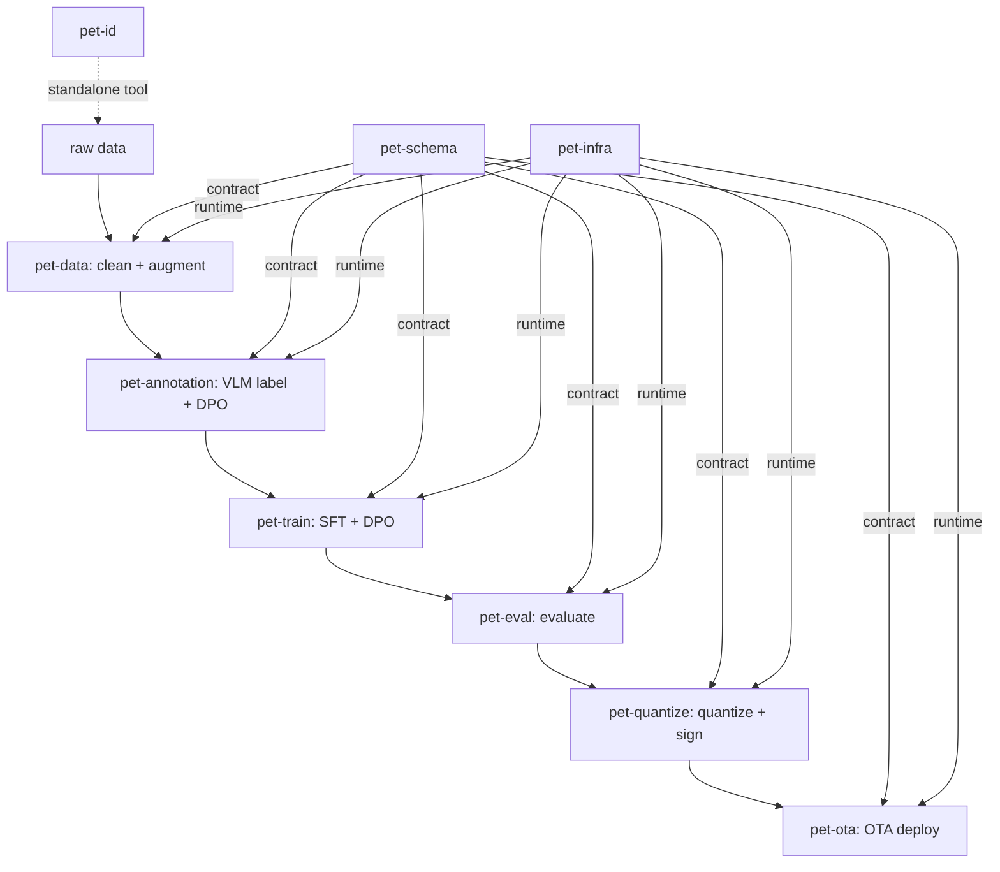
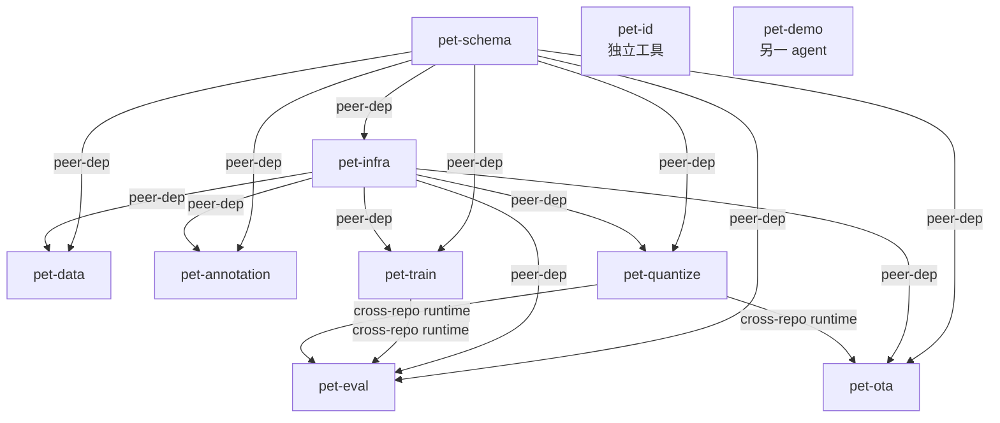

# Train-Pet-Pipeline 系统技术设计总览

> 维护说明：`compatibility_matrix.yaml` 加行 / 依赖治理规则改动必须同步本文档
> 最后对齐：matrix row 2026.10-ecosystem-cleanup / 2026-04-23 (Phase 10 ecosystem optimization closeout)

---

## 1. Pipeline 全景

### 仓库职责

| 仓库 | 一句话职责 | 架构文档 |
|------|-----------|---------|
| `pet-schema` | Schema / Prompt 定义，所有仓库的上游合同 | `docs/architecture.md` |
| `pet-infra` | 共享运行时——Registry、Plugin Discovery、Config、CLI、Orchestrator、Storage、ExperimentLogger、Replay | [本仓 docs/architecture.md](../architecture.md) |
| `pet-data` | 数据采集、清洗、增强、弱监督 | `docs/architecture.md` |
| `pet-annotation` | VLM 打标、质检、人工审核、DPO 对生成 | `docs/architecture.md` |
| `pet-train` | SFT + DPO 训练，音频 CNN 训练 | `docs/architecture.md` |
| `pet-eval` | 评估管线，被 pet-train 和 pet-quantize 共同调用 | `docs/architecture.md` |
| `pet-quantize` | 量化、端侧转换、制品打包签名 | `docs/architecture.md` |
| `pet-ota` | 差分更新、灰度分发、回滚 | `docs/architecture.md` |
| `pet-id` | PetCard 宠物身份注册与识别（独立工具，无 pet-* peer dep） | `docs/architecture.md` |
| `pet-demo` | 对外演示站（另一 agent 负责） | — |

### 数据流

```
raw → clean → labeled → trained → evaluated → quantized → OTA
```



---

## 2. 依赖关系图



---

## 3. 依赖治理约定（peer-dep + matrix 模型）

### β 决策（2026-04-23）

Python 无原生 peer-dep 概念，项目通过以下约定模拟：

- **pet-schema 和 pet-infra 均为 peer-dep**：下游 6 个仓（pet-data / pet-annotation / pet-train / pet-eval / pet-quantize / pet-ota）的 `pyproject.toml [project.dependencies]` 不声明 pet-schema 和 pet-infra。
- **matrix = 唯一版本真理源**：`pet-infra/docs/compatibility_matrix.yaml` 的 `releases[-1]` 行是当前所有仓库的版本锁定。
- **安装者负责提供 peers**：CI 和开发者按 §4 装序先装 peer，再装目标仓，使用 `--no-deps` 防止 pip 重解析。
- **fail-fast guard**：每个下游仓库的 `_register.py` 在 `register_all()` 内 / 模块顶部检查 peer 是否已安装，未安装时给出含安装指令的友好错误（见 DEVELOPMENT_GUIDE §11.3）。

### 约定细节

| 约定 | 说明 |
|------|------|
| `pyproject.toml` | 下游不写 `pet-schema` / `pet-infra` 行 |
| `compatibility_matrix.yaml` | 每次 release 新增一行，历史行降级为 archive |
| matrix 格式 | 无 `-rc` 后缀；`releases[-1]` 是最新行 |
| `_register.py` guard | pet-infra 本身在 `__init__.py` 用 `ImportError`；下游在 `register_all()` 内用 `RuntimeError` |
| 跨仓 plugin dep | pet-eval 依赖 pet-train + pet-quantize 作为 runtime peer；见 §4 8-step 装序 |
| Phase 7/8 债务 | pet-quantize / pet-ota 当前仍有硬 pin 残留，Phase 7/8 修复 |

---

## 4. 装序矩阵表 ★依赖集中一处核心落点

> 此表记录**两个状态**：**当前实际** (Actual) = 今天 CI workflow 跑的装序；**β 目标** (Target) = 所有 Phase 完成后的装序。`Current` 列里标了 ✓ 表示仓已迁移到 β；`(Phase N target)` 表示未迁移，本仓 Phase 会修到 β。CI workflow 路径从 `compatibility_matrix.yaml releases[-1]` 行取版本号。

| 仓 | Current (2026-04-23, matrix 2026.10) | CI workflow | 迁移 Phase |
|---|---|---|---|
| pet-schema | ✓ β (链首无 peer-dep) — 1 步 | `pet-schema/.github/workflows/ci.yml` | Phase 1 ✓ |
| pet-infra | ✓ β (pet-schema peer) — 3 步 | `pet-infra/.github/workflows/ci.yml` | Phase 2 ✓ |
| pet-data | ✓ β (pet-schema + pet-infra 双 peer) — 5 步 | `pet-data/.github/workflows/ci.yml` | Phase 3 ✓ |
| pet-annotation | ✓ β (双 peer) — 5 步 | `pet-annotation/.github/workflows/ci.yml` | Phase 4 + Phase 5 ✓ |
| pet-train | ✓ β (双 peer + fail-fast guard) — 5 步 | `pet-train/.github/workflows/ci.yml` | Phase 5 ✓ |
| pet-eval | ✓ β (pet-schema + pet-infra peer；pet-train + pet-quantize 运行时 peer)；CI **8 步** (① schema → ② infra → ③ train → ④ quantize → ⑤ editable --no-deps → ⑥ editable dev → ⑦ re-pin schema+infra → ⑧ 4-module assert) | `pet-eval/.github/workflows/ci.yml` | Phase 6 ✓ |
| pet-quantize | ✓ β (pet-infra peer via `_register.py` delayed guard, option X) + α hardpin pet-schema@v3.2.1；CI 4 步 | `pet-quantize/.github/workflows/ci.yml` | Phase 7 ✓ (7A) |
| pet-ota | ✓ β (pet-infra peer via delayed guard, option X)；`pet-quantize` 在 `[signing]` extras **no-pin**；CI 4 步 | `pet-ota/.github/workflows/ci.yml` | Phase 8 ✓ (8A + 8B) |
| pet-id | ✓ 独立 (无 pet-* 依赖，spec §5.2)；Phase 9 新加 `.github/workflows/ci.yml` + `no-wandb-residue.yml`（**首次 CI**） | `pet-id/.github/workflows/ci.yml` | Phase 9 ✓ |

### cross-repo-smoke-install.yml

新增于 pet-infra Phase 2（本次）。每次 `compatibility_matrix.yaml` 变更时触发，对上表 7 个下游仓（除 pet-schema 和 pet-infra 自身）按矩阵最新行安装并 import assert。文件路径：`pet-infra/.github/workflows/cross-repo-smoke-install.yml`。

---

## 5. 跨仓 CI guard 清单

| workflow | 仓 | 触发条件 | 作用 |
|---|---|---|---|
| `schema_guard.yml` | pet-schema | push/PR to dev/main | 派发 `repository_dispatch` 给 8 个下游仓触发全链 CI |
| `cross-repo-smoke-install.yml` | pet-infra | matrix.yaml 变更（push to dev/main）+ workflow_dispatch | 按最新 row 装 7 仓 + import assert。Phase 10 端到端验证：7/7 绿 |
| `no-wandb-residue.yml` | pet-infra / pet-train / pet-eval / pet-quantize / pet-ota / pet-id | push/PR | positive-list 扫描；pet-infra 从 Phase 4 起；pet-train Phase 5 / pet-eval Phase 6 / pet-quantize Phase 7 / pet-ota Phase 8 / pet-id Phase 9 陆续补齐 |
| `ci.yml` | 所有仓 | push/PR + repository_dispatch | 标准 lint + test。pet-id 的 ci.yml 是 Phase 9 首次 onboarding |
| `peer-dep-smoke.yml` | pet-data / pet-annotation / pet-train / pet-eval / pet-quantize / pet-ota | PR | 每仓专用的 peer-dep 装序 smoke（本仓独立装序契约验证，与 cross-repo smoke 互补） |
| `quantize_validate.yml` | pet-quantize | workflow_dispatch | 硬件 smoke（`pytest src/pet_quantize/validate/ --device-id <serial>`）。Phase 7 ② ③ 修了之前的 `python -m pet_quantize.validate` 死调用；Phase 5 硬件接入时真触发 |

---

## 6. 北极星四维度映射表 ★CTO 仪表盘

四维度定义：Pluggability（插件化程度）/ Flexibility（配置灵活性）/ Extensibility（扩展容易程度）/ Comparability（实验可比性）

| 仓 | Pluggability | Flexibility | Extensibility | Comparability |
|---|---|---|---|---|
| pet-schema | ExperimentRecipe + 4-paradigm Annotation discriminator | DpoPair modality/target_id 扩展 | BSL open-core，pydantic strict 验证 | Schema 版本化，全链合同 |
| pet-infra | 7-slot Registry + entry-point discovery | compose_recipe + Hydra defaults-list + overrides | BaseStageRunner 继承树 + STAGE_RUNNERS dict | ClearML ExperimentLogger + replay cli |
| pet-data | 弱监督 label 策略可替换 | params.yaml 驱动清洗参数 | store.py 单点扩展 | dedup.py 保证数据集无重叠 |
| pet-annotation | 4 范式表 per annotator_type | LS 1.23 import/export 可配置 | 新增 annotator_type 只加一张表 | DPO pair 版本化 + modality 标注 |
| pet-train | 3 plugin 体系（SFT/DPO/Audio）| LLaMA-Factory vendor 可替换 | audio namespace 独立 | ClearML 实验追踪 + model card sha |
| pet-eval | 8 metric plugins + 2 evaluators | cross-modal fusion rule-based 可配置 | 新增 metric = 1 plugin file | ExperimentRecipe variations 对比 |
| pet-quantize | RKNN/RKLLM 双 target | rknn_toolkit2 版本 pin | 制品打包签名可替换 | 量化前后精度对比 via pet-eval |
| pet-ota | S3 + HTTP 双后端 | 灰度分发策略可配置 | 新增后端 = 1 storage plugin | 差分包 sha256 校验 + rollback |
| pet-id | CLI register/identify/list/show/delete | PetCard registry JSON 可迁移 | 独立工具，无 pet-* 耦合 | — |

---

## 7. 新人上手路径

### Day 0

1. 读 `pet-infra/docs/DEVELOPMENT_GUIDE.md` — 规范源（怎么做 / 禁止什么 / 约定）
2. 读本文档 — 架构源（是什么 / 为什么 / 依赖关系）
3. 理解 §3 依赖治理约定 + §4 装序矩阵表

### Day 1（选定目标仓库后）

```bash
git clone https://github.com/Train-Pet-Pipeline/<target-repo>
conda activate pet-pipeline
# 按 §4 装序安装 peers 再装目标仓
make setup
make test
# 读本仓 docs/architecture.md
```

### Day 2–3（扩展练习）

按本仓 `docs/architecture.md §5 Extension points` 跑一次"添加新 plugin"练手：
- pet-infra：添加新 storage 后端（STORAGE registry via entry-point）
- pet-train：添加新 trainer plugin（TRAINERS registry）
- pet-eval：添加新 metric plugin（METRICS registry）

### 跨仓贡献

回到本文档 §2（依赖图）/ §3（治理约定）/ §4（装序矩阵），确认：
- 变更是否影响 pet-schema（需 ≥ 2 reviewer approve）
- 变更是否影响 compatibility_matrix.yaml（需同步本文档 §4）
- 变更是否跨仓（需通知下游仓负责人）

---

## 8. 本文档与 DEVELOPMENT_GUIDE.md 的分工

| 文档 | 定位 | 内容 |
|------|------|------|
| `DEVELOPMENT_GUIDE.md` | **规范源** | 怎么做 / 禁止什么 / 约定 / CI 模板 / 代码风格 |
| 本文档（OVERVIEW.md） | **架构源（系统级）** | 是什么 / 为什么 / 9 仓依赖关系 / 装序矩阵 |
| `pet-infra/docs/architecture.md` | **架构源（本仓级）** | pet-infra 模块设计 / 扩展点 / 已知复杂点 |
| 各仓 `docs/architecture.md` | **架构源（本仓级）** | 各仓自己的模块设计 |

两者交叉引用，不复制内容：
- DEVELOPMENT_GUIDE §11 引用本文档 §4 作为装序矩阵落点
- 本文档 §3 引用 DEVELOPMENT_GUIDE §11 作为 guard 模板来源
- 修改 matrix 时，`compatibility_matrix.yaml` + 本文档 §4 + DEVELOPMENT_GUIDE §11.4 需同步更新
